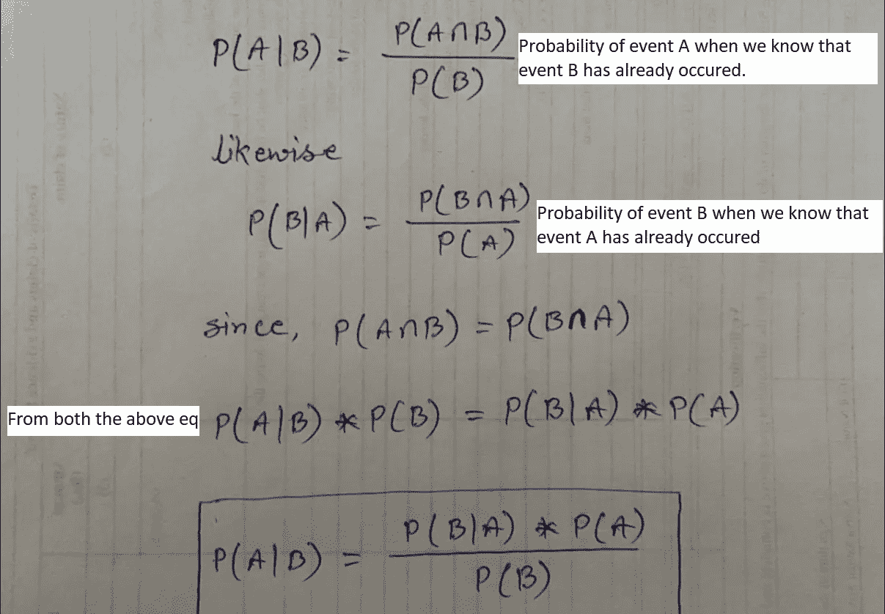
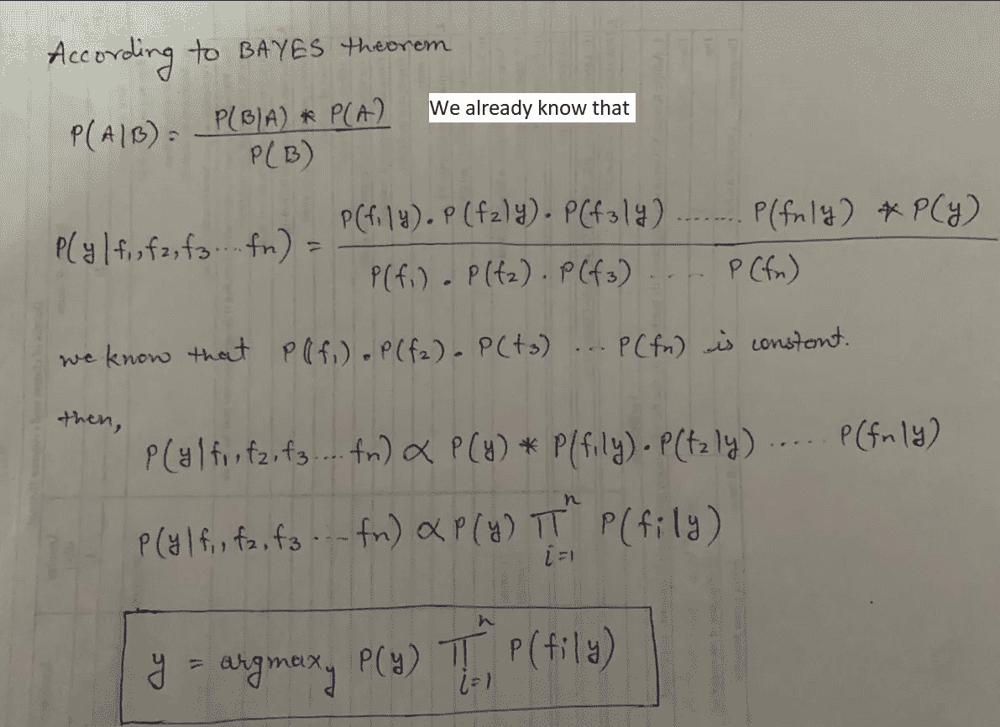
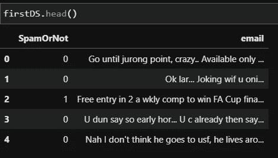
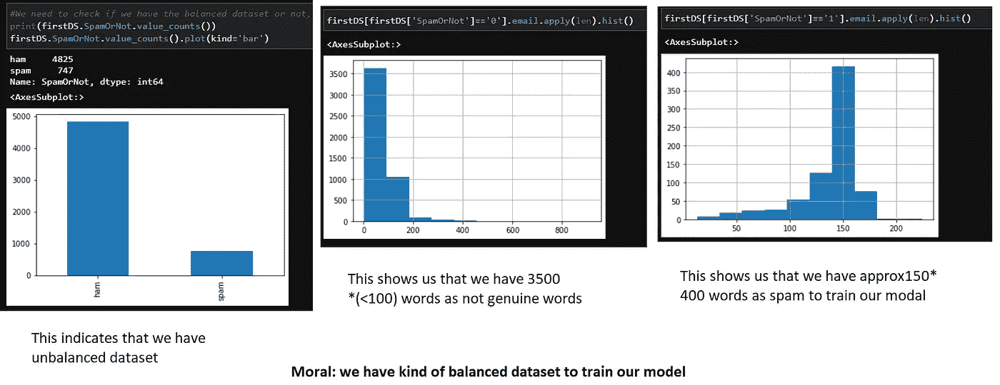
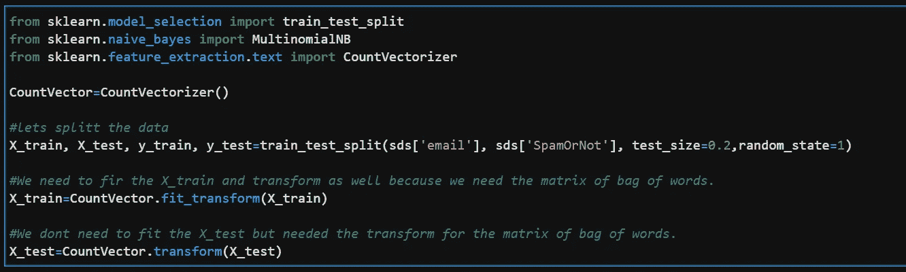
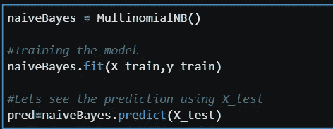
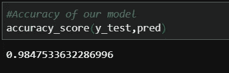

# 从概念到完成的朴素贝叶斯

> 原文：<https://medium.com/mlearning-ai/na%C3%AFve-bayes-from-concept-to-completion-a5a40fb2a771?source=collection_archive---------2----------------------->

简单理解朴素贝叶斯

Photo by [Med Badr Chemmaoui](https://unsplash.com/@medbadrc?utm_source=medium&utm_medium=referral) on [Unsplash](https://unsplash.com?utm_source=medium&utm_medium=referral)

如果我们保持简单😜考虑一个很容易消化数字数据的机器学习模型，你可能想知道文本数据会发生什么？模型如何在文本数据上训练？一个广为人知的人工智能领域叫做自然语言处理(NLP ),起源于同一个问题。

在本文中，我们将尝试从头到尾理解朴素贝叶斯算法，并尝试在机器学习模型中实现它。

> **本文分三个阶段** *贝叶斯定理
> *理解朴素贝叶斯算法
> *在机器学习模型中实现朴素贝叶斯

事不宜迟，让我们开始这一旅程。

# 贝叶斯定理

在我们试图理解朴素贝叶斯定理之前，我们需要先了解一下贝叶斯定理。大约两个半世纪前**托马斯·贝叶斯牧师**描述了在知道先前事件的情况下，一个事件发生的概率，这个概念被称为条件概率。

假设我们有一个事件 A 和事件 B，那么…

> 因此贝叶斯定理指出，给定 B 已经发生的事件 A 的概率等于给定 A 已经发生的概率乘以 A 的概率除以 B 的概率

# 理解朴素贝叶斯定理

现在让我们看看贝叶斯定理是如何被用来推导朴素贝叶斯算法的，该算法将被用于机器学习模型。

从机器学习的角度来看，如果我们谈论事件，我们的独立事件将是除输出标签(即 f1，f2，f3…fn)之外的所有特征列，而依赖事件是输出特征(即 y)。如果我们试图在相同的情况下实现贝叶斯定理，那就像。事件 A ~ y 和事件 B ~ f1，f2，f3，…，fn 的收益率低于。

> 🤦‍♂️，这是什么意思？
> 用机器学习预测语言来讲，任何结果的概率是同一实例中任何独立特征的概率的 argmax(maxima)。

# 潜入…这在现实世界中是如何工作的？

假设我们有文本数据，并且我们想根据它训练一个模型来预测未来的输出。所以朴素贝叶斯…

**Task1** :将整个数据转换成频率表，频率表显示每个单词出现的频率。
**任务 2** :创建一个似然表，找出特征概率。
**Task3** :实例的最终结果将是所有相关特征中概率最高的。

# 朴素贝叶斯在机器学习模型中的实现

假设我们有文本数据，并且我们想根据它训练一个模型来预测未来的输出。所以朴素贝叶斯…

> **Task1** :将整个数据转换成频率表，频率表显示每个单词出现的频率。
> **任务二**:创建一个似然表，找出特征概率。
> **Task3** :实例的最终结果将是所有相关特征中概率最高的。

理解了朴素贝叶斯定理之后，我们将看到它的实现。

**问题** **声明**:我们每天都会收到很多电子邮件，其中很多都是垃圾邮件。如果我们可以开发任何模型，告诉我们一封电子邮件是否是垃圾邮件，以便自动忽略或删除它。

因此，我们有电子邮件内容的数据，以及数据是否是垃圾邮件的标签。

0-非垃圾邮件，1-垃圾邮件

让我们检查一下我们是否有足够的数据来训练我们的模型？

因此，我们知道数据集是不平衡的，但也没那么糟糕，因为我们有大约 150 个单词用于 400 行，也就是大约 60K 个单词来训练我们的模型。所以我们还不错。

现在让我们考虑如何用数字表示电子邮件内容。“词汇袋”的概念由此而来。我们会尽力找出邮件中出现的每个单词。为了做到这一点，sci-kit 已经提供了 [**计数矢量器**](https://scikit-learn.org/stable/modules/generated/sklearn.feature_extraction.text.CountVectorizer.html) 概念，帮助我们完成列表中的任务 1。我们可以使用 TF-IDF 机制来标记列表。

## Lets 培养我们的模式

为了训练我们的模型，我们已经创建了训练数据，这些数据已经使用 CountVectorizer 进行了标记化。现在我们将使用朴素贝叶斯算法来训练我们的模型。

如果我们进一步检查我们的准确性，我们会得到大约。98% ✌

总结:我们看到朴素贝叶斯如何帮助我们在真实场景中训练我们的模型。在使用朴素贝叶斯之前要记住的要点是，特征必须是独立的，因为相关特征会影响性能。朴素贝叶斯算法的好处是它可以很好地处理大量数据。它不需要要素缩放，也可以使用空值。