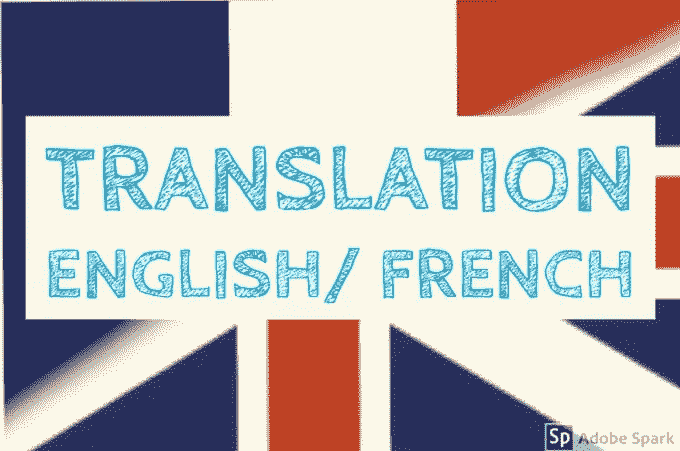
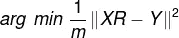
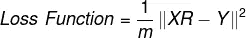
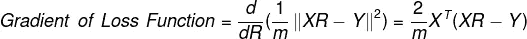

# 自然语言处理中的简单机器翻译

> 原文：<https://medium.com/mlearning-ai/na%C3%AFve-machine-translation-in-nlp-13cf02b9400?source=collection_archive---------6----------------------->

**天真的机器翻译:**

这个项目的目的是使用单词嵌入和向量空间模型将英语单词翻译成法语。



Image Source: [Fiverr](https://fiverr-res.cloudinary.com/images/t_main1,q_auto,f_auto,q_auto,f_auto/gigs/151330916/original/c616ef73c76b73204e888c9d8460c2ca9b596964/translate-from-french-to-english.jpeg)

当我们为一个词汇表训练单词嵌入时，主要的焦点是优化单词嵌入，使得核心含义和单词之间的关系得以保持。这个概念背后的思想是由约翰·鲁珀特·弗斯在 20 世纪 50 年代提出的:“你应该从他所交往的人那里知道一个词”——弗斯，J.R. (1957)

它的工作原理是，一个词的语义或意义主要是通过上下文或它与其他词的使用来捕捉的。因此，任何单词的周围单词都有助于理解该单词的意思。

Gensim 是 Python 中的一个主题建模和相似性检索库，它提供对 Word2Vec 等单词嵌入算法的访问以进行训练，还提供预训练的单词嵌入以供下载。

```
from gensim.models import KeyedVectorsen_embeddings = KeyedVectors.load_word2vec_format (‘./GoogleNews-vectors-negative300.bin’, binary = True)
fr_embeddings = KeyedVectors.load_word2vec_format(‘./wiki.multi.fr.vec’)
```

对于这个项目，我使用了 Coursera workspace 中提供的嵌入子集，这是一个字典，其中关键字是单词，值是一个 300 维的数组，包含特定单词的单词嵌入。

```
en_embeddings_subset = pickle.load(open(“en_embeddings.p”, “rb”))
fr_embeddings_subset = pickle.load(open(“fr_embeddings.p”, “rb”))
```

加载英语到法语数据字典，将英语单词作为关键字映射到法语单词作为值。

```
en_fr_train = get_dict(‘en-fr.train.txt’)
en_fr_test = get_dict(‘en-fr.test.txt’)
```

我们在训练数据集上训练模型，并在测试集上测试它。

创建一个函数，该函数将英语到法语词典、英语嵌入和法语嵌入作为输入，并将它们转换成 2 个矩阵 X 和 Y，使得矩阵 X 在单行中包含每个英语单词的单词嵌入，而矩阵 Y 在相应行中包含对应法语单词的单词嵌入。

```
for en_word, fr_word in en_fr.items():
    #check if the words have an embedding in the given dataset
    if fr_word in french_set and en_word in english_set:
        #Get the english and french embedding of corresponding words and append them to the list
        en_vec = english_vecs[en_word]
        fr_vec = french_vecs[fr_word]
        X.append(en_vec)
        Y.append(fr_vec)
return X,Y
```

该函数返回用于训练机器翻译器的 X_train 和 Y_train 矩阵。

有了 X 和 Y 矩阵，机器翻译问题可以转化为最小化问题。解决方案归结为找到一个变换矩阵 R，当乘以 X 时，给出一个嵌入 F 的新单词。然后我们可以计算 Y 中 F 的最近邻居，并推荐最相似的单词

因此，我们将尝试找到一个变换矩阵 R，使得该方程最小化，其中 x R 是计算的输出，Y 是目标



在这种情况下，我们使用矩阵的 Frobenoius 范数来计算损失函数。Frobenoius 范数由下式给出:


其中 I 是矩阵 a 的行，j 是矩阵 a 的列

损失函数将是矩阵与其近似值之差的 Frobenoius 范数的平方，除以训练样本数𝑚

1.  计算损失函数:



```
loss = np.sum(np. square (np.dot (X, R) — Y))/m
```

2.计算损失函数的梯度:



```
gradient = np.dot (X.T, (np.dot (X, R) — Y)) *(2 /m)
```

3.用梯度下降算法寻找最优 R

计算损失相对于矩阵 R 的梯度 g，并迭代更新 R:

```
def tranformation_matrix():
    for i in range(steps):
        gradient = compute_gradient(X, Y, R) 
        R = R — learning_rate*gradient
    return R
```

这个函数返回变换矩阵 R。

k-NN 是一种算法，它将一个向量作为输入，并在数据集中找到与其最接近的其他向量。我们将使用 k-NN 来获得与来自变换向量 XR 的嵌入最接近的嵌入。

余弦相似性是量化两个文档之间相似性的两个向量之间角度的余弦。如果我们把向量的方向看作它的意义，它就能更好地捕捉语义的相似性。此外，向量之间的角度更不受字数等外部因素的影响。

使用基本的三角函数，

Cos (0) = 1(如果角度为 0，向量在同一直线上，方向相同，因此非常相似)

Cos (90) = 0(如果角度为 90，则矢量是正交的，因此它们不相似)

cos(180)=-1(如果角度为 180，则矢量完全不同)

所以当文件之间的角度θ在 0°和 90°之间时(0<= Cos(θ) <= 1), we consider the documents to be similar, else dissimilar.

Since distance and similarity are not the same, we define distance metric using cosine similarity as

d = 1 -cos (u, v)

So we create a nearest neighbor function that takes in the vector, all possible nearest neighbors candidates and number of neighbors as input and gives the indices of top n closest neighbors as output.

```
def nearest_neighbor(v, candidates, k):
    for row in candidates:
        cos_similarity = cosine_similarity(row,v)
        similarity_l.append(cos_similarity)
        sorted_ids = np.argsort(similarity_l) 
    return sorted_ids[-k:]def get_translation(X, Y, R):
    pred = np.dot(X,R)
    for i in range(len(pred)):
        pred_idx = nearest_neighbor(pred[i], Y, 1)
    return pred_idx
```

So the closest neighbor returned by this function is the word embedding in French, which can be translated into its corresponding French word using the French embedding dictionary.

The machine translation accuracy obtained using this model is 56%

Note : This blog is based on the new specialization NLP at [https://www.deeplearning.ai/](https://www.deeplearning.ai/)