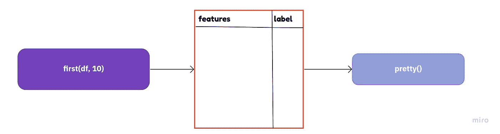

# 用 Julia 进行自然语言处理(上)

> 原文：<https://medium.com/mlearning-ai/natural-language-processing-with-julia-part-1-422a21902e93?source=collection_archive---------2----------------------->

Photo by [Leonardo Toshiro Okubo](https://unsplash.com/@leookubo?utm_source=medium&utm_medium=referral) on [Unsplash](https://unsplash.com?utm_source=medium&utm_medium=referral)

# 介绍

Python 无疑是数据科学中使用最多的编程语言。但是城里的一门新语言比 Python 快多了，非 **Julia** 莫属。

Julia 是一种高级、高性能、动态编程语言。除了作为一种通用编程语言，它还被明确地设计用于数值分析和计算科学。

在这个系列中，我将展示使用 Julia 编程语言进行自然语言处理。据我所知，我找不到任何关于在自然语言处理中使用 Julia 的演练教程。所以这个系列是献给所有的 Julia 新手用户(像我一样)，正在考虑过渡到 Julia 的数据科学家，以及高级的 Julia 用户。

> 注意:这是一个关于在 NLP 中使用 Julia 的实践系列。如果你对这两者都完全陌生，请查看 [Julia 课程](https://julialang.org/learning/)以详细了解 Julia，并查看[自然语言处理专业](https://www.coursera.org/specializations/natural-language-processing)以掌握 NLP 领域。在本系列中，我将假设您已经在系统中安装了 Julia。

# 首先要做的是

你将需要安装一些软件包到你的朱莉娅 REPL 中，以便在朱莉娅中完成自然语言处理任务。和 Python 中的`pip`一样，也有针对 Julia 的包管理器；叫做`Pkg`。现在有两种方法可以在您的 Julia 环境中安装软件包。

一种方法是将`Pkg`导入到你的朱莉娅·REPL 中，然后使用`Pkg.add("<package-name>")`来安装包。另一种方法是在你的朱莉娅 press 中按下`]`，然后在你的朱莉娅 press 中键入下面的命令`add <packages-names>`来添加包

对于我们的自然语言处理的任务，我们将需要在我们的朱莉娅 REPL 包列表如下:

> 注意:您也可以在 Julia 中创建一个虚拟环境，方法是按下`]`，然后键入以下命令:
> 
> `activate .`
> 
> 这将为您当前的项目文件夹创建一个自定义的虚拟环境。

安装上面的包需要一点时间。但是一旦完成，您就可以使用下面的代码片段导入代码中的包:

# 使用数据集

对于本教程，我将使用 [Kaggle 数据集](https://www.kaggle.com/datasets/team-ai/spam-text-message-classification)中的*垃圾短信分类*。该数据集的合作者是*AI 团队，*以 ***知识共享许可(CCO)在公共领域发布，*** 表示该数据集没有相关的版权。

为了在 Julia 中读取数据集，我们将使用 Julia 的`CSV.jl`和`DataFrames.jl`包，如下所示:

在上面的代码中，`|>`被称为*管道*操作符，它是 Julia 的`Pipe.jl`包的一部分。

对于不熟悉这个运算符的人来说，它只是简单地将*第二个函数*应用于*第一个函数*的**输出**，其用法在 R 编程语言中可以广泛找到。

The Pipe Operator

这个数据集有 5572 个记录或样本，其中一个文本列代表*消息*，一个标签列代表*目标*。

# 文本预处理

像 Python 一样，Julia 也有自己的文本库`TextAnalysis.jl`，其中打包了许多函数，可以用来预处理 Julia 中的文本数据。一些常用的功能如下:

*   `remove_case!(...)` —使文本正常化。换句话说，就是将字符串小写。
*   `prepare!(..., strip_numbers)` —从字符串中删除数字。
*   `prepare!(..., strip_punctuation)` —删除字符串中的标点符号。
*   `prepare!(..., strip_html_tags)` —从字符串中删除 HTML 标签。

上面的包提供了一系列其他功能，这些功能可以在文本分析文档中找到。

但是必须转换字符串数据类型才能使用上述函数。`TextAnalysis.jl`的函数期望字符串数据为以下任一类型:

*   `StringDocument`
*   `FileDocument`
*   `TokenDocument`
*   `NGramDocument`

要将 Julia 数据帧中的数据从一种类型转换成另一种类型，我们可以如下使用`DataFrame.jl`的`transform(...)`模块:

> 注意:`chain`命令的工作方式类似于管道操作符。

一旦我们执行了上面的代码，我们就会得到我们的`TextAnalysis`包函数所需格式的文本数据。现在，我们可以使用以下代码将预处理算法应用于文本数据:

在上面这段代码中，函数名和括号之间的`.`操作符被称为*广播操作符*，用于 Julia 中的*向量化*。更简单地说，*向量化*是一种使用 for 循环的方法，它不需要显式地使用它们来加速计算。在我们执行上面这段代码后，我们将在数据集中的一个新列`:Message2`中有预处理过的文本。

# 准备语料库和建立 Tf-idf 矩阵

在为我们的文本数据生成 Tf-idf 矩阵之前，我们需要为我们的文本数据构建一个`Corpus`对象。`TextAnalysis.jl`的`Corpus`对象代表一组文档。

我们需要执行下面这段代码来生成文本数据的`Corpus`对象。

一旦执行完毕，我们就需要构建文本数据的词汇表并更新它，这可以使用`TextAnalysis`包的`update_lexicon!(...)`快速完成。

为了构建我们的文本语料库的 tf-idf 矩阵，我们需要将我们的文本语料库包装在一个`DocumentTermMatrix(...)`对象中，之后我们可以应用`tf-idf(...)`函数来构建我们的文本数据的 Tf-idf 矩阵。这方面的代码如下:

# 茱莉亚 ML 建模简介

就像 Python 中的 *Scikit-learn* 一样，我们在 Julia 中有 *MLJ 框架*。Julia 中的 *MLJ 框架*具有与 Python 中的 *Scikit-learn* 几乎相似的功能，如数据建模、模型堆叠、超参数优化等。最棒的是，它是纯 Julia 编写的，因此我们可以从这个框架中期待惊人的速度。

在系列的这一部分，我们将继续机器学习的相同基本程序，即:

*   将数据集分为训练集和测试集
*   在完整的训练集上拟合模型
*   在测试集上评估性能

现在在本教程中，我们正在处理一个监督学习问题；因此，第一条经验法则是定义问题的`X`和`y`。为此，我们可以使用下面这段代码:

对于我们的数据建模，我们将使用*决策树*算法。让我们从使用下面这段代码定义模型开始:

在 *MLJ 中，*一个**模型**是一个作为模型超参数的*容器*的对象。为了在 *MLJ 中安装一个模型，*我们首先需要调用 *MLJ 机器*一个包装器，将模型和数据包装成一个实例。为此，我们可以运行如下代码:

在 *MLJ 中，*数据必须被编码成特定的 scitype⁴.否则，模型将与数据不符。在上面这段代码中，我们使用`coerce(...)`函数将`X`和`y`数据编码成特定的 scitype。

为了将数据划分为训练集和测试集，我们可以使用 *MLJ 框架*的`parition(...)`如下:

现在，必要的步骤已经完成，我们现在可以使用 *MLJ* 框架的`fit!(...)`来拟合我们的机器学习模型，并通过`rows=train`来拟合我们在训练集中的模型。这方面的代码如下:

一旦模型符合我们的训练数据，我们就可以使用下面的代码在测试集上评估模型的性能。

# 未来作品

在本系列的下一部分中，我将尝试发布 Julia 在 NLP 领域的更多高级应用。接下来的内容将集中在交叉验证、超参数优化等方面。所以下一部分再见了。

# 密码

如果你们想看看这篇文章的工作片段，可以在下面的链接中找到我的代码:[https://colab . research . Google . com/drive/1m _ 3g a7 rir JV 0 wy bnt 9 kb a4 xrtfg-tVKS？usp =分享](https://colab.research.google.com/drive/1m_3ga7RiRjV0Wybnt9KBa4Xrtfg-tVKS?usp=sharing)

# 参考

[1]Julia Hub 撰写的 TextAnalysis.jl 文档—[https://docs.juliahub.com/TextAnalysis/5Mwet/0.7.3/](https://docs.juliahub.com/TextAnalysis/5Mwet/0.7.3/)

[2]通过[Bence Komarniczky](https://niczky12.medium.com/?source=post_page-----ad04a1696944--------------------------------)—[https://towards data science . com/Vectorize-everything-with-Julia-ad04a 1696944](https://towardsdatascience.com/vectorize-everything-with-julia-ad04a1696944)

[3]茱莉亚的机器学习框架——MLJ 框架:[https://alan-turing-institute.github.io/MLJ.jl/dev/](https://alan-turing-institute.github.io/MLJ.jl/dev/)

[4] MLJ 数据解释和 sci types:[https://Julia ai . github . io/datasciencetutorials . JL/Data/scitype/](https://juliaai.github.io/DataScienceTutorials.jl/data/scitype/)

 [## Mlearning.ai 提交建议

### 如何成为 Mlearning.ai 上的作家

medium.com](/mlearning-ai/mlearning-ai-submission-suggestions-b51e2b130bfb)