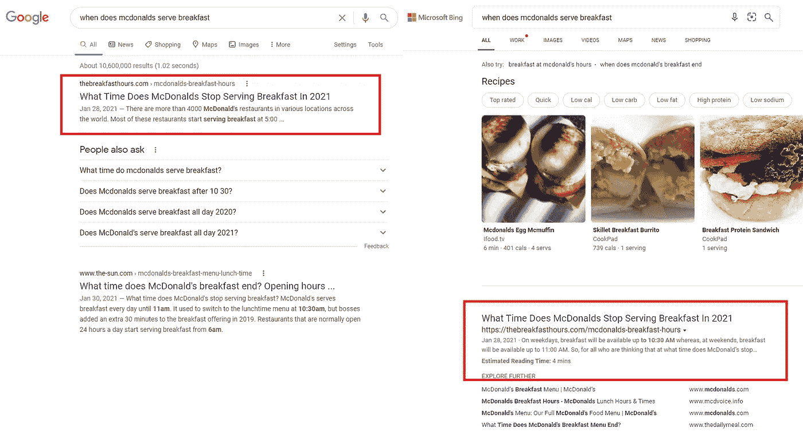
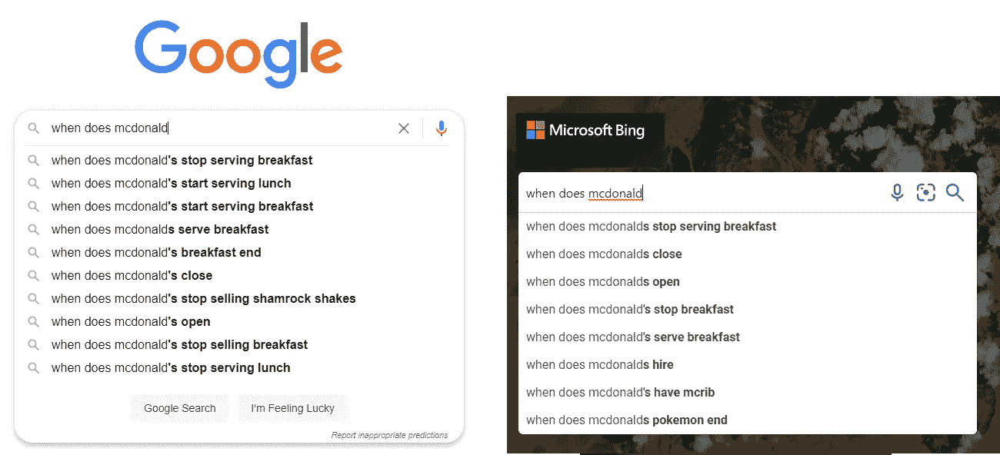
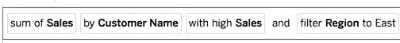

# 面向分析的自然语言搜索:商品化和采用

> 原文：<https://medium.com/mlearning-ai/natural-language-search-for-analytics-is-it-a-commodity-2ccc6692b1b4?source=collection_archive---------8----------------------->

计算机中的自然语言处理(NLP)始于 40 多年前，当时有一系列硬性的 if-then 规则，定义了文本应该如何解释。传统上，自然语言处理被认为是分析大量的文本来实现一个目标。其中一些包括但不限于:

1.  基本的语音识别和解析
2.  关系分析
3.  意义、意图和情感
4.  摘要

自然语言搜索(NLS)是通过搜索引擎引入的(还有人喜欢 AltaVista 吗？)并由谷歌完善。今天，你可以在谷歌和必应中输入相同的短语，得到非常相似的结果。

Top results are the same

在这些背后有大量的处理，并且整体模型非常相似。Google 和 Bing 都通过抓取网页来创建一个搜索数据库(“数据”)。他们可能会对这些数据进行索引，并创建一些上下文映射。当用户键入一个问题时，谷歌和微软(以及其他搜索平台)使用一整套模型来返回一个上下文相关的准确答案。虽然谷歌没有确认他们使用哪种搜索模式，但他们有时会在更新时发布。见[此处](https://www.searchenginejournal.com/google-algorithm-history/)。

可能有某种运行上下文和概念之间关系的神经网络，一个帮助理解句子语法和结构的基本解析器，一个帮助处理拼写错误和类似单词的距离模型等等。

关键是，所有搜索引擎的最终结果通常都是一样的。它们都在索引相同的数据，理解你输入的问题，并在合理的范围内提供相同的答案(甚至建议相同的事情)。

Google vs Bing suggestions

从某种程度上来说，谷歌、必应和其他搜索提供商日子过得很轻松。通过直接为消费者服务，他们拥有庞大的数据集，他们索引了数十亿个网站，总大小超过 100，000，000 千兆字节。

这让我们想到了 NLS 和大 B2B 鲸鱼的交集。

# 企业中的 NLS

第一次创业者往往建立 B2C，而第二次创业者建立 B2B 产品。这是为什么呢？企业有钱，他们愿意大规模地花钱！因此，由谷歌为消费者构建并普及的自然语言搜索将扩展到 B2B 市场是有道理的。

面向分析的 NLS(NLSa)是数据和 NLP 在单个企业层面的交集。ThoughtSpot 成立于 2012 年，IBM 在 2015 年中期在他们的 Watson 系列中有自然语言搜索，PowerBI/Tableau/others 在 2018/2019 年紧随其后。那么，NLS 在企业领域的过去 9 年给了我们什么？

> “从长远来看，一切都是烤面包机”——布鲁斯·格林沃尔德

事实证明，对商业的自然语言搜索和对消费者的自然语言搜索并没有什么不同。唯一的区别是公开的数据的范围和类型。此外，企业自然语言搜索的目的是面向分析，即结构化的数据，而不是非结构化的网页列表。这应该更容易构建可为单个企业定制的规则。

与消费市场不同，自然语言搜索尚未在大多数组织中用于分析。如果你问普通分析师他们现在是如何使用分析的，他们会告诉你是通过固定的报告或仪表盘。

## 那么，NLSa 是商品吗？

乍一看，它似乎是一种商品。看看这些相似的用户界面:

产品商品化意味着使其广泛可用，并可与同类产品中的其他产品互换。通常情况下，广泛供应意味着既有供应又有需求。根据这个定义，NLSa 还不是一个商品产品，原因有两个:需求(即采用)和产品成熟度。

## **领养**

虽然采用的速度在加快，但目前绝大多数公司都不使用 NLSa。这种简单的使用方法证明了为什么 NLSa 还不是一种商品。采用滞后的原因是由于产品的成熟度。

## 产品成熟度

与基于消费者的同类产品不同，NLSa 并没有有效地为用户节省大量时间。虽然这个界面吸收了谷歌最好的、最容易识别的部分(输入一个问题并将其与一些数据联系起来)，但它目前缺少互补的自动化功能。

在当今典型的 NLSa 平台中，用户有一个业务问题。让我们举下面的例子:

问题:酒精饮料的销售业绩下降
第一步:用户查询“显示酒精饮料的销售”，工具返回一个图表
第二步:他们以不同的方式问了 100 次同样的问题。这非常类似于使用过滤器导航仪表板。

面向消费者的自然语言搜索是一个成熟的产品，围绕它建立了一个完整的生态系统，允许用户解决他们的整个问题。以用户在谷歌搜索中的体验为例:

问题:用户的车辆坏了
步骤 1:用户谷歌车辆症状，谷歌返回可能的原因
步骤 2:用户谷歌如何修复可能的原因，谷歌返回一个循序渐进的 Youtube 视频

界面是一样的(输入一个问题)，但结果却大相径庭。NLSa 有效地吸收了自然语言搜索中最好的、最可移植的部分:理解单个单词及其背后与“数据”相关的上下文。今天，NLSa 供应商在提供帮助用户真正解决问题的工具方面做得并不好。

为了推动 NLSa 的采用，供应商应该关注他们的消费者同胞。

## 那么下一步是什么？

我们可以通过观察谷歌搜索的变化来了解下一步会发生什么。在他们构建了一个优秀的搜索工具后，他们开始构建补充的自动化服务，以解决人们最常搜索的内容:

1.  航班(谷歌航班)
2.  翻译(谷歌翻译)
3.  方向(谷歌地图)
4.  要购买的东西(谷歌购物)
5.  娱乐/指导/自助(Youtube)

他们看到了他们的客户在寻找什么，他们开始构建交钥匙解决方案，帮助客户解决他们的问题。突然之间，搜索根据客户提出的问题将他们引向自动化。

NLSa 也遵循着同样的蓝图。关注业务用户、分析师和数据科学家提出的问题并构建自动化来解决这些问题的供应商将会取得成功。自然语言搜索不是目的地，而是解决问题的渠道。

想象一下这样一个世界:业务用户或分析师可以通过自动化轻松回答复杂的“为什么”问题。当一家电子商务公司的分析师问

> 为什么我的笔记本电脑利润增加了

返回的答案将不是简单的可视化——它将是由应用的 ML 和统计数据驱动的、以自然语言呈现的复杂的、细致入微的摘要。该总结应该是针对典型性能问题的交钥匙分析。

随着消费者使用谷歌搜索作为出发点来了解餐馆的菜单、评论、方向、预订和乘坐的所有信息，企业用户将使用 NLSa 作为出发点来衡量、了解和影响他们由数据驱动的组织。

与搜索相邻的自动回答是市场的发展方向，Tellius 正通过我们的[自动洞察](https://www.tellius.com/product/auto-insights/)引领这一愿景。要了解更多关于我们如何帮助分析师更快工作的信息，请查看 [Tellius](http://tellius.com) 。

*注意:对于本文中所有 Google vs Bing 的例子，我都使用了匿名模式。*