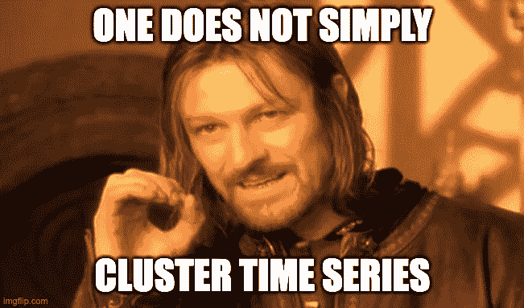
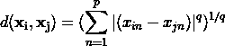
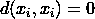
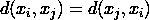
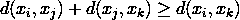
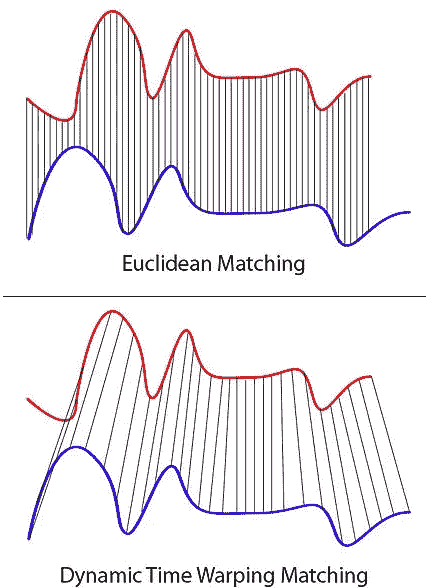
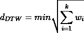

# 在时序聚类中导航

> 原文：<https://medium.com/mlearning-ai/navigating-through-time-series-clustering-a7401d8e4004?source=collection_archive---------4----------------------->

Meme by Author | Source: [https://imgflip.com/memesearch?q=one+does+not+simply](https://imgflip.com/memesearch?q=one+does+not+simply) | Inspired by Boromir (Sean Bean) from Lord of The Rings franchise (2011)

聚类分析或更广为人知的聚类与社会科学领域有着紧密的联系。它最初起源于人类学领域，后来被罗伯特·泰伦引入心理学。从那时起，它已经发展成为一个包含数学严谨性的领域。聚类分析的主要目的是将物体分成不同的组，这比听起来要困难得多。这是因为算法不知道什么是“相似”，什么是“不同”。为了解决这个问题，我们需要客观的测量方法，定量地告诉我们空间中各种物体的相对距离。一个衡量标准是*闵可夫斯基*距离:

*闵可夫斯基*距离是我们熟悉的*几个距离度量的概括。*举个例子， *w* 当我们设 q = 2 时，我们会得到*欧氏*距离。如果我们足够雄心勃勃，也可以创建自定义距离指标，只要它满足以下标准:

一旦选择了邻近度，像 *Kmeans* 这样的聚类算法就可以用来对我们的对象进行分类。

## 这对时间序列有用吗？

虽然我们可以在时间序列数据上直接使用 *Kmeans* 和*欧几里德*距离，但它可能不会产生良好的聚类，因为*欧几里德*距离忽略了时间偏移。它也不能处理不同长度的数据。其他“正常”距离度量也是如此。同时，时间序列数据有各种大小和时间变化。幸运的是，对时间序列进行聚类的技术已经发展了多年，可以分为三大类:

*   将时间序列直接输入具有特定距离度量的聚类算法——自定义距离度量方法
*   在利用聚类算法之前从时间序列中提取特征—特征提取方法
*   对时间序列建模，然后对模型执行聚类——建模方法

## a)自定义距离度量方法

这种方法用更适合时间序列的距离度量代替了传统的距离度量。一个流行的度量是*动态时间扭曲**【DTW】*。与*欧几里得*、*不同，DTW* 并没有忽略时间的转移。它甚至适用于长度不等的两个时间序列。下图显示了*欧几里得*和 *DTW* 的区别:

source:[https://commons.wikimedia.org/wiki/File:Euclidean_vs_DTW.jpg](https://commons.wikimedia.org/wiki/File:Euclidean_vs_DTW.jpg)

如上所示，当我们对有时间偏移的时间序列进行欧几里德匹配时，我们会将时间序列的错误部分匹配在一起。因此，我们的聚类算法可以得出结论，这两个时间序列相距甚远，因此是不同的。

要求 DTW 距离，首先要构造一个 n x m *局部代价矩阵(LCM)* ，其值对应于时间序列 A 和时间序列 B 中元素之间的累积距离，通俗地说，就是通过穷尽性地考虑时间序列 A 和 B 中的值，用公式填充空矩阵。一旦构建好矩阵，DTW 距离就是从 *LCM* 左下角到右上角的最短可能路径:

然后我们可以使用这个距离代替*欧几里德*用于我们的聚类算法。幸运的是，到处都有 python 包，所以我们不必从头开始构建 *DTW* 。但是对于纯粹主义者来说，网上有很多资源可以帮助我们从头开始构建 DTW。当然，也随时欢迎你阅读原文。

## b)特征提取方法

在这种方法下，我们将在利用聚类算法之前从时间序列中提取特征。一个有趣的方法是执行*离散傅立叶变换* *(DFT)* 。DFT 背后的主要思想是引人注目的:转型。在这种方法下，时间序列被转换成各种频率。然后，聚类算法和我们选择的距离度量可以应用于这些频率。使用 *DFT* 的一个好处是降维。幸运的是，scipy 库可以用来执行 *DFT* 并计算这些频率。此外，还有许多关于 well⁴.的在线资源

## c)建模方法

在这种方法下，我们考虑到每个时间序列都是由某种过程产生的，因此可以建模。例如，在对*隐马尔可夫模型* ⁴.使用聚类算法之前，我们可以首先为时间序列建立*隐马尔可夫模型(HMMs)* 另一种方法将是使用经典的 *ARIMA* ⁵.当然，与自定义距离度量和特征提取方法相比，建模方法可能更加耗时。例如，使用 *ARIMA* 方法，我们必须注意时间序列的平稳性以及其他考虑因素。虽然有 python 包可以用来自动完成寻找 *AR(p)* 、 *I(d)* 和 *MA(q)* 值的过程，但是模型的质量可能没有那么好。为了获得特别是 ARIMA 的最佳结果，我们必须手动微调模型。

## 我能用它做什么？

找出一种对时间序列进行聚类的方法打开了许多有趣的应用。这是因为时间序列数据在任何行业都非常普遍。就我个人而言，我在我的大学论文中应用了其中一些方法，试图回答以下问题:

> 聚类分析可以用来帮助投资组合经理创建多样化的投资组合吗？

这只是时间序列聚类有趣应用的一个例子(至少对我来说是这样)。我希望通过分享这些知识，人们将能够从事许多有趣的项目。也就是说，如果你做过任何酷的时间序列聚类相关的项目，请告诉我！

[1]罗伯特·乔特·泰伦。聚类分析:相关简档和正交
(因子)分析，用于分离思想和人格的统一性。爱德华兹兄弟公司，平版印刷和出版商，1939 年。

[2]T 沃伦廖。时间序列数据的聚类-综述。模式识别，38(11):1857–1874，2005。

[3]米勒，梅纳德。"动态时间扭曲"*音乐和动作信息检索*(2007):69–84。

[4][https://python numerical methods . Berkeley . edu/notebooks/chapter 24.02-离散傅立叶变换. html](https://pythonnumericalmethods.berkeley.edu/notebooks/chapter24.02-Discrete-Fourier-Transform.html)

[5]科维耶洛、伊曼纽、安东尼·陈和格特·兰克利特。"具有变边的聚类隐马尔可夫模型."《机器学习研究杂志》15.1(2014):697–747。

[6]Kalpakis、Konstantinos、Dhiral Gada 和 Vasundhara Puttagunta。" ARIMA 时间序列有效聚类的距离度量."2001 年 IEEE 数据挖掘国际会议论文集。IEEE，2001 年。

 [## Mlearning.ai 提交建议

### 如何成为 Mlearning.ai 上的作家

medium.com](/mlearning-ai/mlearning-ai-submission-suggestions-b51e2b130bfb)