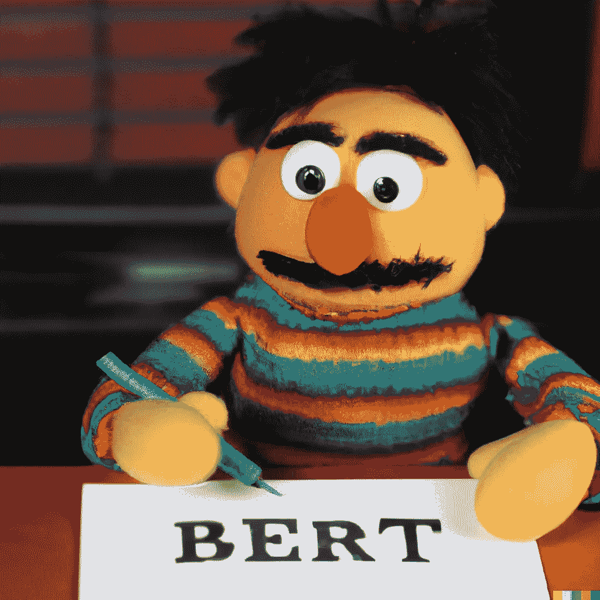

# 需要帮助你计算字数吗？

> 原文：<https://medium.com/mlearning-ai/need-help-hitting-your-word-count-ca69c9e7cbbb?source=collection_archive---------6----------------------->

## 让伯特用人工智能来充实你的文章！

Generated by OpenAI’s DALL-E2

你可能已经看到 OpenAI 的 GPT 如何在给出提示的情况下生成非常令人信服的文本，但是如果你可以使用 AI 以一种在相邻句子的上下文中有意义的方式添加到文档中，那不是很好吗？还需要 500 字，但你已经写了你能想到的关于这个话题的所有内容？没问题。

GPT 是因果语言模型或自回归模型的一个例子。这意味着它模拟了一个单词出现的概率，给出了前面出现的文本。这些模型是生成语言的自然选择，但它们只能考虑前面的句子，而不能考虑后面的任何句子。

输入伯特。正如它的全名——来自变压器的双向编码器表示——所表明的，它从向后和向前两个方向获取上下文。但是 GPT 是原始[变压器](https://jalammar.github.io/illustrated-transformer/)的解码器部分，而伯特只是编码器。这使得 BERT 适用于分类任务，但如何使用它进行语言生成并不明显。

碰巧的是，伯特接受训练的任务之一是猜测文本中随机隐藏的单词。在 [HuggingFace](https://huggingface.co) Python 包中的 *BertForMaskedLM* 模型可以用这种方式来填补空白。然而，单纯要求伯特填补大量连续空缺的结果是非常令人失望的。相反，一种称为 MCMC(马尔可夫链蒙特卡罗)的技术可以用于从以周围令牌为条件的分布中进行采样。这个想法最早发表在论文 [BERT 有嘴，而且是必须要说话:BERT 作为马尔可夫随机场语言模型](https://arxiv.org/abs/1902.04094)。

那么它的效果如何呢？这里有一个取自《T8》封底的例子，小龙虾在那里唱歌。**粗体**中的句子是模型添加的。

> 多年来，“沼泽女孩”的谣言一直困扰着巴克利湾，这是北卡罗来纳州海岸的一个安静的小镇。在过去的几年里，这个城镇有着臭名昭著的犯罪、毒品和谋杀的历史。因此，1969 年末，当英俊的蔡斯·安德鲁斯被发现死亡时，当地人立即怀疑所谓的沼泽女孩基亚·克拉克。**毕竟，她是酒保，也是泥溪传奇谋杀案的嫌疑人。**但是 Kya 不是他们说的那样。**大约十几年前，当她在佛罗里达州被发现时，她强壮健康。敏感而聪明的她在这片她称之为家的沼泽地里独自生存了多年，在海鸥中寻找朋友，在沙滩上学习。她的自然本能与生命周期相协调，因此她很快乐。然后，她渴望被抚摸和被爱的时候到了。在她寻找自己身份的过程中，那些在危险中挺身而出帮助她的人。当两个来自镇上的年轻人被她的野性之美所吸引时，Kya 开始了新的生活——直到不可思议的事情发生了。她踏上了一段旅程，进入了一个没有人能理解她想说什么的世界。**

HuggingFace 现在还托管了 [Spaces](https://huggingface.co/spaces) ，在那里你可以用几行代码在 [Streamlit](https://streamlit.io/) 或 [Gradio](https://www.gradio.app/) 应用中部署你的模型。你可以在这里试试我的*嵌入式*模型

 [## teticio 的拥抱脸空间

### 发现由社区制作的令人惊叹的 ML 应用程序

huggingface.co](https://huggingface.co/spaces/teticio/inBERTolate) 

并在这里找到源代码

 [## GitHub - teticio/inBERTolate:使用 BERT 来充实你的文章，从而达到你的字数要求！

### 生成与前面和后面的句子都在上下文中的句子。像 GPT 这样的模特不是…

github.com](https://github.com/teticio/inBERTolate) 

如果你发现它有点太随机，那么尝试减少*温度*参数或增加*典型 _p* 参数。

# 小心使用

语言模型从给定的数据中学习模式，但它们也学习偏见。由于 BERT 并不常用于语言生成，我很想看看它与 GPT-2 在这方面有何不同，并对结果感到震惊。

我向 RoBERTA-large 模型提供了两个提示，以查看这将如何影响结果:

> “白人曾是一名…”

和

> "那个黑人当了一名……"

模型生成如下(不是我写的！):

> 这位白人在希拉里·克林顿执政期间担任气候研究员，并被任命为该办公室的副主任。
> 
> “一个黑人在附近做失业的看门人。下院议员发现了他，并把他和另外两个人一起处以私刑。”。

这比我预想的要极端得多。尽管人们永远不应该根据单一样本得出结论，但这说明了模型所依据的数据。如果我告诉你 [RoBERTA](https://ai.facebook.com/blog/roberta-an-optimized-method-for-pretraining-self-supervised-nlp-systems/) 是由 Meta(脸书)建立和训练的，你可能会得出错误的结论，因为他们使用的[数据集](https://arxiv.org/pdf/1907.11692.pdf)实际上是基于从 Reddit 帖子中抓取的书籍、新闻和网站。

 [## Mlearning.ai 提交建议

### 如何成为 Mlearning.ai 上的作家

medium.com](/mlearning-ai/mlearning-ai-submission-suggestions-b51e2b130bfb)