# 嵌套变分推理

> 原文：<https://medium.com/mlearning-ai/nested-variational-inference%C2%B9-a666f95ceb07?source=collection_archive---------8----------------------->

## 回顾了一种基于深度生成模型的分层变分推理方法

讨论了一种新的训练复杂概率模型的变分推理方法。它被 NeurIPS 2021 接受了。

# 深度生成模型

作为本文的主要优化目标，我们首先给出几个这类模型的例子。

## 深度潜在高斯模型

这些是深度定向图形模型的一般类别，由处理层级的每一层的**高斯潜变量组成。**

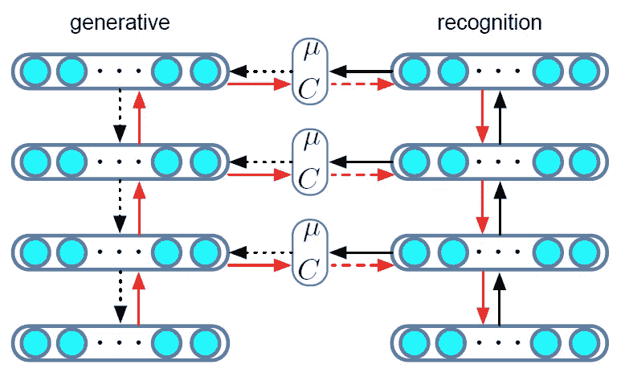

Figure 1: Computational graph for DLGM. Note the 2 sides are the same model in different use cases (not to be confused with a GAN-like construct which has 2 parts). Black arrows indicate the forward pass of sampling from the recognition and generative models: Solid lines indicate propagation of deterministic activations, dotted lines indicate propagation of samples. Red arrows indicate the backward pass for gradient computation: Solid lines indicate paths where deterministic backpropagation is used, dashed arrows indicate stochastic backpropagation. (Quoted from original paper)

为了从模型中生成一个样本(例如一个图像)，我们从顶层开始，绘制高斯分布图(如图 1 的左部所示)。然后在每一层应用被高斯噪声干扰的激活函数。最终，在底层，通过从观察似然中采样来生成观察值，该观察值可以是任何适当的分布。识别过程与流程相反，从底部向顶部传播(如图 2 右侧所示)。

作者还讨论了随机反向传播技术设计的训练这样的结构，可以值得进一步阅读。此外，该体系结构概括了许多常见的图形模型，如因子分析、高斯信念网络等。

## 生成对抗网

该框架通过对抗过程来估计生成模型，该过程在 **minimax** 游戏设置中同时训练一个**生成**模型`G`和一个**鉴别**模型`D`。

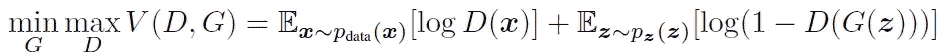

Equation 1: Objective function for GAN. (Quoted from original paper)

为了了解发生器在数据上的分布，在输入噪声变量`z`上定义先验`p(z)`，然后映射到数据空间的是`G(z)`，其中`G`通常是深度神经网络。鉴别器`D(x)`，通常也是一个深度神经网络，被定义为表示`x`来自数据的概率，而不是来自生成器的分布(真实与生成)。这样，我们可以训练`D`区分真实的训练样本和来自`G`的样本，同时训练`G`为“傻瓜”`D`，目标如等式 1 所示。

# 重要性抽样

重要抽样是嵌套变分推理的一个重要组成部分，因此作者描述了这种方法的一般框架和两个鼓舞人心的例子。

假设我们有一个目标分布π，我们想从中取样，但很难做到，还有一个建议密度`q`，从中取样很简单。然后，我们可以通过定义如下所示的重要性权重`w`来重写关于π的期望值。

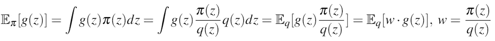

通常，π是感兴趣的后验分布，因此我们可以用联合密度γ和边际可能性`Z`写出 [π=γ/Z](https://en.wikipedia.org/wiki/Bayes%27_theorem) 。然后，上面的等式可以重写如下，其中更新了`w`的定义。

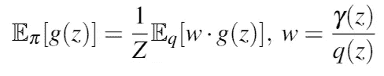

## 自标准化重要性采样器

自归一化估计量使用加权样本来计算期望值和归一化常数的估计值，如下所示，其中`S`是样本数。

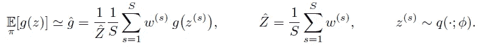

由于`1 / Z = 1 / E[Z_hat] <= E[1 / Z_hat]`由[詹森不等式](https://en.wikipedia.org/wiki/Jensen%27s_inequality)得出，因此得到的估计值是一致的，但有偏差。偏差随着`q`和π之间的差异缩小而减小，因此对于迭代算法，初始估计偏差会很大，但随着迭代的进行，这将会改善。

## 嵌套重要性抽样和适当加权

嵌套重要性抽样通过调用其他重要性抽样器来形式化建议的构造。现在想象一下变分分布`q`是未标准化的，因此不能直接从中取样。在这种情况下，我们可以应用相同的想法，使用**另一个重要性采样器**，但是建议η模拟来自`q`的样本。由此产生的加权样本随后可用于计算`q`的归一化常数，使我们能够随后从`q`采样。

这种想法可以形式化为*适当加权*，其陈述对于概率密度π和某个常数`c > 0`，随机对(w，z)~π是**适当加权的** (p.w .)，对于未规格化的概率密度γ=Zπ，如果`w >= 0`和对于所有可测函数`g`下面的等式成立。

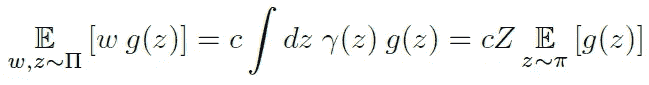

其重要性在于，只要取样器能产生目标密度的 p.w .样本，就能计算出一致的估计值。

# 随机变分推理

作为所提出方法的另一个重要组成部分，随机 VI 将在此简要介绍，具有正向和反向 [Kullback-Leibler 发散](https://en.wikipedia.org/wiki/Kullback%E2%80%93Leibler_divergence)。

随机变分方法用一个**变分概率密度** `**q**`(通常是一个近似器和一个潜在变量的函数，但由*自己的*参数ϕ).定义)来近似一个**目标概率密度π** (潜在变量的函数，并由*模型*参数θ定义)如前所述，通常π是具有联合密度γ和边际可能性`Z`的感兴趣的后验分布。这种近似通常通过优化方程 2 所示的变分目标来实现，其中`f`是散度函数。

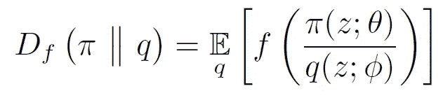

Equation 2: Variational objective for stochastic VI. (Quoted from original paper)

## 向前 KL 散度

对于向前(也称为包含)KL 的情况，`f`-散度具有`f(w) = w log(w)`的形式。该场景中的一个常见策略是通过最大化数据上的[证据下限](https://en.wikipedia.org/wiki/Evidence_lower_bound) (ELBO)或似然性来训练**生成型**模型，并通过从后验 **π** 采样来优化**推理**模型(这可以通过使用变分分布`q`的[重要性采样](https://en.wikipedia.org/wiki/Importance_sampling)来实现)。

## 反向 KL 散度

另一方面，对于反向(又名独占)KL，我们使用`f(w) = -log(w)`。这种情况通常通过最大化等式 3 中给出的下限来解决，其梯度可以使用重新参数化的 samples⁴、似然比 estimators⁵或两者的组合来估计。

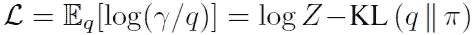

Equation 3: Objective lower bound for reverse KL. (Quoted from original paper)

# 嵌套变分推理

重要性抽样的一个常用策略是定义一个非标准化密度序列，该序列介于易于抽样的初始密度和最终目标密度之间。这使我们能够利用重要性重采样或[马尔可夫链蒙特卡罗](https://en.wikipedia.org/wiki/Markov_chain_Monte_Carlo) (MCMC)等技术，从较简单的密度构建更复杂的密度。

## 嵌套变分目标

NVI 以双向视角构建共同战略，为**建议**定义*正向密度*，为**中间目标**定义*反向密度*。例如，对于序列中的第`k`步，作者将**前面的目标** γ(k-1)与一个**正向核** `q(k)`组合形成**正向密度**，将*下一个目标* γ(k)与一个*反向核* `r(k-1)`组合形成*反向密度*。这在图 2 中用图形表示，在等式 4 中用符号表示。

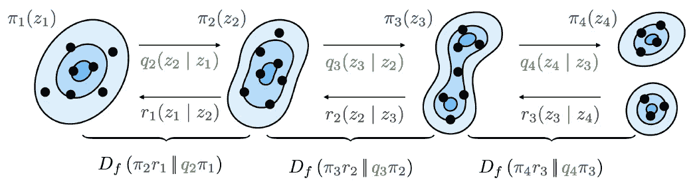

Figure 2: Nested variational inference minimizes an f-divergence at each step in a sequence of densities to learn forward proposals q(k), reverse kernels r(k-1), and intermediate densities π(k). (Quoted from original paper)

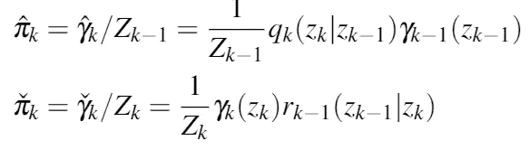

Equation 4: Forward and reverse densities defined for NVI. The symbols with a hat on top are for forward calculations, and the ones with a check are for reverse calculations.

使用这样的公式，目标是学习尽可能相似的正向和反向密度对。为了实现这一目标，NVI 目标被最小化，定义如下。

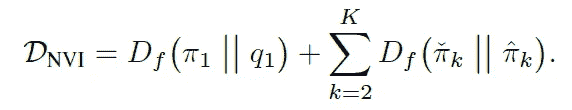

## 从中间密度取样

为了优化上述目标，需要从中间密度(k > 1)抽取样本。这是通过迭代方法实现的。考虑到对于先前的目标密度γ(k-1)为**适当加权的**对`(w(k-1), z(k-1))`，可以应用**顺序蒙特卡罗** sampling⁶来为第`k`步 via 找到该对

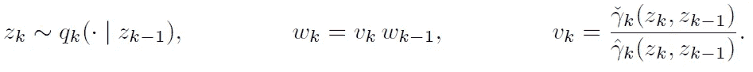

使用这种结构，我们可以首先证明`(w(k), z(k-1:k))`对于反向密度是**适当加权的**，如等式 5 所示。

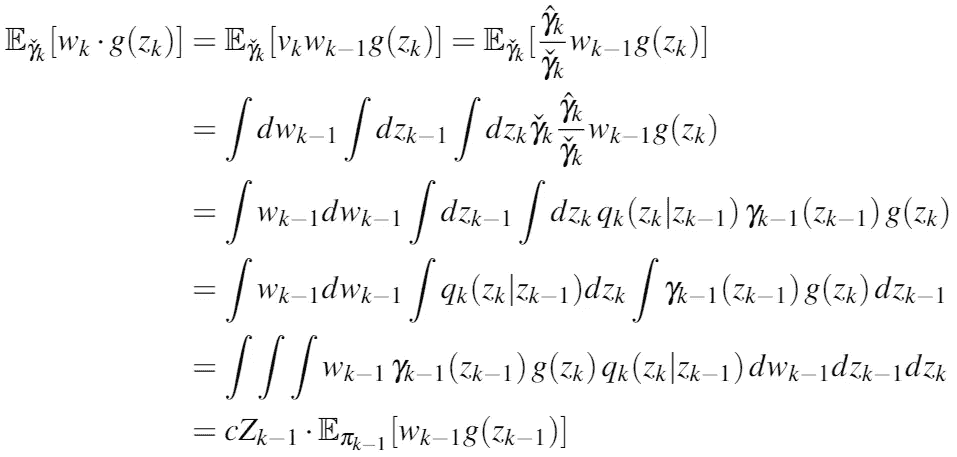

Equation 5: Proof for reverse density proper weights.

随后，我们可以很容易地表明`(w(k), z(k))`是**对建议密度的适当加权**，如等式 6 所示。

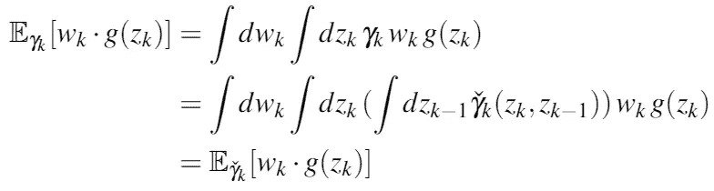

Equation 6: Proof for proposal density proper weights.

顺序重要性采样可以与保持适当加权的其他操作相结合，包括拒绝采样、应用 MCMC 转换运算符和重要性重采样。作者考虑了退火重要性 sampling⁷ (AIS)和序列蒙特卡罗 Carlo⁸ (SMC ),前者具有等式 7 中给出的退火路径，后者具有作为中间目标的滤波分布。

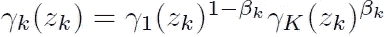

Equation 7: Annealing path for annealed importance sampling.

## 计算梯度估计值

目标密度π、正向内核`q`和反向内核`r`有 3 组主要参数。这些可以进一步分组为用于正向密度和反向密度的参数。作者在附录中给出了梯度的计算，并给出了结果。

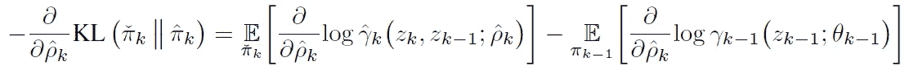

Equation 8: Gradient for forward KL objective w.r.t. forward parameters.

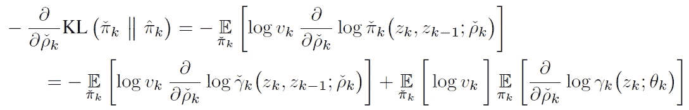

Equation 9: Gradient for forward KL objective w.r.t. reverse parameters.

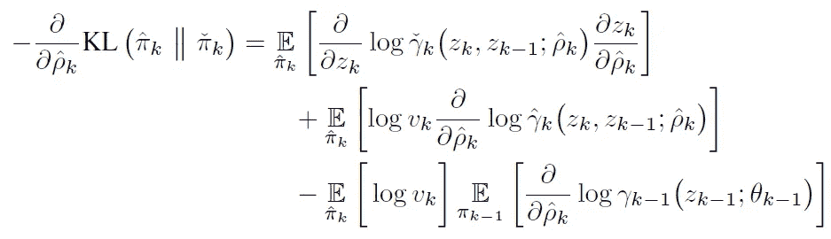

Equation 10: Gradient for reverse KL objective w.r.t. forward parameters.

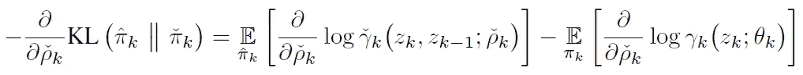

Equation 11: Gradient for reverse KL objective w.r.t. reverse parameters.

## 与重要性加权和自归一化估计量的关系

NVI 与现有方法的不同之处在于，它为每个嵌套层的变量对定义了一个目标，而不是为整个变量序列定义了一个目标。如图 3 所示，这可以避免**信噪比**随着样本数量的增加而矛盾地恶化的问题，这在普通 VI 构造中很常见。

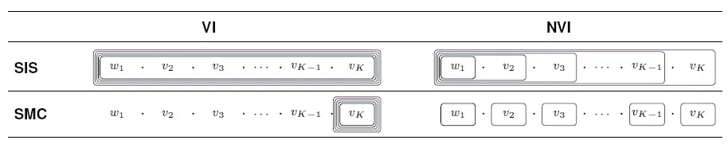

Figure 3: Weight contributions in the self-normalized gradient estimators for the forward KL-divergence for VI and NVI using SIS (no resampling) and SMC (resampling). VI computes gradient estimates using the final weights (SIS), which simplify to the final incremental weight when resampling is performed (SMC). NVI computes gradient estimates based on the intermediate weights (SIS), which simplify to the intermediate incremental weights when resampling is performed (SMC). (Quoted from original paper)

此外，NVI 允许我们计算特定采样器级别的梯度估计，这导致**更低的方差**以及潜在的**内存**优势(`O(SK) -> O(S)`)。

# 实验

执行的第一项任务是学习从非标准化目标密度取样，其中使用退火产生中间密度。

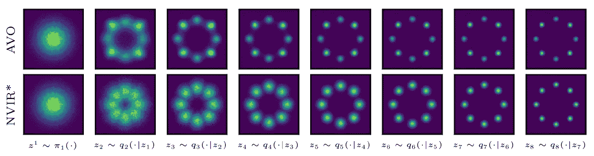

Figure 4: Samples from forward kernels trained with annealed variational objective (AVO), and NVI with resampling and a learned annealing path (NVIR*). (Quoted from original paper)

第二个任务是学习启发因子，以近似状态空间模型中未来观察的边际可能性。

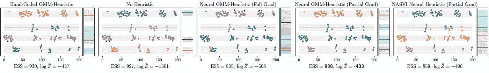

Figure 5: (Top) qualitative results of an instance with K = 200 time steps (x-axis). Observations are color-coded based on the inferred assignments. Each colored band corresponds to the inferred cluster mean and standard deviation; grey bands indicate the ground truth of the clusters. (Bottom) We compute logarithm of Z-hat and the ESS using 1000 samples and report average values over 2000 test instances. (Quoted from original paper)

第三个任务是从深度生成贝叶斯混合的少量例子中推断类的分布。

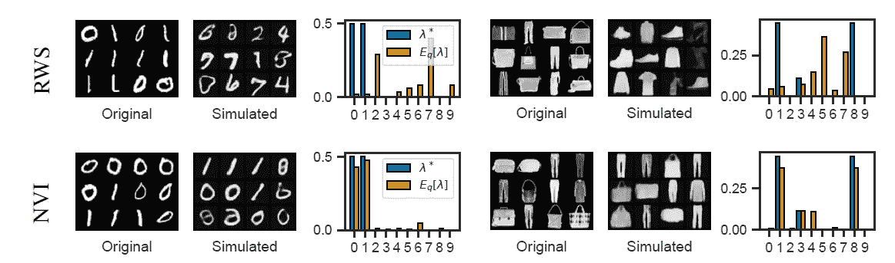

Figure 6: BGMM-VAE trained on MNIST & FashionMNIST with the RWS objective (Top) and the NVI objective (Bottom). (Left) Samples from a test mini-batch of size N = 300\. (Middle) Samples from the generative model, generated from the **λ** inferred from the test mini-batch. (Right) Comparison of ground truth **λ*** and the expected inferred value.

# 结论

作者成功地证明了经过 NVI 训练的采样器在从多峰密度、贝叶斯状态空间模型和分层深度生成模型采样时能够超越基线。

在这篇文章中，我们回顾了 NeurIPS 2021 年的论文<nested variational="" inference="">，尝试证明了一些结果，并修改了深度生成模型以及变分推理技术。但是，我们找不到相应的代码库，因此联系了作者。</nested>

[1]齐默尔曼，海科，等。“嵌套变分推理。”arXiv 预印本 arXiv:2106.11302 (2021)。

[2]雷森德、达尼洛·希门尼斯、沙基尔·穆罕默德和金奎大·威斯特拉。"深度生成模型中的随机反向传播和近似推理."*机器学习国际会议*。PMLR，2014 年。

[3]古德费勒，伊恩，等，“生成性对抗性网络。”*神经信息处理系统进展* 27 (2014)。

[4]金玛、迪德里克·p 和马克斯·韦林。"自动编码变分贝叶斯." *arXiv 预印本 arXiv:1312.6114* (2013)。

[5] Ranganath、Rajesh、Sean Gerrish 和 David Blei。“黑盒变分推理。”*人工智能与统计*。PMLR，2014 年。

[6]德尔·莫拉尔、皮埃尔、阿诺·杜塞和阿贾伊·亚斯拉。"顺序蒙特卡罗抽样器."皇家统计学会杂志:B 辑(统计方法学)68.3(2006):411–436。

[7]拉德福德·尼尔，“退火重要性抽样”统计与计算 11.2(2001):125–139。

8 德·弗雷塔斯、南多和尼尔·詹姆斯·戈登。*实践中的序贯蒙特卡罗方法*。由…编辑阿诺·杜塞。第一卷。№2.纽约:斯普林格出版社，2001 年。

 [## Mlearning.ai 提交建议

### 如何成为 Mlearning.ai 上的作家

medium.com](/mlearning-ai/mlearning-ai-submission-suggestions-b51e2b130bfb)