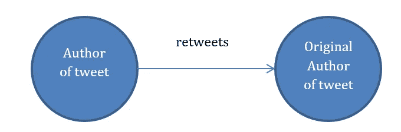
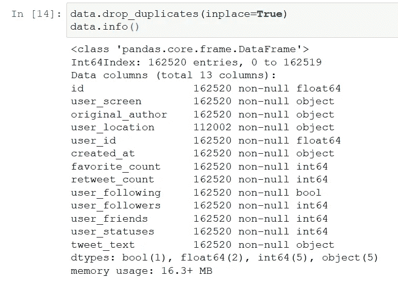
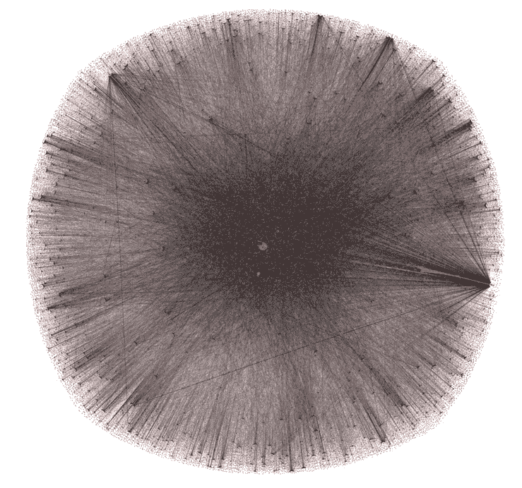
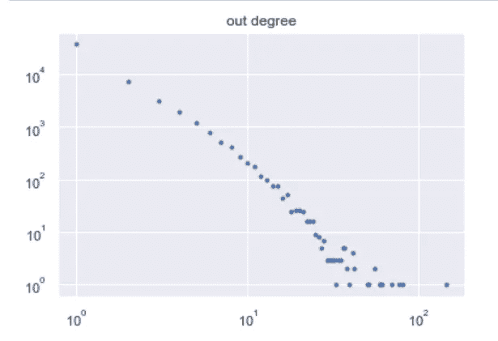
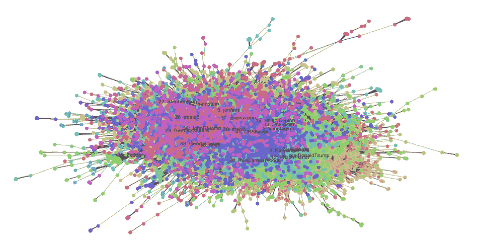
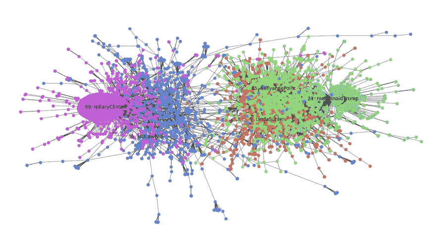

# 政治微博的网络分析和社区发现

> 原文：<https://medium.com/mlearning-ai/network-analysis-and-community-detection-on-political-tweets-9e0f21294e31?source=collection_archive---------2----------------------->

社交网络在人们的日常社交中发挥着重要作用。我一直着迷于社交网络的方方面面，以及人们使用社交网络时有趣的行为方式。例如，他们重新分享信息的速度，他们如何根据相似的兴趣相互分组，他们如何相互交流，等等。Twitter 一直是我最喜欢观察这一点的网络。出于这个原因，我决定分享我的一个老项目，该项目旨在通过绘制将人们连接成网络的关系来了解 Twitter 上形成的社区，并试图找出网络中的关键个人、群体以及个人之间的联系。

在每个国家引起主要观点发布和转发的最大事件之一是选举。虽然来得有点晚，但我在这个项目中使用的目标数据是美国 2016 年总统选举推文。我从全部推文中选取了一个公平的子集，组成了一个网络，看看它是如何分布的，哪些法律对网络有效，以及检查用户是否根据他们喜欢的候选人形成了社区等等。


Photo by [Jeremy Bezanger](https://unsplash.com/es/@unarchive?utm_source=medium&utm_medium=referral) on [Unsplash](https://unsplash.com?utm_source=medium&utm_medium=referral)

# 数据

我从哈佛大学的 [*数据库*](https://dataverse.harvard.edu/dataset.xhtml?persistentId=doi:10.7910/DVN/PDI7IN) 中检索推文，其中包含了大约 2.8 亿个推文 id 的庞大语料库，分为几个文件。它们被分成几个 tweet ids 集合。出于这个项目的目的，从 id 集合*选举过滤器 1* 到 *6* 下载了几千条推文。使用*[*Hydrator*](https://github.com/DocNow/hydrator)工具从六个不同的集合中检索推文。由于 Twitter 以 json 格式发布数据，因此 tweets 可以先用 R 处理，然后转换成 csv 格式。*

*为了做到这一点，我们可以使用 R 中的“jsonlite”包，在这里我们可以选择保存哪些 json 属性(我们不需要全部保存)，然后将它们作为属性添加到我们新保存的 csv 文件中。下面显示了代码的快照:*

```
*library(jsonlite) 
library(plyr) 
library(xlsx) 
library(csv) 
library(“data.table”) 
json1<-lapply(readLines(“election-filter-6.json”), fromJSON) id<-list()
for(i in 1:length(json1)){ 
   id[i]<-json1[[i]]$id } user_screen<-list()
for(i in 1:length(json1)){ 
   user_screen[i]<-json1[[i]]$user$screen_name } original_author<-list() 
for(i in 1:length(json1)){ 
        if(is.null(json1[[i]]$retweeted_status)==FALSE){    
           tmp<-json1[[i]]$retweeted_status$user$screen_name } else{              
           tmp<-”Null” } original_author[i]<-tmp }
...to_export<-cbind(id,user_screen,original_author,user_id,favorite_count,retweet_count,user_following,user_followers,user_friends,user_statuses,tweet_text)  
                                                     to_export_df<-data.frame(to_export)                                                           write.xlsx(to_export_df,"el-filter6_new.xlsx",row.names = FALSE)                             fwrite(to_export_df, file ="el-filter6_new.csv")*
```

*结果数据集总共包含 162，520 个条目和 13 个列属性。我们将关注网络创建的“用户屏幕”和“原创作者”属性。这个网络是用 Python 的 [networkx](https://networkx.org/) 包创建的，其中每个节点是一个用户，边是用户之间的“转发”连接。这意味着，如果该推文最初由用户 X 发布，并由用户 Y 转发；我们将有一个从用户 Y 到用户 x 的有向链接，换句话说，我们创建一个以‘user _ screen’为源，以‘original _ author’为目标的有向图，其中映射函数 f 是‘retweet’。首先，我们删除“original_author”字段为空的条目(它们不会被转发)，因为我们只检查用户之间的转发关系。*

**

*The way the graph is formed: The source node is the tweet author (who retweeted it) and the target node is the original author (who wrote it)*

*结果数据集的统计如下所示:*

**

*Dataset information*

*我们可以用以下函数创建图形(或网络，在这种情况下两个术语都是正确的):*

```
*retweets_G = nx.from_pandas_edgelist(tmp, source=’user_screen’,                                                                                                               
target=’original_author’, edge_attr=True,          create_using=nx.MultiDiGraph())nx.write_edgelist(retweets_G, ‘retweets_graph.csv’)*
```

# *网络属性*

*如前所述创建一个图，我们最终得到 65，920 个节点和 104，718 个连接。*

## ****节点度****

*我们可以用。degree()函数，它将返回网络中所有节点的度数。如果我们对它们进行排序，我们可以得到最大的枢纽，即指向和来自它的链接最多的节点。*

```
*node_and_degree = retweets_G.degree()(largest_hub, degree) = sorted(node_and_degree, key=itemgetter(1))[-1]*
```

*在像这样的网络中，我们有像希拉里·克林顿和唐纳德·特朗普这样的受欢迎的个人资料，通常这些个人资料充当最大的枢纽，因此具有非常高的节点度，而其他个人资料最多只有 1 度(被转发一次，或者根本没有)。*

**

*Graphical representation of the network*

*我们还可以计算其他网络统计数据，例如:自循环、密度等。*

```
*nx.density(retweets_G)nx.number_of_selfloops(retweets_G)nx.degree_assortativity_coefficient(retweets_G)*
```

## *幂定律*

*考虑到网络的不均匀分布，可以有把握地假设网页的幂定律适用于这个网络。在其定义中，它告诉我们有 k 个内链接的网站的数量大约是 1/k。在我们的例子中，被转发 k 次的 tweeters 的比例大约等于 1/k。如果我们将数据转换成双对数坐标，这种关系就形成了一个线性图。*

*我们可以计算幂律，并通过首先计算入度和出度频率，然后绘制它们来以图形方式显示它:*

```
*def get_frequencies(degree_dict):
 degree_freq = {}for node, deg in degree_dict.items():
 if deg in degree_freq:
 degree_freq[deg] += 1
 else:
 degree_freq[deg] = 1x = sorted(degree_freq.keys())
 y = [degree_freq[k] for k in x]
 return x, yx, y = get_frequencies(dict(retweets_G.out_degree(set(data.user_screen))))
plt.title(“out degree”)
plt.loglog(x, y, linestyle=’None’, marker=’.’, )
plt.show()*
```

*我们以一个证明幂律适用于此的图结束:*

**

*Power law for the out degree nodes*

## *友谊悖论*

*斯科特·费尔德研究了这一现象，他指出，一个人的朋友平均比他/她有更多的朋友。这被证明是真实的脸书友谊，推特关注连接，但在现实生活中也是如此。例如，你的伴侣平均比你拥有更多的伴侣。我们可以用转发网来检验友谊悖论，看看它在这里是否成立。由于它包含一定数量的高调节点，这些节点的转发量远远高于平均水平，因此友谊悖论不适用于整个网络。*

*就这个网络而言，78%的人口都是如此。也就是说，平均有 51，294 名用户转发了他们的帖子。另外 14，626 人我们可以假设是政治家、报纸门户网站和其他有影响力的人。计算友谊悖论的代码快照可以在我的代码的完整版本中找到。*

## *页面等级*

*一种著名的链接分析算法，根据重要性和权威性对网页进行排序。一个页面的页面排名是递归计算的，它取决于链接到它的所有其他页面的页面排名指标的数量。按照这种逻辑，我们计算 Twitter 在网络中的页面排名，并根据重要性对它们进行排序。PageRank 可以用 networkx scipy 实现来计算。*

```
*page_rank = nx.pagerank_scipy(retweets_G, alpha=0.9)sorted(page_rank.items(), key=lambda kv: kv[1], reverse=True)[:30]*
```

# *社区检测*

*在这样的大型社交网络中，尤其是与政治选举等重要话题相关的社交网络中，人们通过与一些用户互动，根据观点将自己分组。我们将使用 python 实现 Louvain 社区检测算法。在 Blondel 等人的工作中描述了该算法。该算法的思想在于模块性计算的基础，作为用于测量划分质量的度量。模块性度量是区间[-1，1]中的标量值，并且与社区之间的链接相比，度量社区内部的链接密度。*

*它迭代地寻找分区，首先将每个节点作为自己的社区，然后基于模块性计算，在每次迭代中，它将节点移动到新的社区，以便最大化该社区中的模块性。如果模块性没有变化，那么节点就留在自己的社区中。该算法的一个很大的优点是，它给出了算法的每个层次的中间结果。根据网络的不同，在到达具有最大模块性的最后一个之前，层级上可能有不同的数字。*

*要找到社区，首先我们需要包含 Louvain 实现的“社区”包。*

```
*import community
retweets_new=retweets_G.to_undirected()
partition = community.best_partition(retweets_new)size = float(len(set(partition.values())))
pos = nx.spring_layout(retweets_new)
count = 0.
for com in set(partition.values()) :
 count = count + 1.
 list_nodes = [nodes for nodes in partition.keys()
 if partition[nodes] == com]
 nx.draw_networkx_nodes(retweets_new, pos, list_nodes, node_size = 20,
 node_color = str(count / size))nx.draw_networkx_edges(retweets_new, pos, alpha=0.5)
plt.show()*
```

*从这里，我们可以访问所有被鲁汶发现的社区，以及他们的成员。然而把它们都画在一起有点乱，特别是如果我们想给每个社区涂上不同的颜色。例如，如果我们删除成员数量低于某个阈值的社区，我们可以解决这个问题。它将给我们留下最大的社区。我们还可以打印出每个社区中最大的节点。*

```
*# Keep only communities with a minimum of authors
counter=0
centers = {}
communities = {}
G_main_com = retweets_new.copy()
min_nb = 500
for com in set(partition.values()) :
 list_nodes = [nodes for nodes in partition.keys() if partition[nodes] == com]
 if len(list_nodes) < min_nb:
 G_main_com.remove_nodes_from(list_nodes)
 else:
 # Get center
 H = G_main_com.subgraph(list_nodes)
 d_c = nx.degree_centrality(H)
 center = max(d_c, key=d_c.get)
 centers[center] = com
 communities[com] = center
 # Print community
 print(‘Community of ‘, center , ‘(ID ‘, com, ‘) — ‘, len(list_nodes), ‘ retweeters:’)
 counter=counter+1
 print(list_nodes, ‘\n’)*
```

**

*Visualization of the top 20 communities by number of members in the network*

*虽然社区之间有所分离，但社区成员之间仍有较高的相互联系。我们还可以根据关键字过滤推文，以获得更有趣的结果和更小的社区(希望能更好地概述)。例如，如果我们只包含像“希拉里”和“克林顿”这样的词，我们会得到一个非常有趣的图表。有两个非常不同的社区，中间有一堵墙，这表明有少量的转发量在两个方向流动。这两个区块确实是政治候选人和接近他们的个人资料。很酷，不是吗？*

**

*The top 5 communities with over 1000 members plotted for the Clinton-related tweets graph*

*你可以在[https://github.com/popkristina/Twitter_community_detection](https://github.com/popkristina/Twitter_community_detection)查看我的完整代码*

# *参考*

1.  **社交网络分析:“如何引导”。*伦敦:内政部，2016 年*

*2.*优化 Twitter 社交网络中的社区发现。* **G. Suryateja，p . saravanan**，2018*

*3.*规模问题:社区检测算法的比较分析。* **保罗·瓦根瑟勒三世，汪锋**，2017*

*4.*大型网络中社区的快速展开。文森特·d·布隆德尔，让-卢普·纪尧姆，雷诺·朗比奥蒂，艾蒂安·列斐伏尔，2008 年**

*5.[https://en.wikipedia.org/wiki/PageRank](https://en.wikipedia.org/wiki/PageRank)*

*6.[https://www . technology review . com/s/523566/how-the-friendship-paradox-makes-your-friends-better-than-you-are/](https://www.technologyreview.com/s/523566/how-the-friendship-paradox-makes-your-friends-better-than-you-are/)*

*7.[https://python-louvain.readthedocs.io/en/latest/](https://python-louvain.readthedocs.io/en/latest/)*

*[](/mlearning-ai/mlearning-ai-submission-suggestions-b51e2b130bfb) [## Mlearning.ai 提交建议

### 如何成为 Mlearning.ai 上的作家

medium.com](/mlearning-ai/mlearning-ai-submission-suggestions-b51e2b130bfb)*