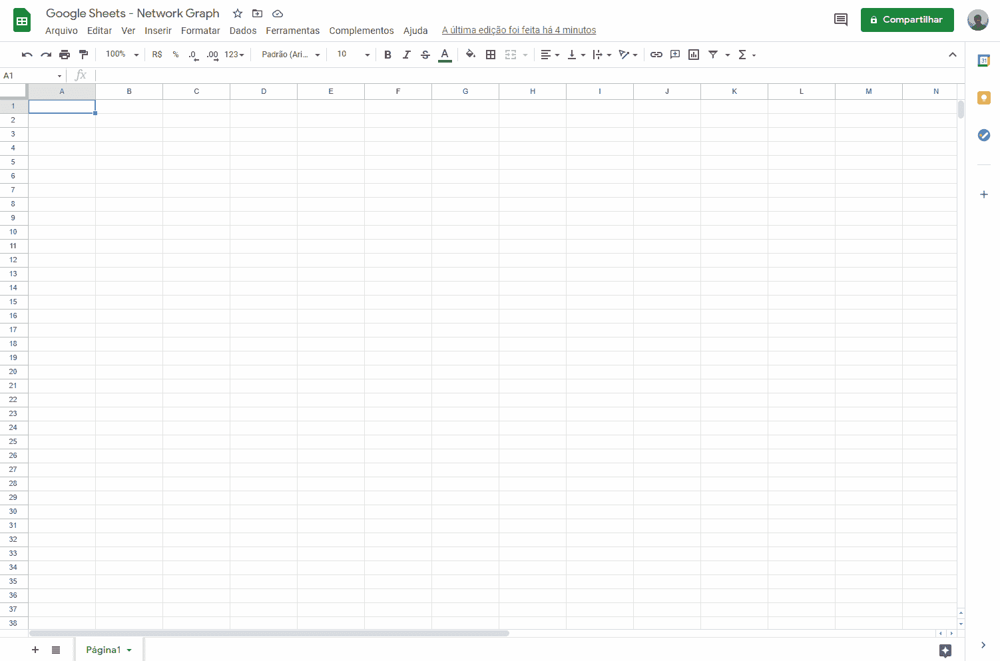
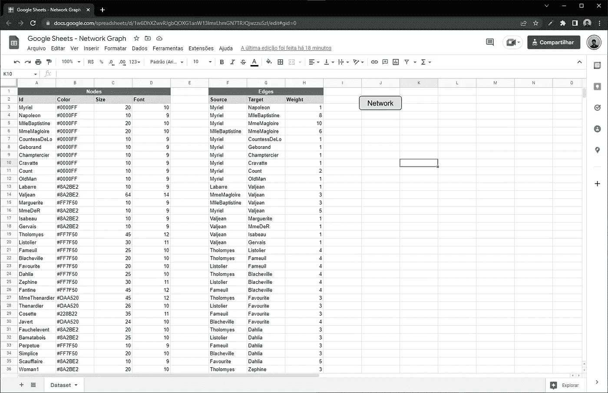
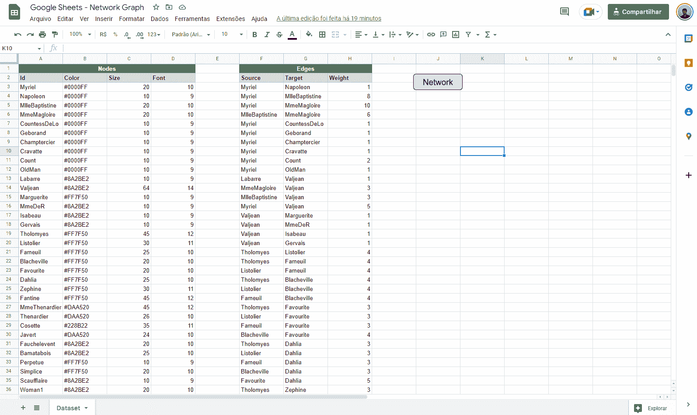
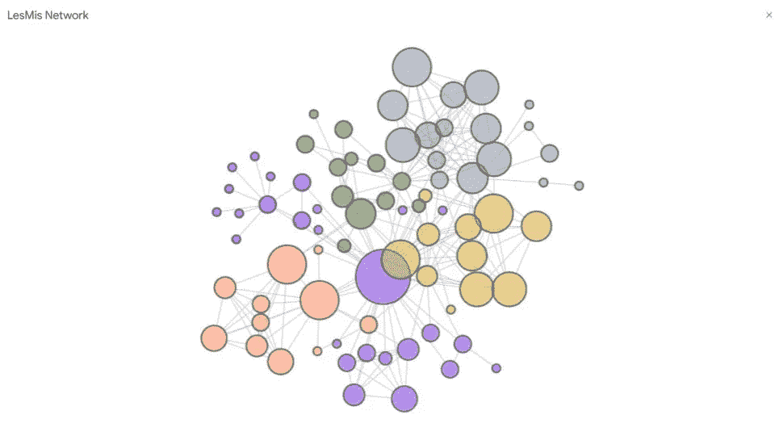
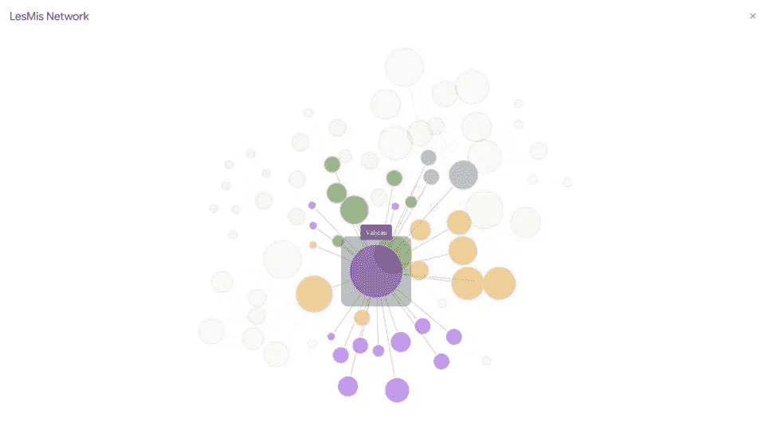
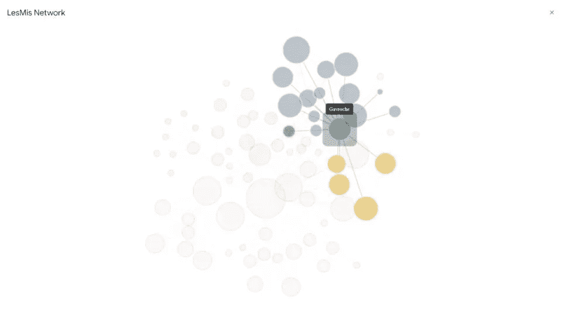
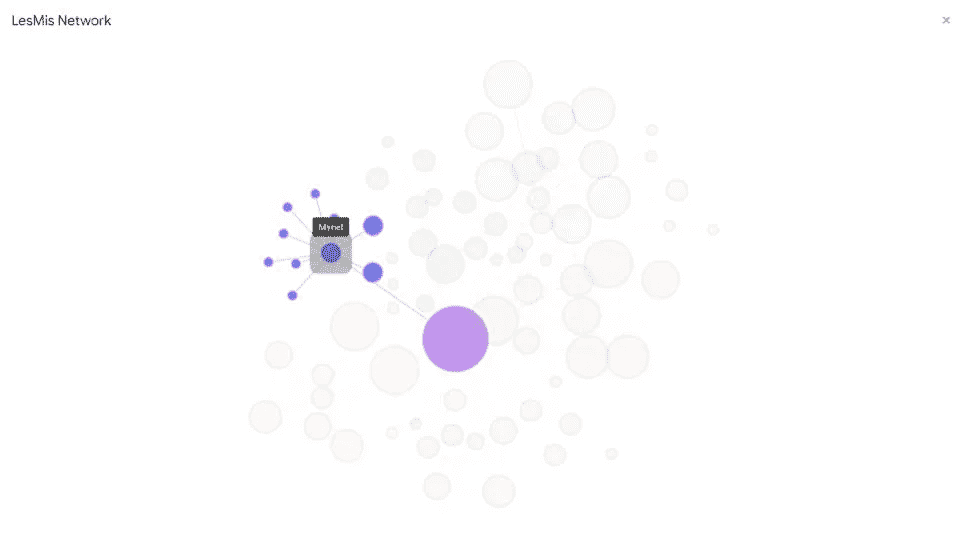

# 谷歌工作表中的网络图

> 原文：<https://medium.com/mlearning-ai/network-graphs-in-google-sheets-feda6891f18d?source=collection_archive---------0----------------------->

## **如何仅使用 Google Apps 脚本环境可视化组织网络**


Photo by [The Jarkata Post Travel](https://br.pinterest.com/pin/513199320035383922/?autologin=true) at Pinterest.

# **简介**

图是一对(V，A)，其中 V 是任意集合，A 是 V 的子集，其中 V 是 V 的所有无序元素对的集合，V 的元素称为**顶点，**，A 的元素称为**边** [1]。如果边有一个关联的方向(在图形表示中用箭头表示)，我们就有一个有向图(定向图)[2]。

图表应用的一些例子有:

*   棋盘上棋子的移动
*   确定两点之间的最短路径
*   确定两点之间的最大流量
*   化学键分析
*   组织网络分析

在这里，我们将在[组织网络分析](https://www.numerapeopleanalytics.com/blog/anlise-de-redes-organizacionais)的范围内讨论图表的创建，组织网络分析由一种分析贯穿组织的协作纽带、信息流、个人关系和指导实践的方法组成【3】。

# **图表和组织网络**

有几种工具可以用来创建图表，无论它们是更复杂的需要一些编程，还是更简单和更直接的(在这两种情况下总是有一个折衷)。下面是一个使用图形的网络示例。注意:可以与对象进行交互。

Network Graph. Source: the author.

尽管有各种可能的方法来生成这种可视化，但在流行的图形工具中并不容易找到，如 [excel](https://www.microsoft.com/pt-br/microsoft-365/excel) 、 [Google Sheets](https://docs.google.com/spreadsheets/u/0/) 、 [Google Data Studio](https://datastudio.google.com/) 等。即使是今天最流行的数据可视化平台之一的 Power BI，我们也依赖市场视觉来构建图表。

这就是这个部分出现的原因。在 **Google Sheets** 中有一种非常有趣的方式来生成组织网络可视化，使用该工具内置开发环境中的一些编程，这被证明是一种验证数据库、快速获得洞察力和绘制可视化草图的便捷方式。

# Google 企业应用套件脚本

Google Apps Script 是一个开发平台，它简化并加速了与 Google Workspace 交互的应用程序的创建。首先，代码是用 JavaScript 编写的，可以访问主要应用程序的内置库，如 Gmail、日历、播放器、表单等。不需要安装任何东西，因为代码编辑器直接在浏览器中提供，脚本在 Google 的服务器上执行[5]。

该平台的完整文档可在[这里](https://developers.google.com/apps-script)找到。有一个关于如何使用 **Google Sheets** 访问集成开发环境的演示。



How to access the Google Apps Script IDE. Source: the author.

请注意，原始环境背景是白色的。对于那些喜欢黑暗模式的人(比如我)，你所要做的就是使用谷歌浏览器的 [AppsScript Color](https://chrome.google.com/webstore/detail/appsscript-color/ciggahcpieccaejjdpkllokejakhkome) 扩展。

# 创建图表

首先，我们将根据生成图表所需的格式来组织数据。下图显示了预期的属性。



Expected data. Source: the author.

对于顶点(或*节点*，将出现以下属性:

*   Id:顶点的标识
*   颜色:顶点颜色的十六进制代码
*   大小:顶点大小，取决于它连接到另一个顶点的次数
*   字体:在两个字体值之间进行插值以优化可视化，从而为更相关的元素生成更大的字体

对于边，属性将是:

*   来源:起始顶点
*   目标:到达顶点
*   Weight:每个连接的权重，代表性地转换这对节点的出现次数(在 0 和 1 之间标准化)

数据集来自星球大战宇宙，已经从 [Kaggle](https://www.kaggle.com/ruchi798/star-wars?select=starwars-full-interactions-allCharacters.json) 下载。

下一步是编写从电子表格中收集数据的脚本，这样您就有了绘制图表的动态信息源。这将允许您为任何数据生成一个组织网络(例如，如果您是《星际迷航》的粉丝)。

基于上面的代码， *getData()* 将返回一个 JSON 对象，这个对象将由呈现视图的脚本使用。

除了 Google Scripts(带有特殊库的 JavaScript)中的代码之外，还可以在环境中编写 HTML 代码，这进一步增加了该工具的可能性。这允许我们创建(和发布！)web 应用程序[6]，以及其他几种可能性，比如在 Google Sheets 中创建一个图表。下面是创建图表的代码。

用于构建图表的库是 Cytoscape.js，对于这种类型的可视化来说，它非常通用和强大。你可以在这里找到完整的文档。代码的一个重要部分在第 24 行:

```
google.script.run.withSuccessHandler(printRet).withFailureHandler(printRet).getData();
```

它是客户端 API，负责应用程序脚本函数和 HTML 页面之间的通信，支持文件之间的集成。注意，在上面的例子中，我们使用了 *withSuccessHandler()* 和 *withFailureHandler()* ，两者都负责为每种情况返回一个函数:APl 调用中的通过或失败。

在完成编码步骤之前，我们有最后两个函数(在 JavaScript 中):保留函数 *doGet()* ，负责收集 HTML 输出，以及 *printGraph()* ，收集 HTML 代码的输出并显示在对话框中(在 Google Sheets 用户界面中)。

最后一点，结果！通过运行 *printGraph()* ，我们有了我们的组织网络，如下所示。



由于 Cytoscape.js 库几乎专门用于绘制网络图表，因此有几种定制输出的可能性。花(投资)几个小时来享受文档是可能的。

# 深入分析

现在我们已经生成了我们的组织网络，让我们来讨论网络中的四个不同的角色。首先，关于图表的一些注意事项:

*   颜色是通过群落检测分析获得的
*   边有不同的厚度，指的是给定的一对顶点在小说中相关的次数(较厚的顶点等于那些角色之间的更大的相互作用)
*   顶点的大小是指人物在小说中被提及的次数，经过处理(按范围分组)后，形象化变得更加和谐
*   网络的布局是使用 igraph 库中的“layout_nicely”获得的，它考虑了顶点之间的吸引力

接下来是完整网络的表示。



Complete LesMis network. Source: the author.

这是完整网络的一个更具交互性的表示。

Complete network. Source: the author.

## 中央连接器

中央连接器可能是组织网络中最先吸引更多注意力的配置文件。在使用顶点的大小作为附加信息的情况下，它们将是网络中最大的顶点，这取决于它所具有的连接数。下图突出显示了一个中心连接器，以及与此人连接的所有人。



Central connectors. Source: the author.

除了连接的数量之外，中心连接器的特征还在于这些连接的数量，作为与网络内不同群体交互的人，从而成为网络内的影响者，换句话说，作为人们自然求助的对象的人，与不同的人和区域建立关系。

## 边界扳手

组织网络中的第二个角色是边界跨越者。在使用颜色作为附加信息的情况下，这种类型的简档在不同的颜色之间接口，是将信息从一个区域带到另一个区域的人。下图突出显示了一个边界扳手，以及与此人有联系的所有人。



Boundary spanners. Source: the author.

边界扳手与中央连接器共享在区域之间传送信息的质量。然而，在这种情况下，这种类型的角色不一定是网络中的引用，也没有大量的连接。

这里的要点恰恰是成为两个或更多区域之间的接口，从而成为网络中不同群体之间信息流动的基本部分。

## 经纪人

经纪人在组织网络中起着至关重要的作用。这种类型的配置文件相对独立于颜色和顶点大小等额外属性的添加，因为代理的主要质量是将人或筒仓与网络的其余部分保持在一起。下图突出显示了一个经纪人，以及与此人有联系的所有人。



Brokers. Source: the author.

注意，在上面的例子中，联合的概念适用于某一组人，如果突出显示的顶点不再存在，他们将不再与网络有联系。然而，代理也连接那些没有自然交互的区域，在它们之间的信息流中扮演着重要的角色。

因此，可以得出这样的结论:代理在某种意义上类似于边界扳手，它是一个使信息流更容易的接口，同时它承担了中央连接器的角色，因为它是某些人的参考，即使没有大量的连接。

## 外围玩家

最后，本文要分析的第四种人物角色是外围玩家。它们通常位于网络的边缘，不需要添加颜色和大小等属性也很容易识别，因为它们在网络中很少(或者更强调地说，只有一个)连接。下图突出显示了一个外围玩家，以及与此人联系的所有人。


Peripheral players. Source: the author.

由于处于网络的边缘，外围玩家被认为是关键人物，这有两个主要原因:他们通过一个或几个人与他们所属区域(或整个网络)的其余部分联系在一起，如果这一联系离开组织(或出于某种原因，不再与所讨论的人物互动)，这种联系将直接改变；另一个原因是，通常外围玩家是拥有大量特定知识的人，由于他们与网络的凝聚力较弱(很少或单一连接)，他们是一个退出风险，可以带走大量知识，并在公司/团队中留下技术空白。

# **结论**

在大多数流行的数据可视化工具中，图形可视化可能并不容易实现。但是，Python、R、JavaScript 和其他技术中有几个库可以生成这种图表。该提案包括提供这些方法中的一种，带有几行代码，100%免费和可定制的工具，以便为那些希望以方便的方式从组织网络中获得洞察力的人增加可能性的范围。

除此之外，我们可以从组织网络分析中获得很多深刻的见解。从 Slack、Zoom、G-Suite 和其他来源获取数据，我们可以轻松预测关键人才流失、本应协同工作的团队之间缺乏凝聚力、组织中的不同文化以及许多其他问题。

完整的项目(代码和电子表格)可在[这里](https://github.com/higor-gomes93/network-google-spreadsheet)。

# **参考文献**

[1][https://www . ime . USP . br/~ yw/publications/books/teoriadosgrafos . pdf](https://www.ime.usp.br/~yw/publications/books/TeoriaDosGrafos.pdf)
【2】[https://pt.wikipedia.org/wiki/Teoria_dos_grafos](https://pt.wikipedia.org/wiki/Teoria_dos_grafos)
【3】[https://www . numerapeopleanalytics . com/blog/an Lise-de-redes-organizacionais](https://www.numerapeopleanalytics.com/blog/anlise-de-redes-organizacionais)
【4】[https://www . Gartner . com/en/documents/3980852/magic-1](https://www.gartner.com/en/documents/3980852/magic-quadrant-for-analytics-and-business-intelligence-p)

[](/mlearning-ai/mlearning-ai-submission-suggestions-b51e2b130bfb) [## Mlearning.ai 提交建议

### 如何成为 Mlearning.ai 上的作家

medium.com](/mlearning-ai/mlearning-ai-submission-suggestions-b51e2b130bfb)