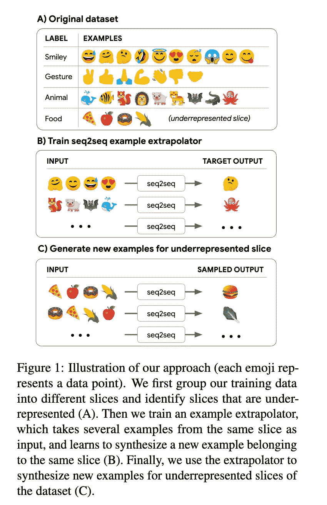
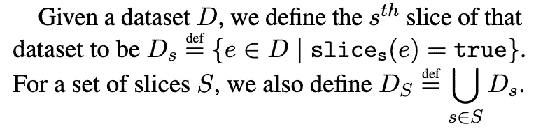
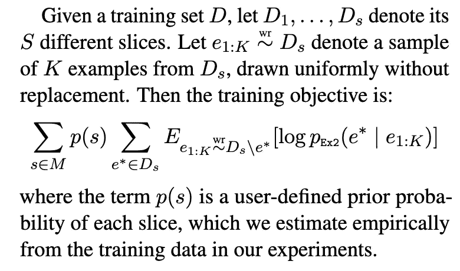
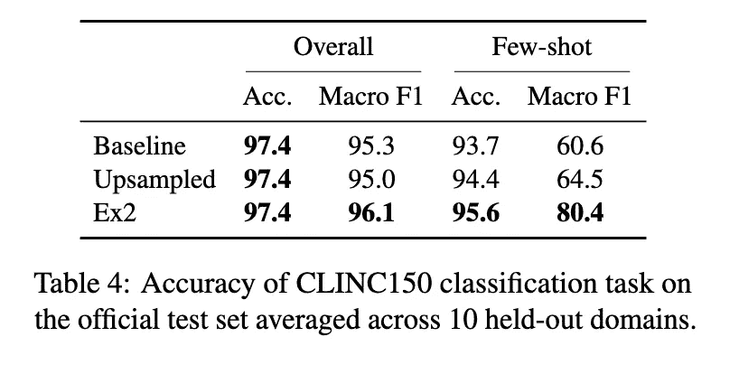
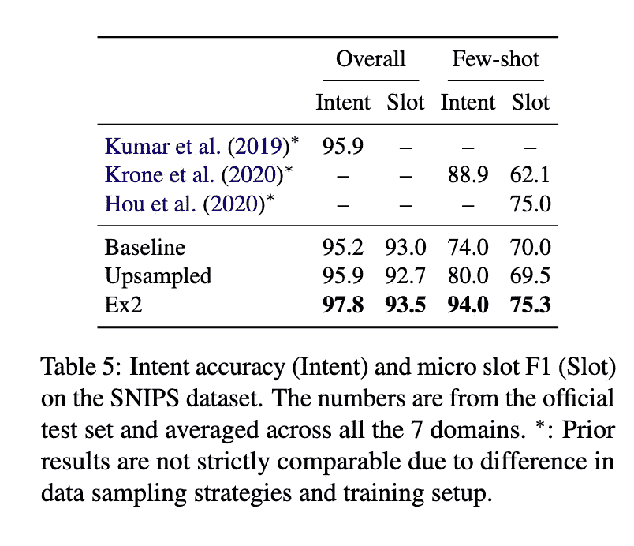
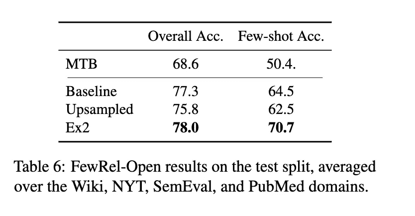
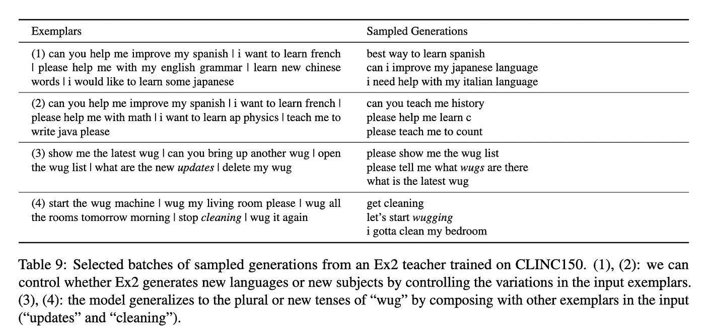

# 神经数据增强

> 原文：<https://medium.com/mlearning-ai/neural-data-augmentation-2330318e8430?source=collection_archive---------4----------------------->

这篇博客文章展示了谷歌最近发表的关于使用文本到文本转换转换器( [T5](https://ai.googleblog.com/2020/02/exploring-transfer-learning-with-t5.html) )模型的神经数据增强的研究工作。数据扩充是每个领域都需要的东西，无论是 NLP、计算机视觉还是任何其他领域。数据，如果大量可用或可以大量生成，将总是有助于深度学习模型更好地学习模式，并在看不见的数据集上进行推广。此外，数据扩充是一种针对有偏差或不平衡数据的流行解决方案，可以通过复制示例或使用试探法来合成新示例来实现。

最近，谷歌发表了这篇题为: ***“通过示例外推法增强神经数据”(***[【https://arxiv.org/pdf/2102.01335.pdf】](https://arxiv.org/pdf/2102.01335.pdf)***)***的论文，该论文讲述了如何为数据的欠表示切片生成合成示例，并显示出比其他技术更好的性能，如对欠表示数据切片进行上采样或任何其他关系提取( [FewRel](https://github.com/thunlp/FewRel) )和意图分类/槽填充任务( [CLINC150](https://archive.ics.uci.edu/ml/datasets/CLINC150) 和[酷！！在深入研究更多理论之前，让我们先看看下面的图片。](https://paperswithcode.com/dataset/snips)

Figure 1 from “Neural Data Augmentation via Example Extrapolation” by Kenton Lee et al.

查看上图，我们将对这种方法如何进行有一个完整的了解，并训练 seq2seq 模型，以便为代表不足的切片生成数据。好的，首先，我们要找到数据中未被充分代表的切片，首先，什么是数据切片？。根据这篇论文，一个片段可以是共享一个给定标签的所有例子的集合，或者是特定语言中的所有例子，或者是具有特定句法结构的所有例子。

他们称之为示例外推法(Ex2)的模型没有对数据如何切片做出任何假设，完全由从业者以暴露重要但未被充分表示的切片的方式对数据进行切片，然后 Ex2 可以将这些切片作为数据扩充的目标。因此，端到端流程的流程如下:

1.  将数据集分成切片。
2.  使用这些切片中的数据训练一个示例外推器。
3.  使用示例外推器为数据集的欠表示切片生成新的合成数据。
4.  在合成数据和真实数据的联合上训练模型。

## 任务制定

由于代表性不足的切片每个只有几个例子，所以本文将它们称为少炮切片**(记为 F)** ，并对这些切片进行数据扩充。数据的剩余切片被称为多次拍摄切片**(表示为 M)** ，这些切片具有足够的数据，并且不会接收数据增强。示例外推器(Ex2)仅用 **M** 训练，并用于推断 **F** 中的新示例，尽管在训练期间从未见过 F 中的任何示例。这是一个非常酷的想法:)。此外，术语**“少数镜头”**在这里意味着任务中的数据片段只有很少的例子。**“少数镜头”**的另一个概念表明整个任务的例子很少，这超出了本文的范围。

假设一个从业者定义了 S 个切片函数的列表，其中每个函数 slice_s(e)是一个布尔函数，指示示例是否属于 slice_s(可能与其他切片函数重叠)。所以总体看起来是这样的:

Defining slices over Dataset for Training seq2seq model (above figure from “Neural Data Augmentation via Example Extrapolation” by Kenton Lee et al.)

## 培训程序

T5 变压器模型在包含许多示例的用 **M** 表示的切片上的训练过程可以通过以下片段来理解:

Training objective formulation for T5 model training (above figure from “Neural Data Augmentation via Example Extrapolation” by Kenton Lee et al.)

> 为了优化上述目标，训练过程迭代所有训练切片 **(s∈M)** ，以及每个切片中的每个示例 **(e^∗)** 。对于每个示例，该过程从同一切片中抽取 K 个其他示例( **e_1:K)** ，不包括**e _∫**本身。训练程序然后优化作为输出的**e _∫**的对数似然，给定 **e_1:K** 作为输入。

## 使用的模型

作者使用了 T5 transformer 模型，这是一个在大型文本语料库上预先训练好的**T**ext-**T**o-**T**ext**T**transformer 模型。这种预训练为网络提供了大量的世界知识，这对于模型在给定示例之外进行推断的能力至关重要。你可以从这个[博客](https://towardsdatascience.com/t5-text-to-text-transfer-transformer-643f89e8905e)和官方[论文](https://arxiv.org/pdf/1910.10683.pdf)中读到更多关于 T5 的内容。

## 对标准基准数据集的评估

作者使用标准任务评估了他们的策略，如分类、槽填充、与相应标准基准数据集的关系提取。他们将他们的模型与**基线技术**和另一种称为**上采样**的数据增强策略进行了比较(来自“少镜头”切片的样本被上采样以匹配多镜头切片的中值频率，从而消除不平衡并改善训练。)的一些结果如下:

[CLINC150](https://archive.ics.uci.edu/ml/datasets/CLINC150) Dataset(above figure from “Neural Data Augmentation via Example Extrapolation” by Kenton Lee et al.)

[SNIPS](https://paperswithcode.com/dataset/snips) Dataset (above figure from “Neural Data Augmentation via Example Extrapolation” by Kenton Lee et al.)

[Few-rel](https://github.com/thunlp/FewRel) Dataset (above figure from “Neural Data Augmentation via Example Extrapolation” by Kenton Lee et al.)

## **使用 Ex2** 生成的示例

作者展示了 Ex2 在 CLINC150 数据集上训练后产生的一些例子。此外，在论文中，他们将他们训练以生成少数镜头切片示例的模型称为**教师模型**，使用实际数据和增强数据训练的下游模型称为**学生模型**。这类似于蒸馏，其中已经训练的较大的教师模型用于训练较小的学生模型，或者其中“教师”用于标记将由“学生”消费的大量未标记的输入(x)。Ex2 方法类似，除了教师不标记预先存在的 x，而是合成全新的(x，y)对。

Table 9 from “Neural Data Augmentation via Example Extrapolation” by Kenton Lee et al.

## 结论

这篇名为“ ***通过示例外推法进行神经数据扩充*** ”的论文提出了一种非常新颖的想法，即使用已经在非常大的语料库上预先训练好并且其中存在世界知识的神经模型来进行数据扩充。此外，这些模型能够很好地概括新的/看不见的示例，并生成遵循类似分布的新示例，该分布对应于数据的少数镜头切片中的示例分布。这种技术显示了对基线和标准方法的改进，以进行数据扩充，如上采样。

## **参考文献**

1.  [https://arxiv.org/pdf/2102.01335.pdf](https://arxiv.org/pdf/2102.01335.pdf)(***通过示例外推的神经数据增强*** )
2.  [https://arxiv.org/pdf/1910.10683.pdf](https://arxiv.org/pdf/1910.10683.pdf)(***T5 纸*** )
3.  [https://towards data science . com/t5-text-to-text-transfer-transformer-643 f89e 8905 e](https://towardsdatascience.com/t5-text-to-text-transfer-transformer-643f89e8905e)