# 神经网络初学者🧠

> 原文：<https://medium.com/mlearning-ai/neural-network-for-beginners-accb6fc1d1ab?source=collection_archive---------2----------------------->

## 第 4 部分:不同类型的神经元连接结构和处理图像数据集。


欢迎回到这个面向初学者的 Pytorch 和神经网络系列的第 4 部分。如果你正在阅读这篇文章，并且不知道这个系列的其他部分，我希望你能看看下面的链接

[](/mlearning-ai/pytorch-for-beginners-62c3fcd75f69) [## Pytorch 适合初学者💫

### 第一部分:张量的基本运算

medium.com](/mlearning-ai/pytorch-for-beginners-62c3fcd75f69) [](/mlearning-ai/pytorch-for-beginners-d759cb85ff1a) [## Pytorch 适合初学者💫

### 第 2 部分:神经网络基础及其从头实现

medium.com](/mlearning-ai/pytorch-for-beginners-d759cb85ff1a) [](/mlearning-ai/pytorch-for-beginners-efb19e529dc3) [## Beginners✨火炬报

### 第 3 部分:使用 Pytorch 内置方法构建神经网络

medium.com](/mlearning-ai/pytorch-for-beginners-efb19e529dc3) 

我们已经完成了张量的基础知识、神经网络的基础知识，并从头开始使用 PyTorch 内置库实现了神经网络。

现在我们将讨论人工神经网络中不同的神经元连接架构，以及如何在 Pytorch 上实现它们。

在本文中，我们将只讨论**单层和多层**,因为我的主要动机是向您解释神经网络的结构，但对于其他架构，我们将只进行概述，因为我将在接下来的文章中非常详细地向您解释它们。

存在五种基本类型的神经元连接结构:

1.  单层前馈网络
2.  多层前馈网络
3.  具有自身反馈的单个节点
4.  单层递归网络
5.  多层递归网络

在本文中，我们将使用 CIFAR-10 数据集，它包含 10 类 60000 幅 32x32 的彩色图像，每类 6000 幅图像。有 50000 个训练图像和 10000 个测试图像。


我会考虑到你们以前从未处理过图像数据集。让我简单地告诉你，我们将如何把这些数据作为神经网络的输入。

图像是一组具有确定形状、大小和通道的像素。考虑来自 MNIST 数据集中的图像，该图像包含手写数字的图像，其中每个图像是具有灰度通道的 28×28 的形状

这里，我们有一个数字 5 的图像。

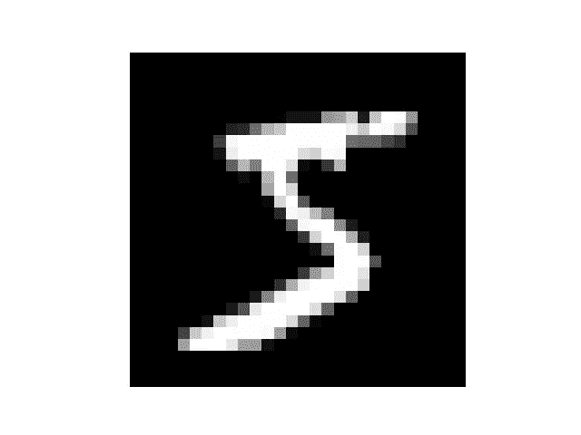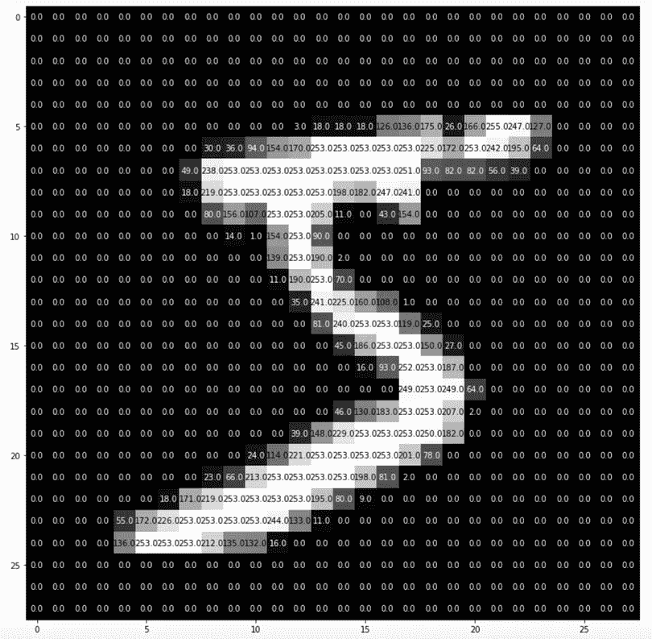

这里，图像的大小为 28 高，28 宽，只有一个通道，因此每个像素的值可以达到 0 到 255，其中 0 表示黑色，255 表示白色。值可以在 0 到 255 之间变化。

> ***所以用简单的语言来说我们的单个图像就是一个形状(高度、宽度、通道)的数组。***

但是在我们的例子中，我们有 3 个通道的大小为 32 x 32 的每个图像。现在 3 个通道表示 RGB(红、绿、蓝)，所以每个像素值的范围可以在(0–255，0–255，0–255)之间

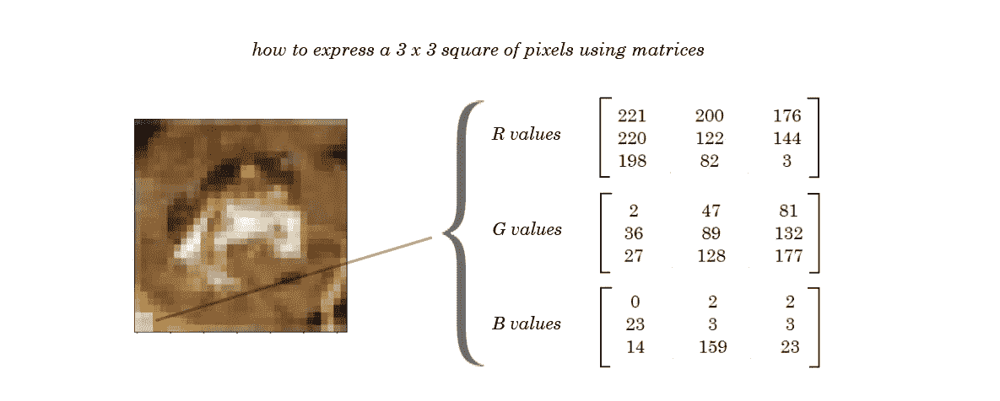

我们提供这些像素值作为神经网络的输入。

现在，我已经告诉过你们，单个神经元如何从输入中获取所有值，将所有输入与权重相乘，然后相加。

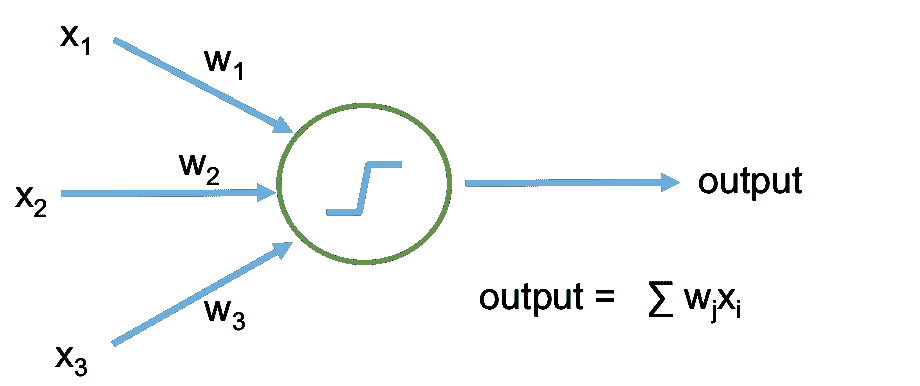

我已经告诉过你，为了简单起见，当我们有多个输入或神经元时，我们可以把输出写成 w(转置)* x

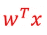

一层由许多神经元组成，每个神经元执行乘法和加法运算**一个神经元用一个圆表示。**

在我们的人工神经网络中有三种类型的层

1.  输入层
2.  隐蔽层
3.  输出层

**在输入层和输出层之间，所有的层都被认为是隐藏层**

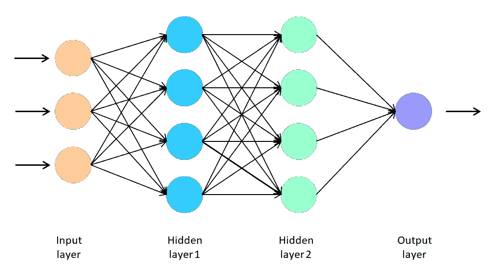

> **请记住，我们不将输入层算作一个层，因为它不参与任何类型的处理，它只是显示输入的数量，在许多文本和书籍中，您会看到输入层神经元由单个点(。)而不是圆圈**

因此，如果有人问你上图中有多少层，你的答案应该是 3(包括输出层)

现在，我们终于为主题做好了准备！

# 不同的神经元连接架构

## 1.单层神经网络

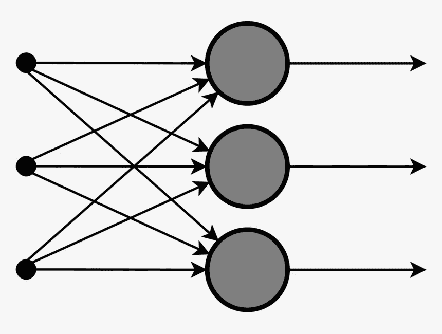

单层神经网络中没有任何隐藏层。它们只有两层输入和输出(**这里我们不认为输入层是一层，所以它只有一层**)。现在使用这个架构似乎没什么用，但是当我解释感知器模型的时候就清楚了。

## 2.多层前馈网络

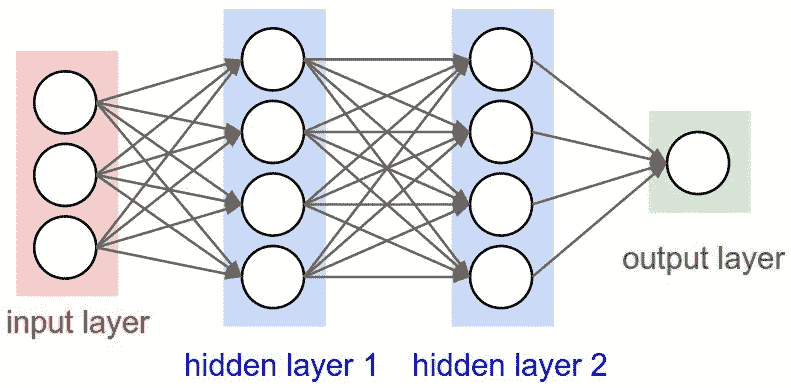

在这里，我们的输入层和输出层之间有不止一层。一个或多个隐藏层的存在使得网络的计算能力更强。

现在我们将学习如何在 Pytorch 中创建和使用多层网络。为此，我们将使用 CIFAR-10 数据集。我们已经讨论过这个数据集。

我们开始吧！

从 transform，我们使用 To。Tensor()获取数据并将数据转换成张量。Torchvision 在`torchvision.datasets`模块中提供了许多内置数据集，以及用于构建您自己的数据集的实用程序类。

 [## 数据集- Torchvision 0.12 文档

### Torchvision 在 torchvision.datasets 模块中提供了许多内置数据集，以及用于构建…

pytorch.org](https://pytorch.org/vision/stable/datasets.html) 

本文档包含火炬视觉提供的所有数据集。

这里，我们使用了 transform = transform，它使用 To。张量，这意味着无论我们将从 CIFAR-10 数据集获得什么数据，转换都会将该数据转换为张量。

`Dataset`存储样品及其相应的标签，`DataLoader`在`Dataset`周围包裹一个可重复标签，以便于获取样品。把可重复的单词记在心里。

在这里，我们将 train = False 作为一个参数，它将创建一个 test_data，为了加载和创建数据集的 iterable，我们还为 test_data 提供了一个 Dataloader。

在这里，我们创建了一个函数来显示数据集中的图像。这里我们首先将张量转换成 NumPy，因为 matplotlib 不能处理张量。正如我已经告诉你的，图像是一个三维数组(高度，宽度，通道)。看看这个例子


现在，当我们将图像从张量转换为 NumPy 时，我们会得到尺寸(通道、宽度、高度),因此我们使用转置方法来更改数组的方向，以便我们可以使用 matplotlib 打印图像。

还记得 iterable 这个词吗？

这里我们创建一个 iterable 对象，并使用 make_grid(用于在网格中显示图像)打印一些图像及其标签值。

这里 0 级标签表示飞机，1 级标签表示汽车，以此类推。

> 这是为你的图像数据集创建神经网络时最重要的一步。这里我们的图像是 3×32×32 的形状(3 个通道，32 个高度和 32 个宽度),因此第一层中神经元的总数将是 3×32×32。

看这里 nn。Linear 用于创建一个带 2 个参数的线性图层

1.  第一层中的神经元数量
2.  第二层的神经元数量

我们已经讨论了为什么我们将在第一层中采用 3*32*32 个神经元，但在此之后，您可以根据自己的选择给出任意数量的神经元(点击和尝试)。要在神经网络中添加另一层，只需创建一个新变量，如 self.layer2，并将前一层输出层的神经元数量作为输入。

## 您可以添加任意多的层/神经元，但请记住，您的模型可能会过度拟合，但我们将在接下来的讲座中学习如何克服过度拟合。

还有一件事你可以注意到，在我们的最后一层(第三层)的 3000 个神经元中，我们在输出中写了 10 个神经元。原因是我们的输出中有 10 个类，所以我们需要 10 个输出，也就是 10 个神经元。

`for i,data in enumerate(train_loader, 0 ):`

我知道我们还没有谈到优化器和激活函数！因为我会在以后的文章里给你详细解释。

我们已经在上一篇文章中讨论了如何编写一个 train_function。

这里不同的是:

1.  我们使用 Adam 作为优化器(我们很快就会明白什么是 Adam Chill)
2.  在这一行中，我们在 train-loader 中枚举，它有两个参数(train-loader 和从哪里开始的索引)

```
for i,data in enumerate(train_loader, 0 ):
```

3.至(设备)

```
device = torch.device('cuda' if torch.cuda.is_available() else 'cpu' )
```

在这一行中，我们检查 GPU 是否可用。如果 GPU 可用，模型会将张量发送到 GPU 进行快速处理。

休息一切照旧。

现在，你知道如何训练一个多层神经网络！

> 从这里开始，每个架构都将归入递归神经网络，我们将在后续文章中详细研究，但出于知识目的，我们将对这些架构进行概述。

## 3.**具有自身反馈的单个节点**

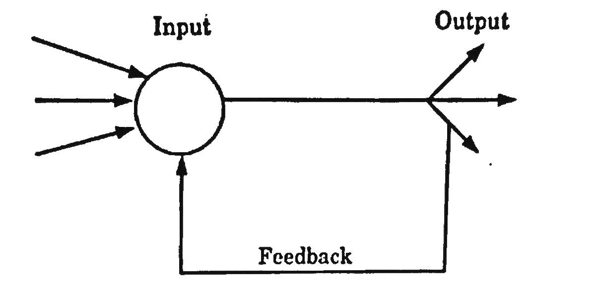

当输出可以作为输入被引导回同一层或前一层节点时，就会产生反馈网络。递归网络是具有闭环的反馈网络。上图显示了一个单个递归网络，该网络具有一个对自身进行反馈的单个神经元。

## **4。** **单层递归网络**

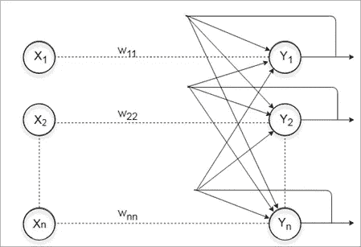

上述网络是具有反馈连接的单层网络，其中处理元件的输出可以被引导回其自身或另一个处理元件或两者。

## 5.**多层循环网络**

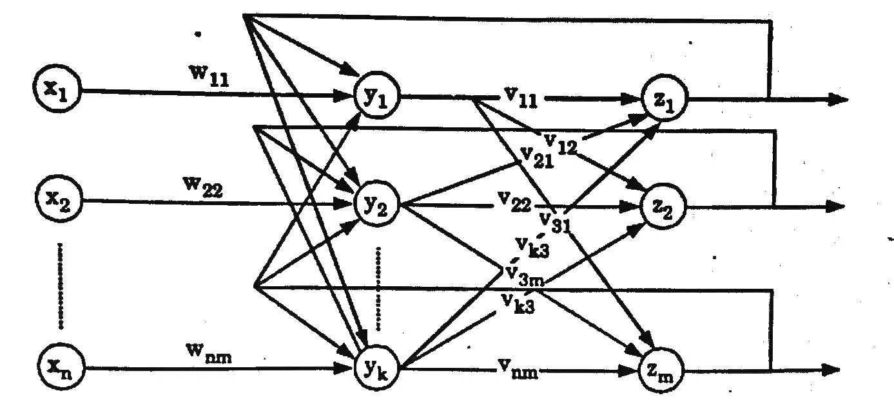

在这种类型的网络中，处理元件输出可以被引导到同一层和前一层中的处理元件，形成多层循环网络。它们对序列中的每个元素执行相同的任务，输出取决于前面的计算。每个时间步都不需要输入。

如果你有任何问题，请在评论中提问！

[](/mlearning-ai/mlearning-ai-submission-suggestions-b51e2b130bfb) [## Mlearning.ai 提交建议

### 如何成为 Mlearning.ai 上的作家

medium.com](/mlearning-ai/mlearning-ai-submission-suggestions-b51e2b130bfb)