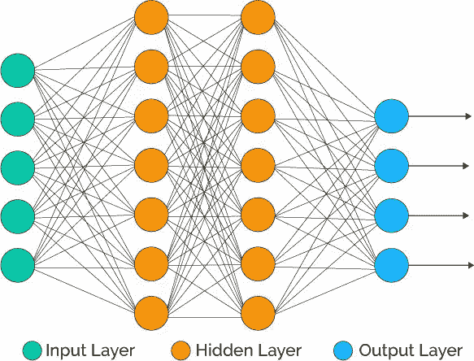
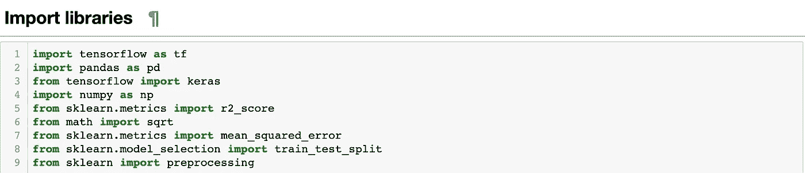
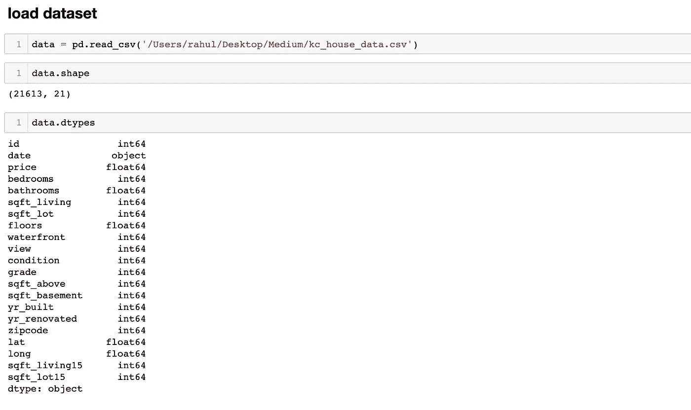
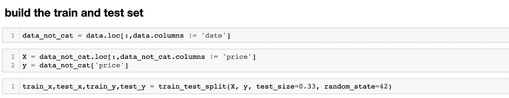
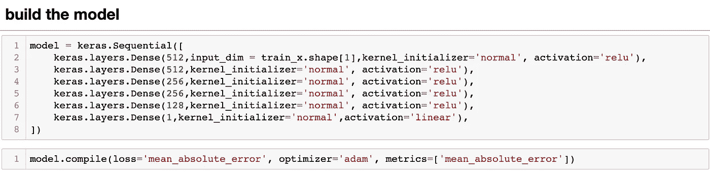
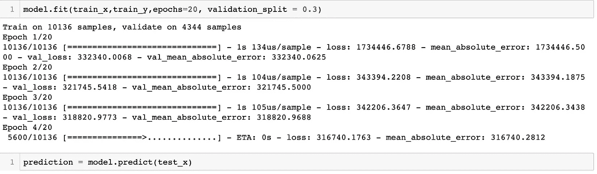

# 回归的神经网络理论与实现

> 原文：<https://medium.com/mlearning-ai/neural-network-theory-and-implementation-for-regression-9e35afd60a51?source=collection_archive---------1----------------------->

# **简介和背景**

在这篇文章中，我们将基于特征建立神经网络回归模型来预测房价。下面是实现及其背后的理论。如果你看到的话，神经网络基本上是从逻辑回归中推导出来的，正如我们在逻辑回归中知道的:

> 逻辑回归公式: **y = ax+b**

因此，对于每一层中的每个节点，我们将应用它，然后输出来自激活函数，该函数具有来自逻辑回归的输入，输出来自激活函数。

所以现在我们将实现具有 5 个隐藏层的神经网络。

# **实现**

1.导入我们将要使用的库

2.导入数据集并检查列的类型

3.现在，从数据集构建您的训练集和测试集。

4.现在我们有了数据，我们现在将制作模型，我将向您描述它将如何预测价格。

这里我们制作神经网络 5 隐藏层，激活层为“relu ”,节点在其中。最后输出的是房价。

5.现在，我们将拟合数据集，然后预测值。

这里我们准备好了神经网络，我们可以用它来预测房价。

# 未来需要记住的要点

1.  在这里你可以选择层数，然后你可以看到预测的变化。
2.  您也可以选择激活功能，这将导致精度的变化。

感谢浏览我的模式，希望在理论和实践上对你有所裨益！！！！

 [## Mlearning.ai 提交建议

### 如何成为 Mlearning.ai 上的作家

medium.com](/mlearning-ai/mlearning-ai-submission-suggestions-b51e2b130bfb)