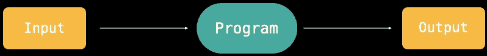
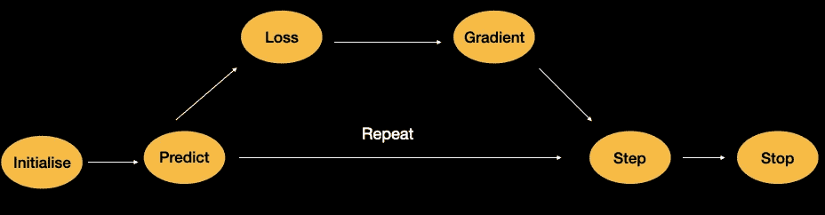
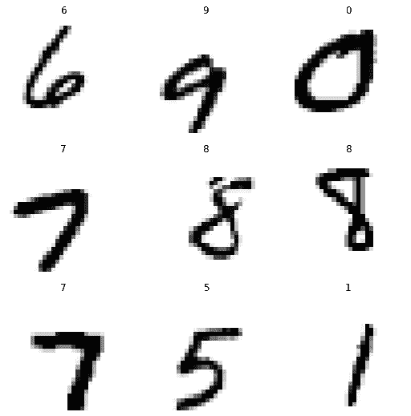
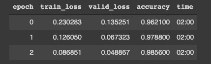

# 神经网络 101

> 原文：<https://medium.com/mlearning-ai/neural-networks-101-a0f93a2db842?source=collection_archive---------5----------------------->

## 让我们来解开神经网络背后的工作原理。


Photo by [Salmen Bejaoui](https://unsplash.com/@slmnbj?utm_source=unsplash&utm_medium=referral&utm_content=creditCopyText) on [Unsplash](https://unsplash.com/?utm_source=unsplash&utm_medium=referral&utm_content=creditCopyText)

神经网络这个术语根本不需要介绍，只有少数人知道神经网络的力量，很多人想学习这项非凡的技术。那你打算在这里读什么？与其讨论神经网络的类型和应用，我将通过神经网络的七个机制，使其强大和多才多艺。

# 什么时候我们称一个‘程序’为机器学习模型？

在深入研究之前，这是一个必须回答的重要问题，如果我们解开传统程序的警告，并用一些很酷的调整来代替它，那么我们可以称之为神经网络。



在传统的编程中，我们通常按顺序编写步骤让它运行。但是机器学习模型确实不同，我们不是给出如何解决问题的步骤，而是向他们展示问题的例子，让他们自己找出如何解决问题。

我们说过一些调整使传统程序成为机器学习模型，它们是:

*   **权重分配**的想法。
*   每个权重赋值都有一些**实际表现**的事实。
*   要求有一个“**自动装置来测试模型的性能。**
*   需要一个“**机构**，通过改变*的重量分配*来提高性能。

好吧，上面的步骤可能看起来很混乱，但是相信我，我们会成功的。这是由 IBM 的研究员亚瑟·塞缪尔在 1949 年提出的。我把他的话总结如下:

因此，一个具有自动权重分配方法的传统程序，其中每个输入都乘以一个权重，我们需要一个性能指标来帮助我们检查权重是否有帮助，如果没有帮助，我们需要一个“**机制**”来自动更新权重。这个过程一直持续下去，直到我们得到想要的输出。但是请记住，这是一个简短的解释，我们将以更详细的方式深入研究上述步骤。

# 将传统程序转化为成熟的机器学习模型

我们的目标是创建一个程序，它可以识别 3 和 7 的图像，并且只使用传统的编程来记忆。

找到 3s 的每个像素的平均像素值，然后对 7s 做同样的事情，怎么样？现在计算这个会给我们两组平均值，我们可以称它们为理想 3 和理想 7。现在，我们将我们的 3 和 7 的图像与我们的理想图像进行比较，这将帮助我们分类为一个数字或另一个数字。

所以我们所做的基本上是找到 3s 和 7s 的像素与理想图像的像素之间的差异。言归正传，我们如何将它转换成一个全功能的机器学习模型？

我们的像素相似度程序没有可用的参数，我们显然没有以下东西:

*   当然是任何一种重量分配
*   任何基于测试权重分配有效性的改进方法。

如果我们将这些调整整合到我们的像素相似性程序中，这确实可以称为机器学习模型。让我们对这种转换有一个高层次的概述，

*   我们可以查看每个像素，并为每个像素得出一组权重，使得最高权重与特定类别中最有可能是黑色的像素相关联。
*   假设右下角的像素不太可能被 7 激活，所以我们可以说 7 的权重很低，但是它们被 8 激活了，所以现在 8 的权重很大。

长期以来，我们一直说有一个**调整**，但这不是解决它的理想方式，我们可以称之为**优化函数**，它将有助于权重分配，并通过测试所提供权重的有效性来改进它。更具体地说，我们将研究**随机梯度函数(SGD)，神经网络中最常用的**优化函数。

简而言之，搜索像素中的最佳权重分配是搜索识别 3 和 7 的最佳函数的一种方式。



下面是我们将程序转换成机器学习模型要执行的步骤:

*   **第一步:**想办法初始化随机权重。
*   **步骤 2** :对于每幅图像，使用这些权重来预测它看起来是“3”还是“7”。
*   **第三步:**根据上面的预测计算模型有多好。这就是我们引入术语**损失函数的地方。**
*   **第四步:**计算*梯度*，在权重分配中起着至关重要的作用。它会告诉我们如何改变重量，这样我们的损失就会改变。
*   **步骤 5:** 步进权重，即根据计算出的梯度改变权重。
*   **第六步:**回到**第二步**，重复这个过程。
*   **第七步:**迭代，直到我们决定停止训练过程。

好了，这里隐藏了一些术语，让我们来澄清一下。

## 初始化

我们首先将参数(或)权重初始化为随机值。人们认为，从随机权重值开始非常有效。

## 失败

当模型的性能良好时，函数将返回一个较小的数字。标准的方法是将小损失视为好迹象，将大损失视为坏迹象。

## 步骤

一个简单的方法来判断体重是应该增加还是减少，就是试着少量增加体重，然后观察体重是增加还是减少。我们做这种增加和减少，直到我们找到一个满足我们的数量。

然而，我们使用微积分来处理这个问题。在不做上述调整的情况下，找到改变每个权重的方向和大致的幅度。我们通过计算**梯度来做到这一点。**这只是一个**性能优化**。

## 停止

这是我们选择历元来训练模型的阶段，我们将继续训练，直到模型的准确性开始变差或超时。

# 渐变是怎么回事？

我们谈论性能优化已经很久了，但它到底意味着什么呢？

机器学习完全是关于数学的，通过利用数学的力量，我们可以更有效地自动化一些过程。在我们的 SGD 优化过程中，我们使用**演算**来提高优化步骤的性能。

微积分将帮助我们快速计算我们的损失是上升还是下降，这取决于我们如何调整模型中的参数。梯度是一个重要的现象，有助于我们找到模型的最佳参数。

简而言之，**渐变会告诉我们需要改变多少权重来使我们的模型更好**。现在我们将看到梯度的最一般的定义，

> *梯度定义为上升/下降，即函数值的变化除以参数值的变化。*

当我们谈论微积分时，我们不应该忘记术语**导数，**它计算一个方程的变化。例如，二次函数在值 3 处的导数告诉我们该函数在值 3 处的变化有多快。简而言之，导数是方程的变化率。

这里的想法是，当我们知道我们的损失函数将如何变化时，我们知道我们需要做什么来使它变得更小。机器学习中的重要机制是有办法改变损失函数的参数，使其变得更小。我们称这个机制为梯度。

当计算损失函数时，它将返回不是一个而是许多权重(参数)，当我们计算导数时，我们将得到每个权重(参数)的梯度。

计算模型梯度的过程也称为**反向传播**。

到目前为止，我们已经讨论了相当多的术语，在下一个系列的博客中，我们将直接跳到一些代码中，我们将在 Pytorch 中实现上述 7 个步骤。

# 用代码弄脏双手


我们已经玩够了理论，现在是时候用代码弄脏我们的手了。在这一部分，我们将编写 PyTorch 和 fastai 代码，用称为 MNIST 的实际数据来表示这 7 个步骤。

> **注:本博客的笔记本版本可在此处获得** [**神经网络 101 Google Colab**](https://colab.research.google.com/drive/1kPD0IRk72akPOvqVpgOM5hNxRZoOeIja?usp=sharing) **，随意运行细胞并可视化结果。**

说得够多了，让我们直接开始吧，在开始之前，我们必须确保数据，尽管我们稍后会处理这个问题，让我们加载它们。

```
# Loading the mnist data and untar itdata_path = untar_data(URLs.MNIST)
```

在上面的代码单元中，我们刚刚下载了 MNIST 数据，函数`untar_data`负责下载并返回文件存储的路径。

我们将把它留在这里，现在，让我们看看如何用 Pytorch 计算梯度。

# 使用 Pytorch 计算渐变

我们知道什么是渐变以及为什么它们很重要，让我们看看如何使用 Pytorch 对它们进行编码。首先将看一看整个代码，然后将逐步分解每一行，看看他们做什么。

*   `xt = tensor(8.).requires_grad_()`:首先创建一个张量，通过将 **requires_grad_()** 设置为 True，Pytorch 中的任意张量将自动跟踪并计算该张量的梯度。
*   我们知道下一步我们会用张量进行一些计算，然后，最后，激活反向传播，这有助于我们得到梯度。
*   `yt.backward()`:这将通过激活反向传播来计算梯度。
*   `xt.grad`:将在计算过程中给出该变量的计算梯度。

但是你可能会想，我们为什么要使用 **require_grads_()** 呢，这个计算背后的底层机制是什么。在我最近的博客中，我解释了自动分化及其驱动这一切的潜在机制。

## 自动微分一瞥

当我们第一次用参数计算损失函数时，它会返回偏导数，我们称这个过程为向前传递。

正向传递负责用我们的参数计算损失函数。但我们知道，神经网络必须优化其参数，以实现最佳结果，即获得最小的损失误差。

但是，我们如何找到有助于神经网络找到最佳参数以使损失最小化的值呢？

渐变。

我们必须通过激活**反向传播**(或)反向通道来获取梯度。首先，我们执行一个正向传递，得到我们的偏导数，通过激活反向传播，使用链式法则来计算梯度。

**但所有这些与汽车差异化有什么关系呢？**

自动微分有助于我们跟踪这些计算，在反向传播过程中，它只需使用这些参数来计算梯度。我们知道，在偏导数的帮助下，我们能够计算可训练变量(权重和偏差)的梯度，并且仍然能够记录成千上万的导数和梯度。

> **注意**:梯度只会告诉我们函数的斜率，并不会告诉我们参数应该调整到什么程度。

那么如何告诉我们的参数，他们应该移动的方式，以尽量减少损失呢？

我们将使用一种叫做**学习率**的东西。

梯度告诉我们方向，但不是方向的大小(即我们必须采取的步骤)。这就是我们的**学习率**有所帮助的地方，它告诉我们每一步应该有多大(或者换句话说，它给了我们应该相信梯度的程度，并朝着梯度的方向前进。

所以我们将梯度乘以一个小的数(学习率)来步进权重。

# 和端到端 SGD 示例

我们现在是有趣的部分。让我们对我们在博客的前一部分中讨论的七个步骤进行编码。在进入代码之前，让我们回顾一下这七个步骤，

*   **第一步**:想办法初始化随机权重。
*   **步骤 2** :对于每一幅图像，使用这些权重来预测它看起来是`3`还是`7`。
*   **第三步**:根据以上预测，计算模型有多好。这就是我们引入损失函数这个术语的地方。
*   **第四步**:计算梯度，梯度在权重分配中起着至关重要的作用。它会告诉我们如何改变重量，这样我们的损失就会改变。
*   **步骤 5** :步进权重，即根据计算出的梯度改变权重。
*   第六步:回到第二步，重复这个过程。
*   **第 7 步**:迭代直到我们决定停止训练过程。

现在代码来了！

正如我们所知，前 4 个步骤非常相似和简单，所以我不会谈论这一点。

*   `params.data -= lr * params.grad.data`:在这里，我们将我们的学习乘以我们的梯度并更新值。一个特殊的方法告诉 PyTorch 我们想要计算值处变量的梯度 w.r.t。(xt →变量，3 →值)
*   `params.grad = None`:将渐变设置为零，这样就不会与之前存在的渐变相加。

让我们创建一些虚拟数据，并使用上述函数进行训练。

如果有些代码没有意义也没关系，因为这篇博客的重点是渐变和在这个过程中发生的工作流程。就像我之前说的，笔记本包含打包的代码，人们可以按顺序执行它并可视化结果。

# 用 Fastai 结束

让我们用实际数据结束这篇博客，并训练一个识别数字的模型。在这篇博客中，我们不会使用 Fastai 的中级组件，而是严格坚持使用低级 API，并使用它创建一个模型。

此外，如果代码没有意义也没关系，我只是想向人们展示如何使用 Fastai + Pytorch 来构建模型。

让我们分解上面的代码，

## `Datasets`

数据集预期，

*   我们想要使用的项目
*   转换(输入和输出应该如何构造和输出)
*   分割的类型(训练和测试)

解码`dsets`:

*   `PILImageBW` - >创建 PIL 映像(接受文件路径)
*   `.create` - >负责进入模型前的预处理。这适用于 X 和 y，更像是各种输入的自定义实现。
*   `splits`本身并不做拆分，我们只是创建了对象的一个实例，稍后传递项目会给我们训练集和测试集。

## 转换

我们将文件名转换为图像，但对于机器学习模型，我们必须将图像转换为张量(数字表示)，并使我们的模型易于在其上学习模式。

我们需要对数据进行一些转换！这些将需要:

*   确保我们的图像都是同样的大小
*   确保我们的输出是我们的模型想要的张量
*   给一些图像放大

```
# Creating transforms for our data by hand (left to right)tfms = [ToTensor() , CropPad(size = 34 , pad_mode = PadMode.Zeros) , RandomCrop(size = 28)]
```

最后，我们还需要一件事，那就是在 **GPU 实例**期间应用的转换，或者换句话说，应用于每个批处理的转换。

使用小批量的重要原因是它们可以在 GPU 上运行，因此计算速度会更快。此外，批处理可以防止训练过程中的偏差，并帮助训练更快地收敛。

我们必须将我们的**数据集**加载到`DataLoaders`中，这样它将帮助我们对数据进行批处理，并在训练期间发送一批完整的数据。

```
# Creating the batch transforms
gpu_tfms = [IntToFloatTensor() , Normalize()]# Building our dataloaders
dls = dsets.dataloaders(bs = 128 , after_item= tfms , after_batch= gpu_tfms)
```

让我们想象一下我们的图像。



看那个，多漂亮啊？从文件路径到实际图像，我们已经走过了漫长的道路！

但是我们已经达到了这个博客的目标，下一步是创建和拟合模型。这个总结部分更像是对了不起的 Fastai 人的一个大喊，没有他们，这个博客一开始就不可能。

在建立和训练我们的模型 3 个时期或 3 次迭代后，我们将有大约 98%的准确率，这意味着我们的模型在识别数字方面做得很好。



Our model’s result

建议您查看一下这个博客的笔记本版本，亲自接触一下这些代码。下面给出了该资源的链接。在那之前，

快乐学习！

**资源**

*   [本博客笔记本版](https://colab.research.google.com/drive/1kPD0IRk72akPOvqVpgOM5hNxRZoOeIja?usp=sharing)
*   [Fastai 课程](https://course.fast.ai/)
*   [Pytorch 教程](https://pytorch.org/tutorials/)
*   [张量流自动微分](https://ashikshafi0.medium.com/auto-differentiation-with-tensorflow-790edd34a50a)

[](/mlearning-ai/mlearning-ai-submission-suggestions-b51e2b130bfb) [## Mlearning.ai 提交建议

### 如何成为 Mlearning.ai 上的作家

medium.com](/mlearning-ai/mlearning-ai-submission-suggestions-b51e2b130bfb)