# 神经网络

> 原文：<https://medium.com/mlearning-ai/neural-networks-ba6fa76eb719?source=collection_archive---------9----------------------->

DeepMind 系列讲座笔记。

这里展示的大部分图片来自 DeepMind 讲座 2 的 [***幻灯片*** *。*](https://storage.googleapis.com/deepmind-media/UCLxDeepMind_2020/L2%20-%20UCLxDeepMind%20DL2020.pdf)

## 什么是人工神经网络？

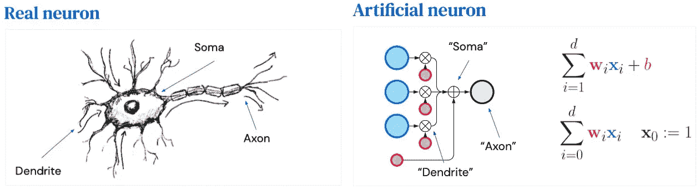

**Figure 1**: A simplified version of a real neuron in human brain vs an artificial neuron in a neural network.

当谈到深度学习和神经网络时，我们经常看到或听到真实神经元与人工神经元的类比。但是这两者到底有什么相似之处呢？(*图 1*

***真正的*** 神经元是人脑中的一种特殊细胞，它代表一种简单的计算。真正的神经元包含三个基本部分:

*   多个*树突*接收来自其他神经元的输入。
*   一个 *soma* 来执行简单的计算
*   一个*轴突*产生一个输出

据估计，人类大脑包含大约 860 亿个这样的神经元。每个神经元都与成千上万的其他神经元相连，形成网络。

一个 ***人工*** 神经元是 ***人工*** ***神经网络(模型)*** 的一个积木。每个人工神经元代表一个简单的计算，并反映了来自真实神经元的一些神经生理学观察。然而，这并不意味着重现它们的动态。人工神经元还包含三个重要的元素，用下面的公式表示:

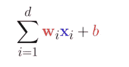

*   **x** :输入
*   **w** :与每个输入相关的权重
*   **b** :偏置

在这个人工神经元中，“树突”接收那些(蓝色)输入，并传递给“体细胞”。“soma”然后执行一些简单的计算，将每个输入与其相关联的(红色)权重相乘，并将其与偏差相加。最后，“轴突”产生最终输出。

> **注 *:*** 在机器学习中，我们经常将这些术语互换使用。**线性**表示**仿射。层中的神经元**通常被称为**单元**。**参数**通常被称为**权重。**

## 我们如何构建一个神经网络？

现在，我们知道什么是神经网络。我们可能想知道如何构建这样的网络。让我们从一个单层神经网络开始(*图 2* )，并从那里建立复杂性。

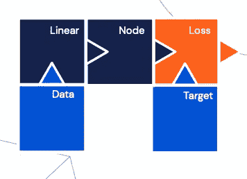

**Figure 2**: A single-layer neural network

一个 ***单层*** 神经网络由(*图 3* )组成:

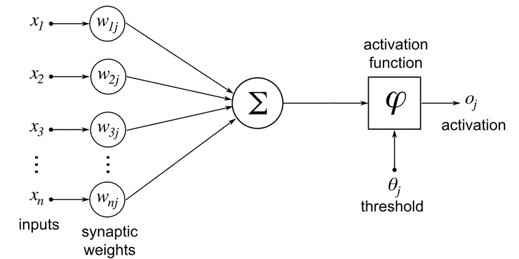

**Figure 3**: A single layer perceptron with n inputs with their corresponding synaptic weights. All weighted inputs are added and an activation function controls the generation of the output signal

*   一个**输入**层:包含矢量化输入
*   一个**线性**层:一个人工神经元的集合，可以有效地向量化，并且容易组成。
*   一个**激活函数**:一个通常用于诱导更复杂模型的对象。该对象引入了非线性行为。它产生概率估计，并有简单的导数。*表 1* 描述了三种标准激活功能及其用法和注意事项:

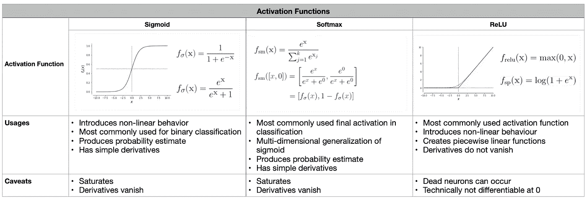

**Table 1**: Most commonly used activation functions

*   A **损失**:损失函数计算出的值，用于评估模型的性能。更小的损失意味着更好的模式。对于不同的任务，有许多损失函数。然而，我们用于二元分类的最常见的损失是 ***交叉熵损失*** *(图 4)* ***。***

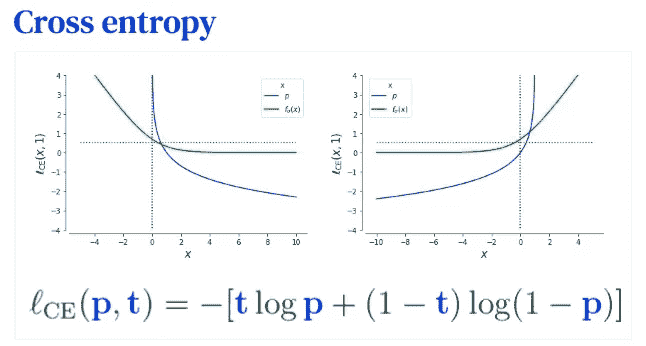

**Figure 4**: Cross entropy loss

其中 **t** 是我们的目标， **p** 是我们的预测。交叉熵损失也称为 ***负对数似然*** 或 ***逻辑损失。***

*   一个**目标**:数据的地面真相

现在，我们有了一些构建单层神经网络的基本要素。我们用它来构造一个两层的神经网络。

一个 ***两层*** 神经网络(*图 5* ):

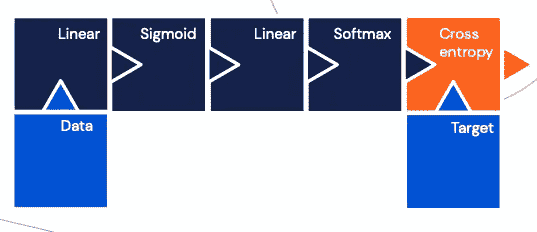

**Figure 5**: A two-layer neural network

我们可以看到这些部分是高度可组合的功能，可以以任何方式排列。然而，我们需要巧妙地将它们组合起来，以获得新的品质。

> **注意:**添加层会增加模型的深度，而添加神经元会增加模型的宽度。深度模型比广度模型更容易表达对称性和规律性。

最后，我们可以通过添加更多层来扩展我们的神经网络(*图 6* )。每一层都越来越抽象，以检测不同的特征。

一个 ***多层*** (深度)神经网络(*图 6* ):

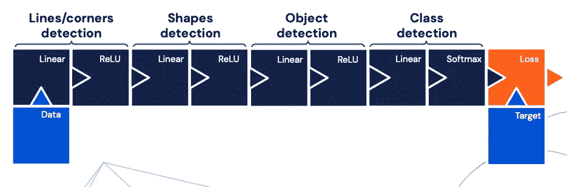

**Figure 6**: A multi-layer neural network

太酷了！现在，我们有了构建和修改神经网络结构的基本知识。到目前为止，我们所遇到的被认为是一个 ***正向*** 传递，我们从左(输入)到右(输出)正向传递变量的值。然而，对于一个模型来说，这还不足以学习和最小化损失。所以让我们来看看:

## 神经网络是如何学习的？

首先，我们需要知道如何将一个神经网络表示为一个 [*计算图*](https://www.tutorialspoint.com/python_deep_learning/python_deep_learning_computational_graphs.htm) ( *图 7* )。

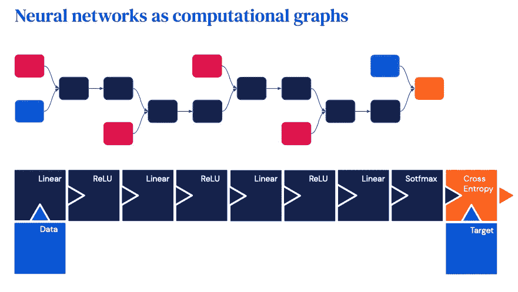

**Figure 7**: Neural networks as computational graphs

因此，计算图是一个有向图，其中每个节点代表一个数学运算。由于神经网络由多个可组合的函数组成，我们希望将其描述为计算图，以便更好地表达和评估那些数学表达式。

那么，我们需要复习一些 [***线性代数***](https://towardsdatascience.com/gradient-descent-algorithm-a-deep-dive-cf04e8115f21) ***。***

***梯度*** *(图 8)* :从 d 维空间到标量空间的函数。计算梯度无非是计算偏导数的向量。高阶抽象中的偏导数只是函数增长最多的一个方向，而负梯度是下降最多的方向。对于 jᵗʰ维函数，我们有这个函数关于 jʰ输入的偏导数。

***雅可比矩阵*** *(图 8)*:kᵗʰ维数泛化如果你有 k 个输出，那么它是一个矩阵，其中你有 iᵗʰ输出相对于 jᵗʰ输入的偏导数。这个雅可比矩阵集合了 ***反向传播*** 所需的偏导数，称为一个 ***向后*** 传递。

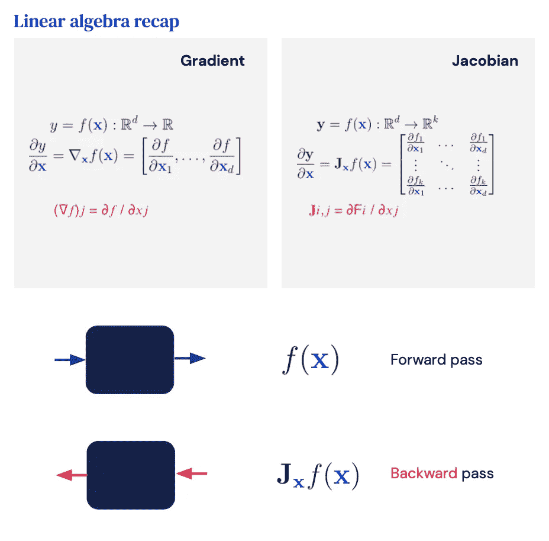

**Figure 8**: Gradient and Jacobian recap

***【梯度下降】(GD)*** *(图 9)* ***:*** 求给定函数的局部极小值/极大值的一种迭代一阶优化算法。GD 通过取从当前点获得的值来迭代计算下一个点，然后减去/加上学习率乘以该特定点的梯度。

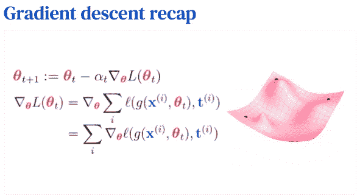

**Figure 9**: Gradient descent recap to minimize the loss function

其中 **θ** 是我们要调整以最小化损失(代价)函数的参数(权重)，而 **α** 是学习率以缩放梯度。

> **注:**学习率的选择至关重要。此外，还有其他基于 GD 开发的优化算法，如 Adam 或 rms prop…然而，Adam 是主要用于训练神经网络的黄金标准优化算法。

最后，让我们把所有的碎片放在一起！

让神经网络学习:

*   首先，我们将 x 作为输入进行正向传递，并计算成本 c 作为输出*(图 10)* 。

**Figure 10:** A forward pass

*   然后，我们从 c 点开始进行反向遍历，计算计算图*(图 11)* 中所有节点(包括代表权重和偏差的节点)的梯度。

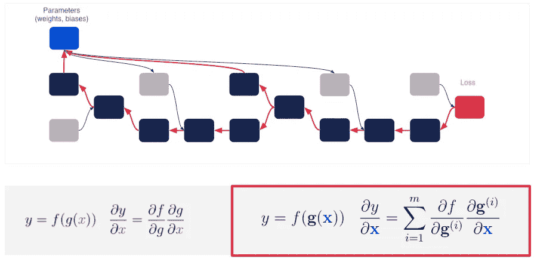

**Figure 11:** A backward pass

*   然后，我们通过应用梯度下降算法来更新权重(参数)。

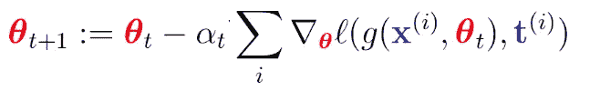

*   我们重复这个过程，直到满足停止标准。

## 一个模型可以有哪些实际问题？

既然我们知道模型是如何学习的，我们就需要考虑它在训练过程中可能遇到的一些实际问题。

让我们从一个训练集开始——一个有限的数据集，我们在其上建立我们的模型。我们的目标是最小化损失函数，从而最小化我们数据的 ***训练误差*** (一种训练风险)。然而，我们实际上并不关心这个训练误差，因为 GD 算法保证它会减少。相反，我们关心一个 ***测试错误*** (一个测试风险)，它测量我们的模型在一个测试集中的表现——一个我们的模型以前从未遇到过的有限数据集。

模型的复杂性和这两个错误的行为*(图 12)* 之间有关系。

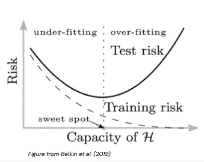

**Figure 12:** Classical U-shaped risk curve and training curve

在统计学和统计学习理论的经典结果中，随着模型变得越来越复杂，它可以创建高度不必要的复杂假设。换句话说，测试风险先下降，但最终会上升并导致 ***过拟合*** 。相比之下，如果模型过于简单，就不能足够代表我们的数据。因此，测试风险仍然很高，并导致 ***不适合*** 。因此，我们希望通过应用一些正则化技术来确保我们的模型既不欠拟合也不过拟合，例如:

*   **Lp 正则化**:将额外损失之一直接附加到权重上，这样你的权重就小了。如果你的重量很小，这个函数就不会太复杂。
*   **脱落**:一些神经元被随机去激活。因此，表示更复杂的事物要困难得多。
*   **噪声数据**:添加噪声
*   **提前停止:**如果训练误差没有改善，则提前停止训练过程
*   **批量/层定额:**为我们的数据增加一些规范化

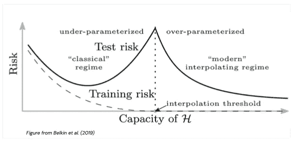

**Figure 13**: Modern curves for training risk (dashed lines) and test risk (solid lines)

另一方面，现代结果表明，随着模型的增长，它们的学习动力会发生变化，使它们不太容易过度拟合。然而，这些大模型仍然可以从正则化技术中受益。

## 下一步是什么？

> 接下来是 DeepMind 深度学习系列第三讲的笔记:[用于图像识别的卷积神经网络。](/@nghihuynh_37300/convolutional-neural-networks-for-image-recognition-7148a19f981f)

 [## Mlearning.ai 提交建议

### 如何成为 Mlearning.ai 上的作家

medium.com](/mlearning-ai/mlearning-ai-submission-suggestions-b51e2b130bfb)