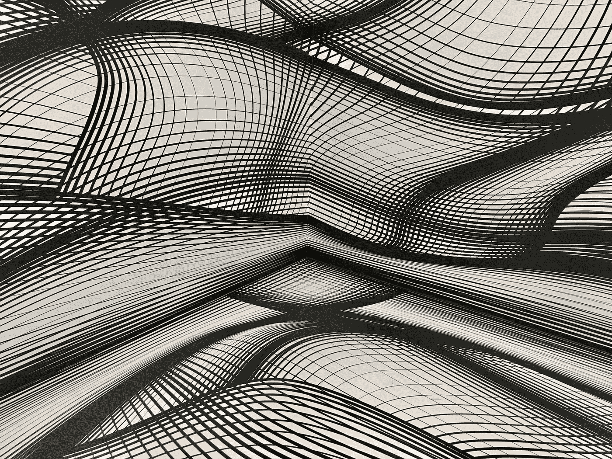

# 从零开始的神经网络:逻辑回归—第 1 部分

> 原文：<https://medium.com/mlearning-ai/neural-networks-from-scratch-logistic-regression-part-1-d8cfc4a2fb3b?source=collection_archive---------3----------------------->

## 单层神经网络与裸基础的逻辑回归

Image by [Armand Khoury](https://unsplash.com/@armand_khoury) on [Unsplash](https://unsplash.com/)

近年来，神经网络已经在计算机视觉、自然语言处理、强化学习等领域推动了几项人工智能突破。不像传统的机器学习…