# 神经网络从一开始

> 原文：<https://medium.com/mlearning-ai/neural-networks-from-the-beginnings-470fbeab0fc8?source=collection_archive---------2----------------------->

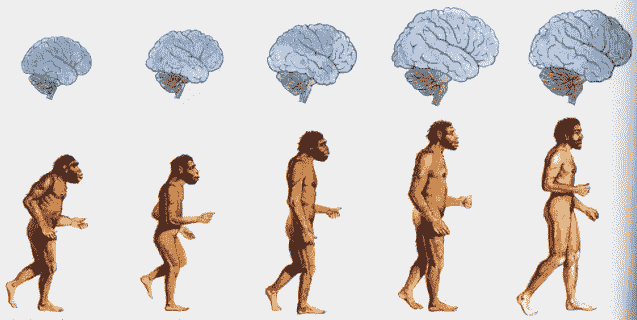

在阅读了几本以不同复杂程度处理**神经网络**主题的书籍后，我提议为那些希望从头开始理解这个主题，或者更确切地说，从线性回归模型的理解开始的人整理这篇文章([在此完成阅读](https://rorjor.wixsite.com/empoweredatascience/post/riding-a-bicycle-on-the-regression-line))，我们将在下面快速回顾。

**回顾线性回归**

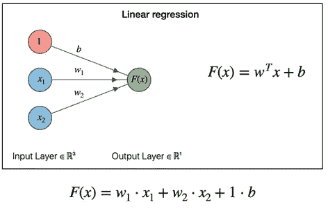

X =我们的数据集

x1，x2，x3，… =数据集的每个要素

w1，w2，w3，…=权重*(乘以 x 的变量值)*

b =偏差*(加到σw * x 上的常数值)*

所以我们有一个值 **y** 作为函数输出的结果，这是我们对目标值的**预测**，我们必须将它与真实值进行比较。这些差异将由旨在最小化该误差的**损失函数**进行评估。

*在线性回归中，我们使用最小二乘法找到最佳拟合线，使观测数据的预测误差最小化。*

好吧，但是这和神经网络有什么关系呢？

# 神经网络基础

*神经网络*是一系列算法，旨在通过试图代表人脑工作方式的过程来识别数据集中的关系。

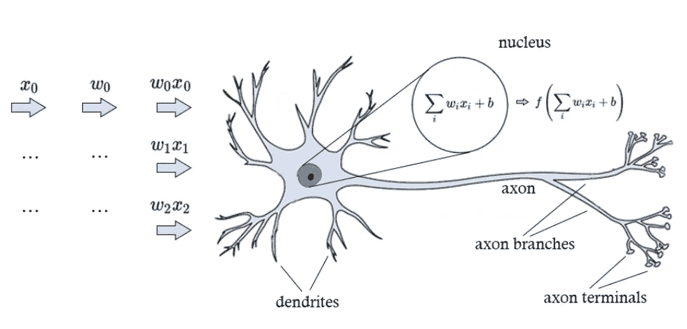

*我们用* ***线性回归*** *函数中的* ***人工神经元*** *(称为感知器)*

神经网络的一些特征:

*   它们建立在由一系列人工神经元组成的层的基础上。最少 3 层(*输入、隐藏和输出层*)
*   是多维数组流经的计算图
*   是一个通用函数逼近器，可以表示任何监督学习问题的解决方案

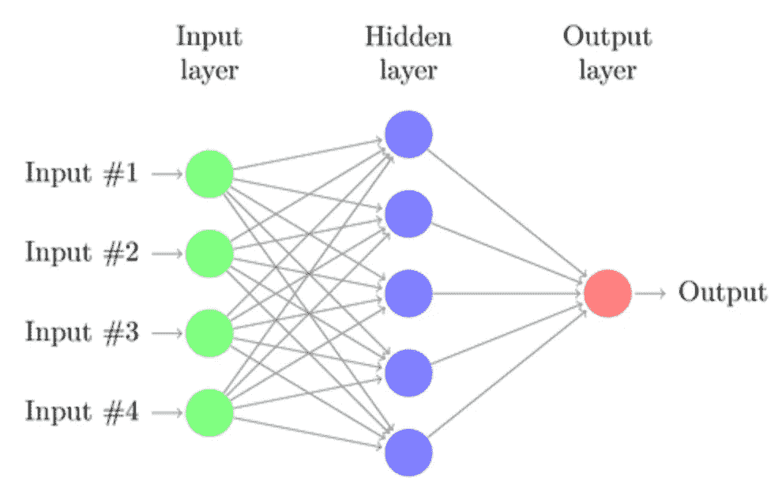

好，我们知道隐藏层的每个神经元将对输入值应用线性回归函数，获得其预测值(P)作为输出

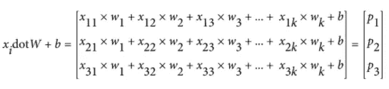

到目前为止，我们已经完成了一次**向前传球**。

然后，这些预测值(P)与实际目标值(y)一起，将成为使预测误差最小化的函数的输入。我们称之为**损失函数。**

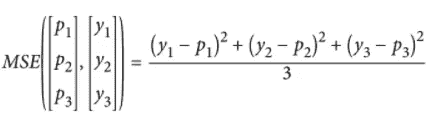

在这种情况下，我们使用 **MSE** ( *均方误差*)代替 LSE ( *最小均方误差*)，就像损失函数一样。

如果我们有小误差，MSE 工作得很好，有助于有效地收敛到最小值，但是对异常值(大误差)很敏感，给它们相对较高的权重(*惩罚*)。我们有其他指标，如 RMSE 或梅。

(*为了更好的理解可以使用的损失函数，我推荐* [*本帖*](/analytics-vidhya/a-comprehensive-guide-to-loss-functions-part-1-regression-ff8b847675d6) )

利用我们的损失函数获得的值加上初始权重，我们将必须获得**梯度** **下降**，这将允许我们重新计算权重，以便获得全局最小值。

由梯度重新计算的这些权重将允许在我们称之为**反向传递**中更新初始权重。

为了可视化梯度下降，想象一个 MSE 损失函数(y ),目标=0，权重(w)。我们必须得到 y (dy)的导数和 w (dw)的导数，才能得到斜率。

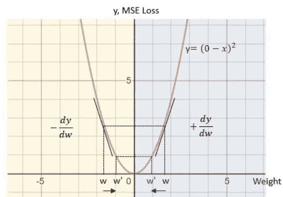

为了前任。:当 w 大于 0 时，dy/dw 为正。正的 dy/dw 可以解释为 w 的正阶跃将导致 y 的正变化。

为了减少损失，需要在 w 方向上的负阶跃:w' ←负阶跃-w

*w' = w — (+ (dy/dw) )*

而当 w 小于 0 时，我们必须做的一个正步骤=> *w' = w — ( — (dy/dw) )*

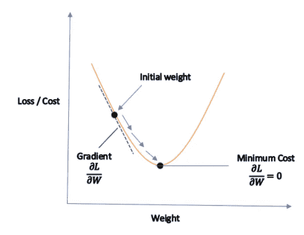

现在我们已经通过反向传递更新了我们的权重，我们可以进行新的正向传递，以此类推，直到我们获得一个调整到最优的模型。基本上，我们使用基于梯度的迭代方法来训练回归，以沿着斜坡(*下降*)下降到某个最小全局误差水平。

**训练模型的步骤总结**

1.  选择一批数据(x，w)
2.  执行模型的*前进*行程
3.  使用正向走刀计算的信息，执行模型的*反向*走刀
4.  使用反向传递中计算的梯度来更新权重(在深度学习中也称为*参数* )

**学习算法的超参数(调整模型)**

*   **批次**:在权重更新之前，模型在**时段**中考虑的一个或多个样本
*   **时期**:由一个或多个批次组成。一个时期意味着数据集的每个样本都有机会更新模型的内部参数(*权重*)
*   **优化器**:用于训练网络的优化算法。您应该找到一组内部模型参数，这些参数在某些性能指标( *MSE、RMSE 等*)下表现良好。这个算法叫做*梯度下降*，是迭代的，由前面解释的步骤组成。在 NN 的情况下，使用**反向传播**，它训练权重(*更新 w* )。使用最简单的是 SGD ( *随机梯度下降*)
*   **学习率**:表示优化算法所走路径的长度。如果值太小，更新会陷入局部最小值，而如果值太大，我们会冒重复跳到全局最小值的风险。

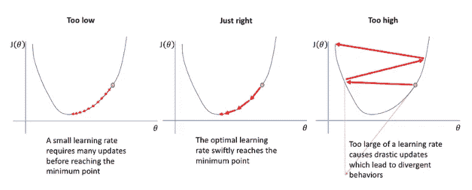

图片来源:[https://www.jeremyjordan.me/nn-learning-rate/](https://www.jeremyjordan.me/nn-learning-rate/)

**批处理和优化器**

一个训练数据集可以分成一批或多批。在*随机 GD* 优化器的情况下，批量测量= 1 个样本。

如果测量的是整个数据集，我们将使用*批次 GD* ，如果是> 1 并且<整个数据集，我们将使用*迷你批次 GD* ，典型值为 32，64，128。

# 非线性关系

到目前为止，我们已经看到我们的神经网络仅由线性回归函数组成，但是如果我们用于预测的一个或多个最重要的特征具有非线性关系呢？

假设我们的数据有这个线性回归函数，这个模型的 RMSE 是:5.05。如果我们将这个数字除以目标值的平均值，我们可以得到一个预测值(平均)与实际值相差多少的度量。

y_test 均值=24.08，所以 5.05/24.08= 21%

将数据的每个特征换算成平均值 0 和标准偏差 1 是很重要的(*标准换算值*)，这样做的好处是我们可以将系数的绝对值(*权重*)解释为对应于不同特征的重要性(*越大=越重要*)

因此，假设我们有 10 个特性，最重要的特性如下图所示:

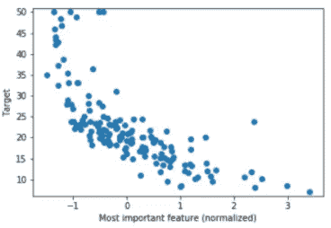

该特征与目标密切相关，但具有非线性关系。

因此，如果我们在模型中只保留线性回归，我们将会丢失学习周期中非常重要的细节。

为此，我们必须建立一个更复杂的模型，包括我们的特征与目标之间的非线性关系。

# 我们的第一个神经网络

在本节中，我们将解释具有单个隐藏层的神经网络，我们将为从波士顿房屋数据集获得的样本数据创建该神经网络(包含在 sklearn 中的*)。*

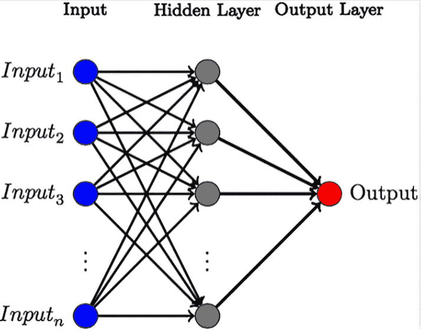

在我们的例子中，数据集中有 13 个特征，所以我们的输入层将有 13 个输入( *1 对应每个特征*)和一个隐藏层( *13 个神经元*)，有 13 个输入和明显的 13 个输出。

最后，输出层有 13 个输入，只有 1 个输出值。

主要思想是，我们将执行许多线性回归，然后我们将通过非线性函数发送结果，最后我们将进行最后一次线性回归，在最后一个实例中进行预测。

**第一步——一系列线性回归**

我们的数据(*输入*)有一个[batch_size ( *我们的样本*)，num_features (13)]的形状。

这里，我们必须将我们的输入乘以维度为[num_features (13)，num_outputs]的权重矩阵，得到维度为[batch_size，num_outputs]的输出。

现在，对于每个样本，我们有[num_outputs]个不同的原始特征的加权和，将加权和视为一个**学习特征**。

**步骤 2 —无线性功能(激活功能)**

现在，通过一个非线性函数，在我们的例子中是一个 Sigmoid 函数，输入每个加权和。

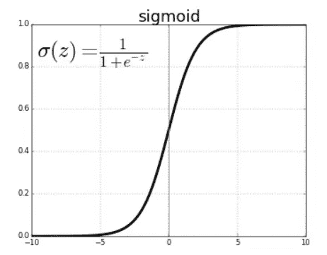

**Sigmoid** 是神经网络中最常用的激活函数之一。

它压缩 0 和 1 之间的一些输入，其中大的正值收敛到 1，大的负值收敛到 0。

有各种激活功能，如 ReLU 或 Tanh。

在这一步中，我们使我们的神经网络能够模拟特征和目标之间的非线性关系

一个神经元的线性回归步骤和非线性激活函数的漂亮视图如下所示:

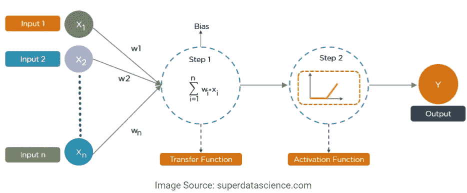

**步骤 3 —另一个线性回归**

现在，我们将获取步骤 1 和 2 中构建的层发出的 13 个值(*线性回归+激活函数。*)我们将输入最后一个线性回归，它将给出一个结果值。

最后，我们将训练我们的第一个神经网络，并评估该指标，以查看它是否提高了相对于线性回归模型的值。

好，我们检查 RMSE 度规，得到 3，67！！，比上一款的 5.05 要好。

但是这种改善的原因是什么呢？

第一名。通过添加非线性函数，我们允许我们的模型更好地学习最重要的特征

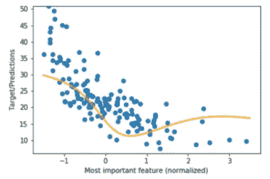

这种关系现在是非线性的，更接近目标。

第二。神经网络可以学习我们的特征和目标之间的组合，不像线性回归模型只学习单个特征。我们的神经网络执行矩阵乘法，并通过结合原始专长创建 13 个学习特征(*)。*

因此，我们有两项改进:

1.  学习非线性关系
2.  学习单个特征的组合与目标之间的关系

# 使用 Pytorch 创建我们的第一个真正的神经网络

Pytorch 是一个非常棒的用于神经网络和深度学习的 python 库。

显然这里我们不会详细解释这个库的特征，所以理解这个库如何工作的主要细节，以及更好地理解张量的任务就留给了读者。

我强烈推荐这本书:[深度学习用 Pytorch(曼宁)](https://www.manning.com/books/deep-learning-with-pytorch)，尤其是第一部分(*第一章到第八章*)。

我们从加载数据和缩放数据开始

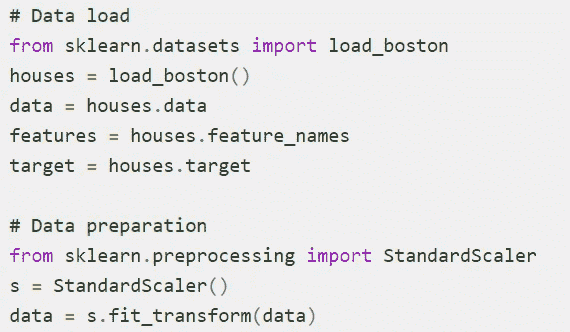

然后，我们将数据分成训练和测试数据集

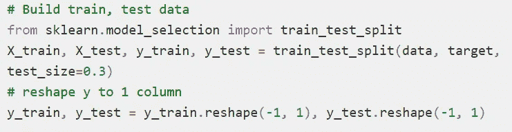

好了，让我们在 Pytorch 的帮助下开始构建我们的模型的代码。PyTorch 能够将模型和层定义为易于使用的对象，这些对象处理向后发送渐变和自动存储参数，只需让它们从 *torch.nn.Module* 类继承即可。

我们将创建一个基类，用一种向前的方法来模拟我们的神经网络，然后我们将创建一个子类来应用我们的*房价预测*模型，它将从我们的基类继承。

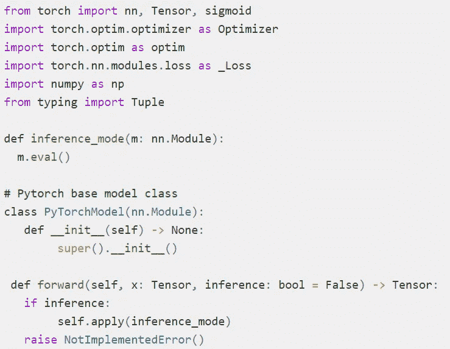

请等一分钟，**推理 _ 模式**方法是做什么的？

一个神经网络可以在已经训练好的模型的训练或者评估模式下执行(*推理*，所以 Pytorch 给了我们 *nn 的方法。Module.eval()* 。因此，推理包括将人工智能在训练中学到的东西付诸实践。此外，在该模式下，我们可以关闭标准化功能，例如*剔除*或*批量标准化*。

在我们的例子中，我们编写了一个没有规范化的简单模型。

好了，接下来我们的*房价预测* NN:

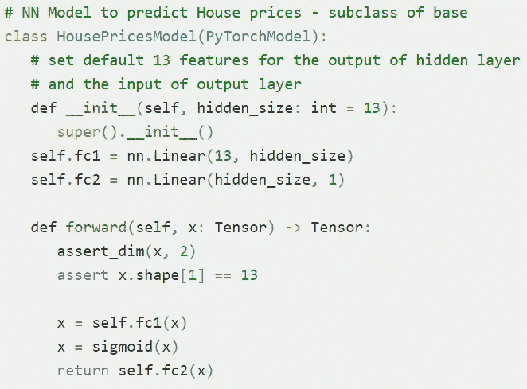

因此，我们将 X 数据张量(*和 13 个特征*)传递给第一个线性回归( *self.fc1* )，然后对其执行一个 sigmoid 非线性函数(*激活函数*)。最后将结果传递给第二个线性回归(*输出层*)

我们创建了新类的一个对象，并看到了它的结果:

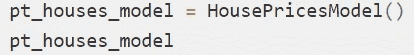

房价模型(

(fc1):线性(输入特征=13，输出特征=13，偏差=真)

(fc2):线性(输入特征=13，输出特征=1，偏差=真)

)

现在，我们创建一个类来训练我们的模型，因此它将有一个 *fit* 方法，其中 NN 的学习将在 n 次迭代(*时期*)中执行。另一个需要澄清的问题是，我们已经制作了 32 个样本的批次( *_generate_batches 方法*)，因此由于我们的数据集有 354 个样本，因此我们将有 11 个 32 个样本的批次( *+ 1 个仅 2 个样本的批次*)。

那么这 11 批中的每批 32 个样本将用于在每个时期训练模型。同样，在每次迭代之前，数据被混洗(*置换 _ 数据方法*)

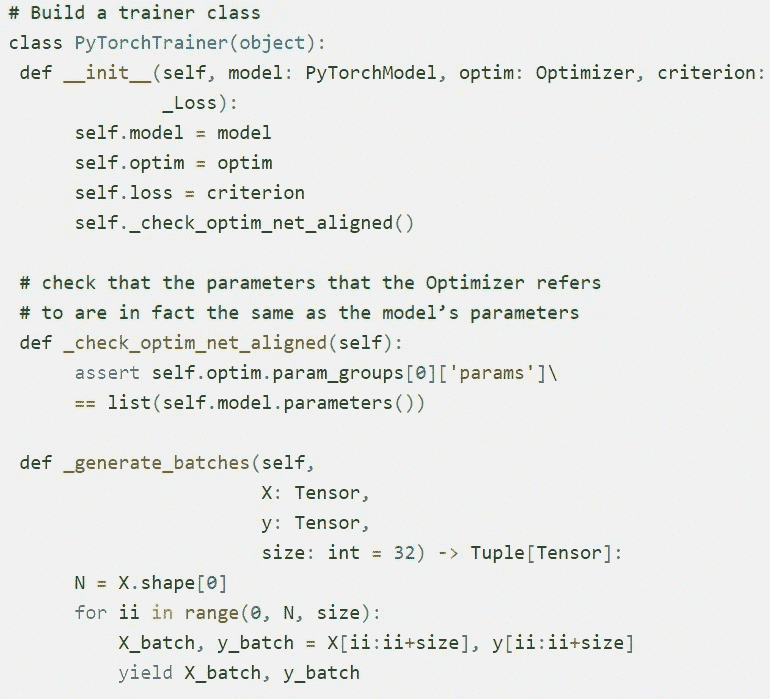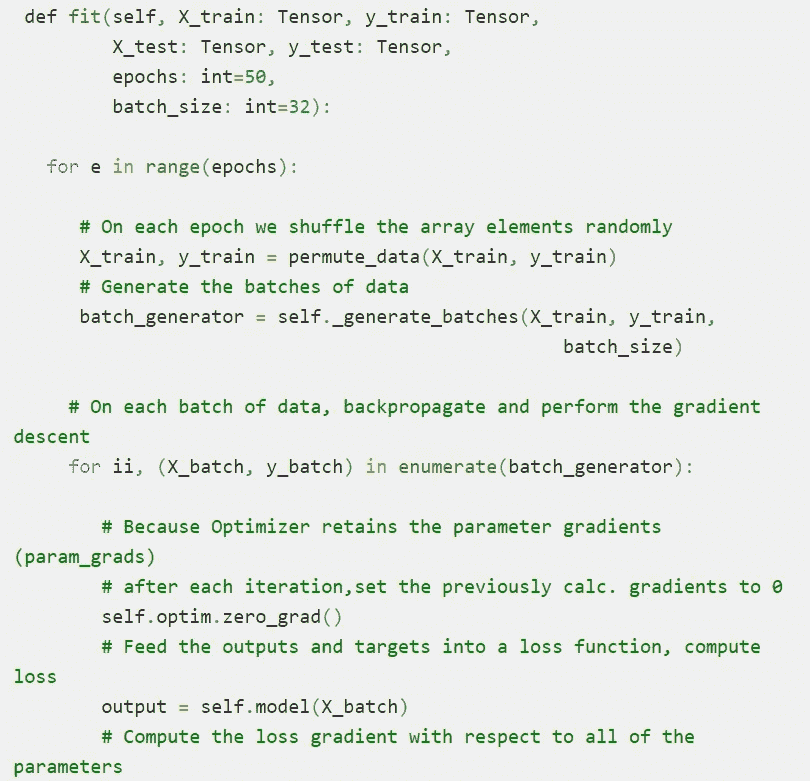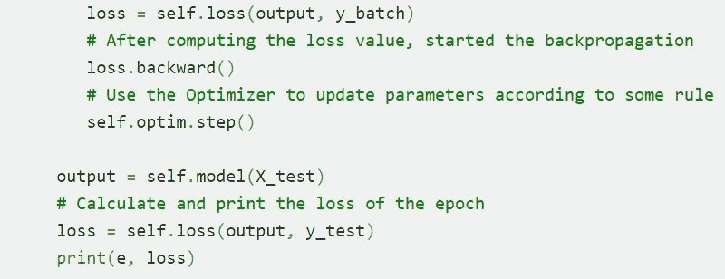

在运行我们的训练器之前，我们必须创建:

*   我们 NN 模型的一个实例(*房价模型*
*   优化器的一个实例
*   损失函数的一个实例
*   将我们的训练和测试数据转换为张量

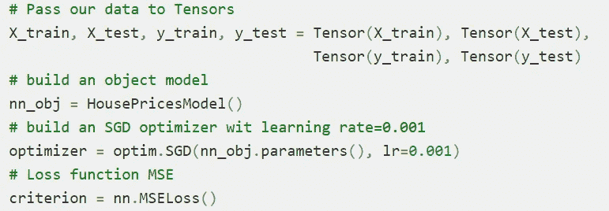

我们将打印每个时期损失函数的结果。让我们试试我们的训练器，看看它在执行 200 个纪元后会给我们什么结果:

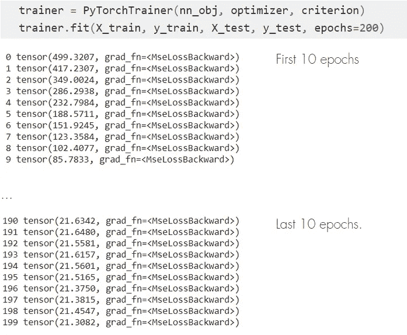

我们获得了一个更好的 MSE 度量，与我们的单线性回归模型的 25.48 相比，为 21.30。这看起来并不多，但我们仍然需要通过微调我们的模型来优化我们的神经网络，或者可能添加新的层。

好了，伙计们，我希望这是你们理解神经网络的一个好的起点。让我们记住，当我们谈论深度学习时，我们必须至少有两个隐藏层，我们只看到了只有一个模型的构建；当然，这是为了尽可能简化难度。

**神经网络**和**深度学习**很棘手，所以慢慢理解每个主题很重要，花时间用代码练习你学习的每一步。

像往常一样，github 与完整的[神经网络 jupyter nb](https://github.com/jrercoli/nn_intro_beginnings) 的链接被附上，这样你就可以自己验证代码。

感谢您的评论。