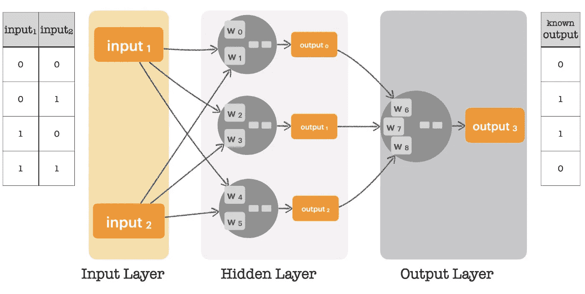

# 深度学习 4J:入门

> 原文：<https://medium.com/mlearning-ai/neural-networks-getting-started-with-eclipse-deeplearning4j-897f3662832b?source=collection_archive---------2----------------------->


**Deep Learning for Java** 是一个为许多与深度学习相关的算法提供支持的库，包括神经网络🙂。让我们回顾一下使用 **DeepLearning4J** 创建、训练和运行神经网络的主要任务。

# 方案

让我们来看一个我们之前讨论过的例子:一个识别 XOR 运算符的神经网络。在《T4》的前作《T5》中，我们从头开始实现了这一点。现在，让我们使用 **DeepLearning4J。**如图 1 所示，这个神经网络有两个输入，一个隐层有三个神经元，一个输出层有一个神经元。还显示了用于训练神经网络的输入数据以及相应的已知输出。



Figure 1\. Our neural network for calculating the XOR operator.

# 先决条件

为了在我们的项目中运行 **DeepLearning4J** ，我们需要以下依赖项(库):

*   **deeplearning4j-core** ，包含神经网络实现。
*   **nd4j-native-platform** ，一个处理 n 维数组的通用库
*   **datavec-api** —用于向量化和加载数据的辅助库。

一定要把这些包含在你的项目里，我们就准备好了。

# 加载数据

首先，我们需要加载输入数据和相应的已知输出。我们需要它们来训练神经网络。为此，我们使用**in array、** an n 维数组接口。in array 不同于标准的 Java 数组，因为它使用*堆外*内存来存储数据。*堆外*意味着内存被分配在 Java 虚拟机之外，也就是说，它不受垃圾收集器的管理。此外，这些内存位置可以(通过指针)传递给底层 C++代码，用于 **Nd4J** 库的操作。进一步来说，由于其后端的不同， **Nd4j** 甚至可以让我们同时使用 CPU 和 GPU。

对于我们的小例子来说，这似乎是不必要的，但是请考虑数据量巨大的情况。我们需要两个数组，一个用于输入值，一个用于已知输出。创建数组最常用的两种方法是*0()*和*1()*。是的，这个方法的名字告诉我们这个值将被用作数组中元素的初始值。而且，数组的形状是用整数参数指定的。例如，要创建一个 4 行 2 列的零填充数组，我们使用:

```
INDArray input = Nd4j.*zeros*(4, 2);
```

创建的数组中**的默认数据类型是 *float。*以类似的方式创建一个数组来存储我们已知的输出，我们可以使用:**

```
INDArray knownOutput = Nd4j.*zeros*(4,1);
```

请注意，这是一个大小为*样本数量 x 特征数量*的矩阵。即使只有一个例子，它也需要这个形状。

下一步，用如图 1 所示的值填充信息，表格在左边和右边。对于我们的例子，一个简单的方法就是将值插入数组。我们可以使用 *putScalar()* 方法，该方法使用两个参数:第一个参数是一个包含新值坐标的整数数组，第二个参数是要存储到数组中的浮点值。我们的输入数据可以如下加载:

```
input.putScalar(new int[]{0, 0}, 0);
input.putScalar(new int[]{0, 1}, 0);
input.putScalar(new int[]{1, 0}, 0);
input.putScalar(new int[]{1, 1}, 1);
input.putScalar(new int[]{2, 0}, 1);
input.putScalar(new int[]{2, 1}, 0);
input.putScalar(new int[]{3, 0}, 1);
input.putScalar(new int[]{3, 1}, 1);
```

同样，我们的已知输出值可以加载如下:

```
knownOutput.putScalar(new int[]{0}, 0);
knownOutput.putScalar(new int[]{1}, 1);
knownOutput.putScalar(new int[]{2}, 1);
knownOutput.putScalar(new int[]{3}, 0);
```

**Nd4j** 库提供了一组优秀的函数来处理数组。强烈推荐你看一下 **Nd4j** 线性代数 API *。*

最后，我们需要将输入和已知输出放在一个**数据集**对象中。**数据集**对象是输入数据和已知输出(标签)的容器。**数据集**构造器接收如下两个参数:

```
DataSet dataSet = new DataSet(input, knownOutput);
```

# 训练模型

**DeepLearning4J** 允许我们使用 [Fluent- **Builder 模式**](/javarevisited/design-patterns-101-factory-vs-builder-vs-fluent-builder-da2babf42113) 创建神经网络。让我向您展示实现图 1 中神经网络的代码，然后我们可以检查细节。

```
**MultiLayerConfiguration** cfg = new **NeuralNetConfiguration.Builder**()
  .weightInit(WeightInit.*UNIFORM*)
  .list()
  .layer(0,new **DenseLayer**.Builder()
    .activation(**Activation**.*SIGMOID*)
    .nIn(2)
    .nOut(3)
    .build())
  .layer(1,new **OutputLayer**.Builder(LossFunctions.LossFunction.*MSE*)
    .activation(Activation.*SIGMOID*)
    .nIn(3)
    .nOut(1)
    .build())
  .build();**MultiLayerNetwork** network = new **MultiLayerNetwork**(cfg);
```

两个基本类是**多层配置**和**多层网络**。关于神经网络、其层、输入、输出、激活函数等的所有细节都在**多层配置**对象中定义。然后，该对象用于使用**多层网络**创建网络。让我们回顾一下**多层配置。**

**多层配置**是这样的:(1)高级神经网络配置和(2)层配置。为了给神经网络创建一个**多层配置**，我们使用类 **NeuralNetConfiguration。建造者**

对于高级神经网络配置:

*   *heavy nit()*定义权重初始化方案。在我们的示例中，我们将使用 [Glorot 和 Bengio 2010](http://proceedings.mlr.press/v9/glorot10a/glorot10a.pdf) 中描述的均匀分布。
*   *list()c* 创建一个 ListBuilder，它将存储我们每一层的配置。
*   *layer()* 新建一层；第一个参数是需要添加层的位置的索引；第二个参数是我们需要添加到网络中的图层类型。

一个**密集层**是一个深度连接的神经网络层，这意味着密集层中的每个神经元接收来自其前一层的所有神经元的输入。**输出层**是产生最终输出的最后一层神经元。除了我们将在示例中使用的密集图层和输出图层之外，还存在其他几种图层类型，其中包括 GravesLSTM、卷积图层、RBM 和嵌入图层。使用这些层，我们可以(以类似的方式)定义简单的神经网络、递归神经网络和卷积网络。注意，对于输出层，我们指定了用于评估输出的**误差函数**。这个误差函数也被称为损失函数。我们在示例**中使用**均方误差**。**

对于层，我们配置如下:

*   *activation()* 定义神经元应用的**激活函数**。在我们的例子中，我们使用的是 sigmoid 函数。
*   *nIn()* 指定来自前一层的输入数量。在第一层中，它表示将从输入层获取的输入。
*   *nOut()* 指定该层将发送给下一层的输出数量。对于输出层，它表示已知输出的数量

我们正在创建一个具有两层的神经网络(我们只计算具有神经元的层)，一个隐藏层是一个密集层，一个输出层使用 MSE 进行误差计算。隐藏层有两个输入，生成三个输出。由于它是一个密集层，所有输入都与所有神经元相连，如图 1 所示。输出层有三个输入，只生成一个输出。两层中的神经元使用 s 形函数作为它们的激活函数。

一旦我们创建了**多层网络**对象，我们调用 init()方法来初始化这个对象。此外，我们可以将网络中所有层的**学习速率**配置为指定值。

```
network.init();
network.setLearningRate(0.7);
```

我们可以使用方法 *summary()* 打印我们的网络配置，如下所示:

```
System.*out*.println(network.summary());
```

对于我们的网络，该方法将打印如下内容:

```
=================================================================
LayerName (LayerType)   nIn,nOut   TotalParams   ParamsShape     
=================================================================
layer0 (DenseLayer)     2,3        9             W:{2,3}, b:{1,3}
layer1 (OutputLayer)    3,1        4             W:{3,1}, b:{1,1}
-----------------------------------------------------------------
            Total Parameters:  13
        Trainable Parameters:  13
           Frozen Parameters:  0
=================================================================
```

与图 1 中的信息相同，但是是一个文本表。注意，我们有九个**权重**(每个神经元每个输入一个)和四个神经元，每个都有其**偏差**值。因此，我们的神经网络需要训练 13 个参数。

# 训练模型

我们的神经网络完成了！是时候训练它了。我们调用方法 *fit()* 进行训练，如下所示:

```
for( int i=0; i < 10000; i++ ) {
    network.fit(dataSet);
}
```

看看我的故事**去神秘化的神经网络**，它描述了当我们运行 *fit()* 时会发生什么。我们的方法 *fit()* 大致相当于那个故事中图 13 中的第 10 到 24 行。

一旦网络训练完毕，我们就可以对其进行评估。

# 测试模型

对于评估， **DeepLearning4J** 提供了类**评估。**方法 *eval()* 将已知输出(标签)与模型生成的输出进行比较。并且，方法 *stats()* 报告分类统计。代码如下:

```
INDArray output = network.output(input);
Evaluation eval = new Evaluation();
eval.eval(knownOutput, output);System.*out*.println(eval.stats());
```

该报告包括:

*   **混淆矩阵**条目——在我们的例子中，预测了两个真阳性(TP)和两个真阴性(TN)。
*   **准确性** —所有正确识别案例的度量。
*   **精度** —从所有预测的阳性病例中正确识别出阳性病例的度量。
*   **F1-得分** —精确度和召回率的调和平均值。

打印结果如下:

```
========================Evaluation Metrics========================
 # of classes:    2
 Accuracy:        1.0000
 Precision:       1.0000
 Recall:          1.0000
 F1 Score:        1.0000
Precision, recall & F1: reported for positive class (class 1 - "1") only=========================Confusion Matrix=========================
 0 1
-----
 2 0 | 0 = 0
 0 2 | 1 = 1Confusion matrix format: Actual (rowClass) predicted as (columnClass) N times
==================================================================
```

我们用大约 50 行代码为 XOR 运算符创建了一个完美的神经网络🙂。您可以从我的 [GitHub 存储库](https://github.com/javiergs/Medium/blob/main/NeuralNetwork/ExampleXORWithDL4J.java)下载所述示例的源代码。这只是一个普通的例子。但是，它为从事更令人兴奋的项目打开了大门。例如，图像识别怎么样。

请注意，现在我们可以担心数据本身，而不是数据的存储或处理。此外，我们可以很容易地玩多个隐藏层或激活功能。此外，我们可以使用 GPU 来提高我们的训练过程的性能(需要一些配置，但它是可用的)。不过，那是后话了。

感谢阅读。请在下面留下您的反馈和评论。