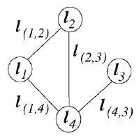
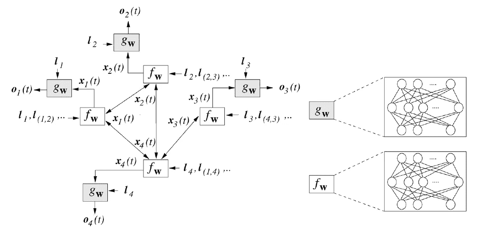
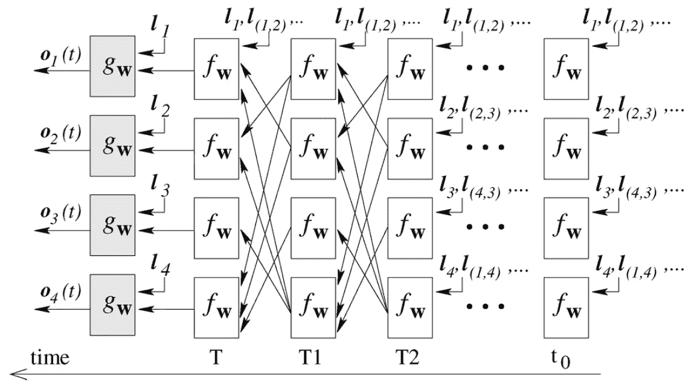
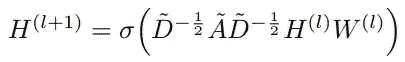
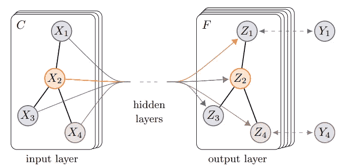
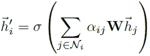
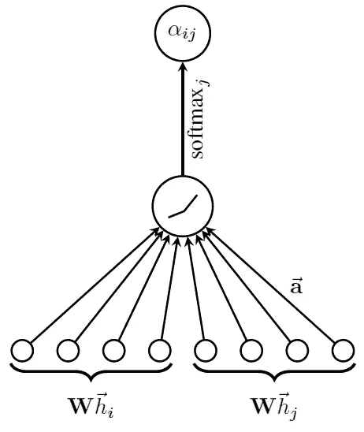
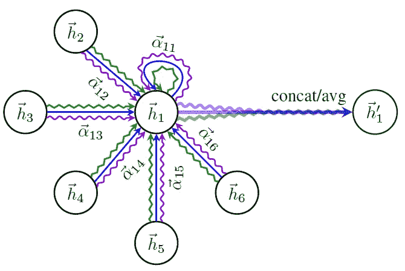

# 图上的神经网络

> 原文：<https://medium.com/mlearning-ai/neural-networks-on-graphs-e06fc7f2b934?source=collection_archive---------5----------------------->

## 介绍了三种常见的图形神经网络模型——GNN、GCN、GAT

Photo by [Z](https://unsplash.com/@dead____artist?utm_source=unsplash&utm_medium=referral&utm_content=creditCopyText) on [Unsplash](https://unsplash.com/s/photos/map?utm_source=unsplash&utm_medium=referral&utm_content=creditCopyText)

神经网络可用于处理由图形自然表示的数据。这发生在许多科学和工程领域，如计算机视觉，分子化学等。

# 图形神经网络

我们回顾的第一个变体是由一个递归架构激发的，并被命名为图形神经网络(GNN)。我们用一个例子来说明 GNN 是如何工作的。如图 1 所示，绘制了一个具有 4 个**节点**和 4 条**边**的无向图，并为每个节点和边给出了**标签**(例如`l1`是节点 1 的标签，`l(1,2)`是边 1–2 的标签)。

Figure 1: Example undirected graph with labels denoted by l. (Quoted from the original paper.)

为了表示这个图，作者首先为每个**节点**定义了一个**状态**T2，来表示每个节点所描述的概念。然后，为了从其邻居和相关标签中推断出`x`的值，作者定义了一个**函数** `f_w`，它将*节点*的标签、包含节点的*边的标签、其*邻居*的内部状态`x`以及包含其邻居*的*边的标签作为估计`x`的输入。这里可以使用神经网络。每个节点还有一个相应的输出值`o`，该值由一个**函数** `g_w`近似，该函数将节点*的内部状态`x`和标签*作为输入。这同样可以使用神经网络来估计。*

然而，内部状态`x`并未给出，因此为了实现良好的估计并在所有节点之间达成共识，作者从**扩散**的现象中得出直觉，并执行多个时间步长`T`的扩散迭代。根据 [Banach 不动点定理](https://en.wikipedia.org/wiki/Banach_fixed-point_theorem)，动力系统以指数速度快速收敛到一致。

Figure 2: How GNN represents the given graph, while maintaining the graph structure. (Quoted from the original paper.)

为了可视化，作者沿着时间轴展平了模型的迭代结构，结果如图 3 所示。(注意扩散是指这里的重复前馈。)这类似于经典的神经网络，因此可以通过反向传播来学习。

Figure 3: GNN architecture when flattened along the time axis. (Quoted from the original paper.)

[1]然后继续证明反向传播的使用，并调查这种方法中不同操作的计算复杂性，如果感兴趣，这两者都值得进一步研究。

# 图形卷积网络

我们回顾的第二个也可能是更普遍的变体，称为图卷积网络(GCN)，基于图的**谱卷积**。与 GNN 的递归架构不同，该架构为每层每个节点重用相同的函数`f_w`，并依赖扩散机制来实现平衡，GCN 为每层`l`应用了具有不同权重矩阵`W_l`的卷积。

数学公式由等式 1 概括，其中`H_l`是层`l`的**激活**，`A`是图的 [**邻接矩阵**](https://en.wikipedia.org/wiki/Adjacency_matrix) ，`DAD`构造用于谱卷积中使用的 [**图拉普拉斯**](https://en.wikipedia.org/wiki/Laplacian_matrix) 计算，`W_l`是如前所述的**权重**矩阵，σ表示**激活**函数(例如 tanh

Equation 1: Formulation of the graph convolutional network.

图 4 展示了 GCN 的可视化描述。在这个例子中，在输入层，有 4 个节点，每个节点取维数为 C 的输入向量，它们一起形成初始激活`H_0`。在通过几个隐藏层之后，激活被转换成输出层节点`Z_i`上的值，每个维度`F`。然后将这些标签与部分标签`Y_i`进行比较，以生成模型训练的损失。

Figure 4: Graphical explanation of the graph convolutional network model. (Quoted from the original paper.)

[2]还包含了对等式 1 背后动机的精彩解释，以及针对不同基准的实验，值得一读。

# 图形注意网络

尽管它们具有优越的实际性能，但是上面提到的像 GCN 这样的谱方法依赖于拉普拉斯特征基，而拉普拉斯特征基依赖于**图结构**。因此，在特定结构**上训练的模型不能**直接应用于具有不同结构的图。相反，非谱方法，如图形注意网络(GAT)，没有这样的限制。更具体地说，GAT 采用一种**自我关注**机制，通过关注其邻居来计算图中每个节点的隐藏表示。

等式 2 示出了 GAT 中单头图注意力层的公式，其中α是节点`i`和节点`j`之间的归一化**注意力系数**，`W`是该层的**权重矩阵**，`h`是该层的输入，而虚线`h`是输出。注意，图的结构信息可以通过**屏蔽掉α中的非邻居注意力权重**来注入(这是作者在他们的实验中所做的)。

Equation 2: Formulation of a single-head graph attentional layer used in a graph attention network.

图 5 中示出了注意力权重计算的示例，包括总体 [softmax](https://en.wikipedia.org/wiki/Softmax_function) 、LeakyReLU 激活和串联的线性变换激活向量的线性变换。

Figure 5: Example implementation of the attention mechanism. (Quoted from the original paper.)

作者还将等式 2 中的公式扩展到多头注意力，这有助于学习过程的稳定。这在图 6 中用图形描述。

Figure 6: An illustration of multi-head attention (with K = 3 heads) by node 1 on its neighborhood. Different arrow styles and colors denote independent attention computations. The aggregated features from each head are concatenated or averaged to obtain the output vector. (Quoted from the original paper.)

然后，可以通过堆叠这些图形注意层并用反向传播进行训练来构建整体模型。

# 结论

我们回顾了 3 个感兴趣的图形神经网络结构，希望能让你了解如何分析图形结构的数据。其他方法也存在，如 GraphSAGE⁴，我们也鼓励我们的读者看一看原始论文中对动机和证据的详细解释。如果您对实现上面提到的模型感兴趣，论文中通常会提供原始代码，下面是一个使用 TDS 的 PyTorch 的示例。

 [## PyTorch 和 PyTorch Geometric 图形神经网络实践

### 在我的上一篇文章中，我介绍了图形神经网络(GNN)的概念和它的一些最新进展。自从…

towardsdatascience.com](https://towardsdatascience.com/hands-on-graph-neural-networks-with-pytorch-pytorch-geometric-359487e221a8) 

感谢您的阅读，并请在下方留下评论:)

[1]斯卡塞利，弗兰科，等.“图形神经网络模型”IEEE 神经网络汇刊 20.1(2008):61–80。

[2]基普夫、托马斯·n 和马克斯·韦林。"图卷积网络的半监督分类." *arXiv 预印本 arXiv:1609.02907* (2016)。

[3] Velickovic，Petar 等人，“图形注意网络”*统计* 1050 (2017): 20。

[4]汉密尔顿、威尔、之桃·英和朱尔·莱斯科维奇。"大型图上的归纳表示学习."*神经信息处理系统进展* 30 (2017)。

 [## Mlearning.ai 提交建议

### 如何成为 Mlearning.ai 上的作家

medium.com](/mlearning-ai/mlearning-ai-submission-suggestions-b51e2b130bfb) 

🔵 [**成为作家**](/mlearning-ai/mlearning-ai-submission-suggestions-b51e2b130bfb)