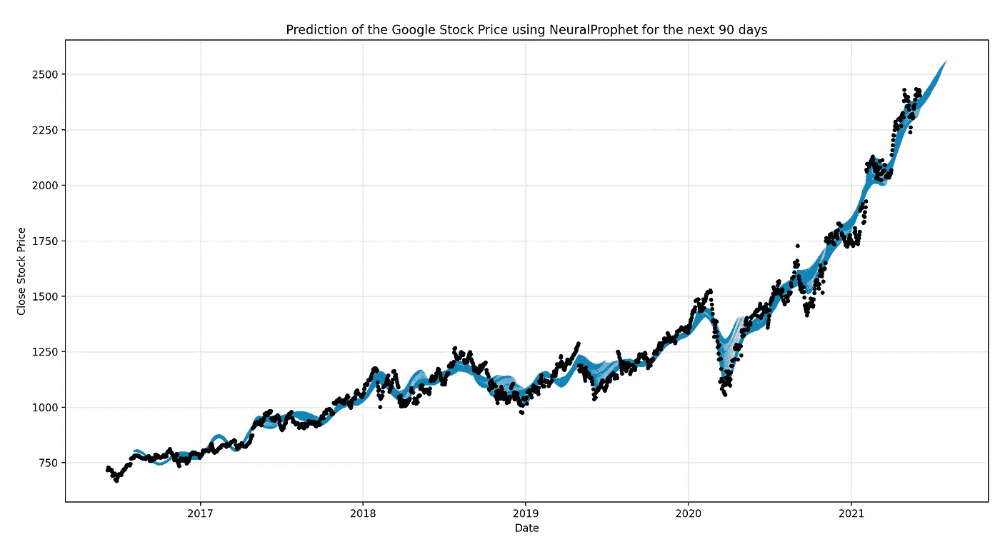

# 时间序列预测的神经网络:用脸书的新模型预测股票价格

> 原文：<https://medium.com/mlearning-ai/neuralprophet-for-time-series-forecasting-predicting-stock-prices-using-facebooks-new-model-a88ca146261c?source=collection_archive---------2----------------------->

## [数据科学](https://towardsai.net/p/category/data-science)，[数据可视化](https://towardsai.net/p/category/data-visualization)

## 在这篇文章中，我提供了一个关于如何使用一个新的预测模型来预测股票价格的教程，该模型可以从脸书数据科学团队公开获得:NeuralProphet！

Figure produced by the author using the model.