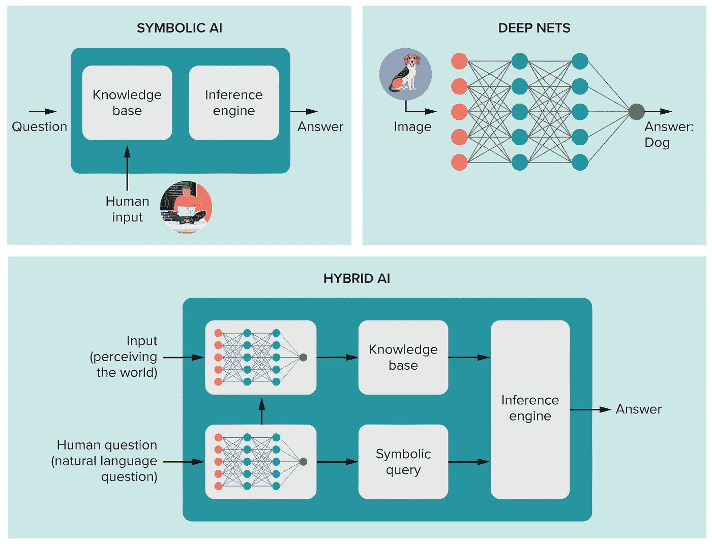
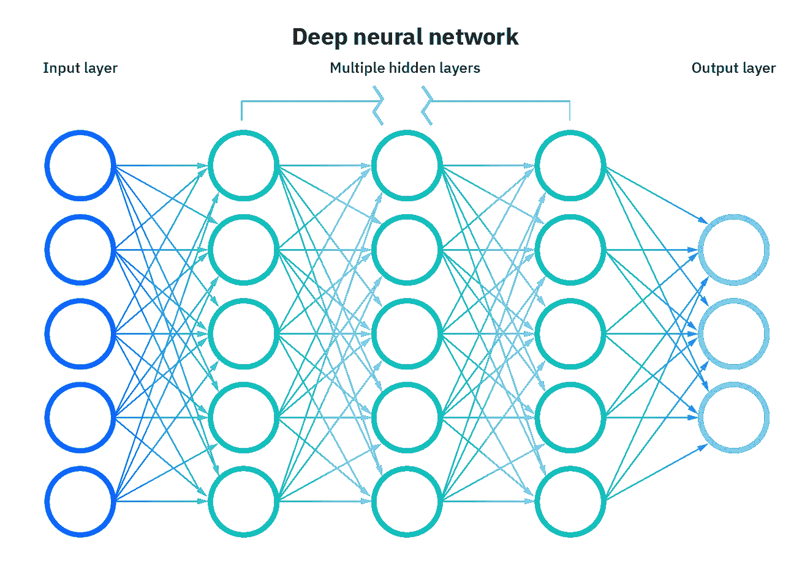
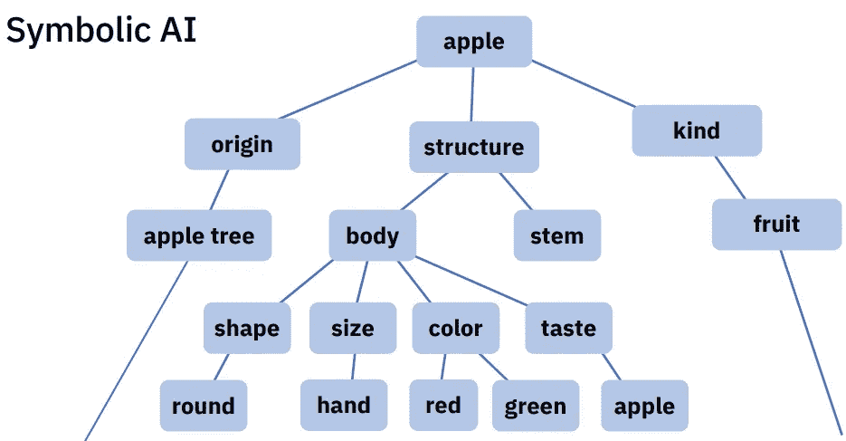
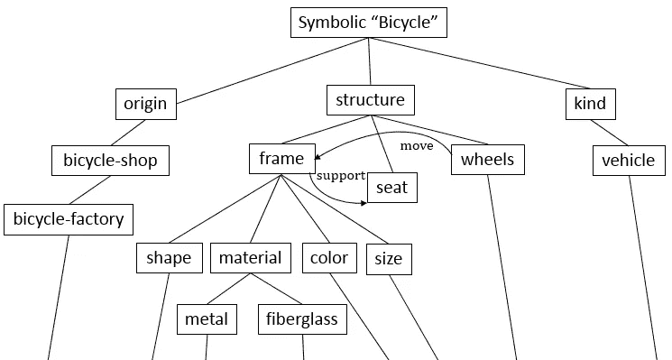
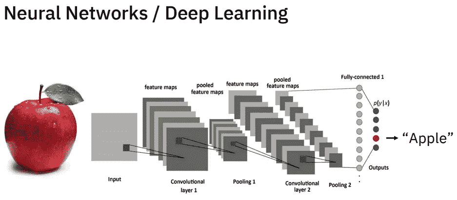

# 神经符号人工智能

> 原文：<https://medium.com/mlearning-ai/neuro-symbolic-ai-an-emerging-class-of-ai-workloads-a-novel-area-of-research-8e330715d83e?source=collection_archive---------0----------------------->

我的文章中使用的图像是各自组织的财产，在此仅用于参考、说明和教育目的。(图片来源:Google【除了部分图片，在图片下方特别提到了其来源】)

神经符号人工智能-一类新兴的人工智能工作负载&一个新的研究领域。

Source: Knowable Magazine

# 什么是神经符号人工智能？

“神经符号人工智能是人工智能研究的一个新领域，旨在将传统的基于规则的人工智能方法与现代深度学习技术相结合”——**康乃尔大学**

它也被称为复合人工智能，是一个成熟概念的新术语，对几乎任何人工智能的企业应用都具有巨大的意义。

通过将 AI 的统计基础与其知识基础相结合，组织可以用最少的问题和更少的支出获得最有效的认知分析结果。

我们可以将它视为与我们所知的 AI 不同的 AI 版本，因为它使用了深度学习神经网络架构，并将它们与符号推理技术相结合。

# **但是它们是什么呢？**

**“深度学习神经网络架构** -深度学习神经网络，或人工神经网络(ANN)，试图通过数据输入、权重和偏差的组合来模仿人脑。这些元素协同工作，以准确识别、分类和描述数据中的对象。”- **IBM**

它们由多层相互连接的节点组成，每一层都建立在前一层的基础上，以改进和优化预测或分类。

这种通过网络的计算过程被称为*前向传播*。深度神经网络的输入和输出层称为可见层。

— — — —

# 符号人工智能

*象征性人工智能也被认为是好的、老式的人工智能(GOFAI)*

符号人工智能是人工智能研究中所有方法的集合，这些方法基于问题、逻辑和搜索的高级符号(人类可读)表示。

简单地说，符号人工智能是一种训练人工智能的方法，与人脑学习的方式相同。它通过形成其“世界”的内部符号表征来学习理解世界。

符号人工智能模拟了这种机制，并试图通过人类可读的符号和规则来显式地表示人类知识，这些符号和规则能够操纵这些符号。符号人工智能需要将人类知识和行为规则嵌入到计算机程序中。

符号 AI 使用 L [逻辑编程](https://www.google.com/search?q=logic+programming&oq=logic+pro&aqs=edge.0.0i512j69i57j0i20i263i512j0i433i512j0i512l2j0i457i512j0i512j69i64.1913j0j1&sourceid=chrome&ie=UTF-8)、[产生式规则](https://www.google.com/search?q=production+rules&oq=production+rules++&aqs=edge..69i57j0i20i263i512j0i512l2j0i20i263i512j0i512l4.3626j0j9&sourceid=chrome&ie=UTF-8)、[语义网](https://www.google.com/search?q=semantic+nets&oq=semantic+nets&aqs=edge..69i57j0i20i263i512j0i512j0i20i263i512j0i512l4j69i64.2353j0j9&sourceid=chrome&ie=UTF-8)、[框架](https://www.google.com/search?q=semantic+frames&oq=semantic+frames&aqs=edge..69i57j0i20i263i512j0i512j0i22i30l4j69i64.2324j0j9&sourceid=chrome&ie=UTF-8)等工具，开发了[专家系统](https://www.google.com/search?q=expert+systems&oq=expert+systems+&aqs=edge..69i57j0i20i263i512j0i512j0i20i263i512j0i512l5.4094j0j1&sourceid=chrome&ie=UTF-8)等应用。

## **符号推理技术**

它们是通过人为干预创造出来的规则。也就是说，要建立一个符号推理系统，首先人类必须学习两种现象相关的规则，然后将这些关系硬编码到一个静态程序中。

例句:我们一直在使用神经网络来识别特定物体的形状或颜色。将符号推理应用于它可以更进一步，告诉它更多关于物体的令人兴奋的属性，如物体的面积、体积、尺寸等。

# 符号人工智能和神经网络的区别

## 符号人工智能

符号人工智能是高度基于规则的。

*   这种方法是创造人工智能的第一次官方尝试。
*   它在 20 世纪 50 年代和 80 年代之间越来越受欢迎。
*   符号人工智能基于人类通过形成符号互连和表示来理解世界的能力。符号表示帮助我们创建定义概念和获取日常知识的规则。
*   这意味着，为了向符号人工智能系统解释一些东西，符号人工智能工程师和研究员必须明确地提供人工智能可以用来进行正确识别的每一个信息和规则。

*下面的图片展示了象征性的人工智能如何定义苹果和自行车。*

This is how Symbolic AI might define an Apple. Image Source: MIT-IBM Watson AI Lab

This is how Symbolic AI might define a Bicycle.

## 神经网络

神经网络是高度基于数据的。

“神经”部分指的是深度学习神经网络。他们受到人类大脑竞争能力的启发。

这是人工智能的最新技术，人工智能专家**通过它激发了许多人工智能的突破。自动驾驶汽车的构思——神经网络。像 Alexa 这样的个人助理的概念——神经网络。**

**他们通过数据学习。**

**为了训练一个神经网络人工智能，你必须给它提供大量的相关主题的图片。这种用来训练它的数据称为训练数据。**

**一旦它足够聪明，它不仅可以识别它被训练的对象，还可以制作甚至可能在现实世界中不存在的类似对象。**

**想一想，人工智能创造的从来不存在的人的脸。**

**这方面的一个例子就是[这个](https://thispersondoesnotexist.com/)网站。**

**每当网页刷新时，一个 GAN(生成对抗网络)(最初由 [NVIDIA](https://www.linkedin.com/company/nvidia/) 编码)就会呈现完全虚假的人的超逼真画像！**

**关于这方面的更多信息，请查看我在 LinkedIn [上的帖子。](https://www.linkedin.com/posts/suryaseshamaddula_this-person-does-not-exist-activity-6884891838877192192-Wpk3)**

***下图显示了神经网络如何定义苹果。***

****

**Image Source: MIT-IBM Watson AI Lab**

# **符号人工智能的问题**

*   **符号人工智能的一个主要问题是，一旦信念被编码到规则引擎中，很难对其进行修改。专家系统是单调的；这意味着，你添加的规则越多，系统中编码的知识就越多，但这也意味着额外的规则无法撤销旧知识。**

**单调性是指一个方向*，*，即一个事物上升，另一个事物也上升。因为 ML 算法可以在新的数据上被重新训练，并且将基于新的数据修改它们的参数，所以它们更擅长于编码试验性的知识，如果必要的话，这些知识可以在以后被收回。如果他们需要学习新的东西，比如当数据不稳定时。**

*   **符号推理的第二个缺陷是，计算机不知道符号的含义，也就是说，它们不一定以非符号的方式与世界的任何其他表示相联系。**

**同样，这与神经网络形成对比，神经网络可以将符号与数据的矢量化表示联系起来，而矢量化表示反过来只是原始感觉数据的翻译。**

**因此，当我们考虑 GOFAI 和神经网络时，主要的挑战是如何将符号接地，或者将它们与其他形式的意义联系起来，这将允许计算机将世界上不断变化的原始感觉映射到符号，然后对它们进行推理。**

# **神经符号人工智能的优势**

**资料来源:DataFloq**

## **更高的精度**

**你可能会想，当神经网络可以正确回答 80%的情况时，这对机器来说是足够好的数字了。为什么剩下的 20%如此重要？**

**考虑这个异常情况。燃烧的交通灯。虽然人类司机会理解对燃烧的交通灯做出适当的反应，但当几乎没有任何数据输入系统时，你如何告诉自动驾驶汽车采取相应的行动。神经符号人工智能不仅可以处理这些极限情况，还可以用更少的数据和高精度处理其他情况。**

## **数据效率**

**训练今天的人工智能系统所需的数据是巨大的。当人脑可以通过几个例子进行学习时，人工智能工程师需要向人工智能算法中输入数千个例子。神经符号 AI 系统可以用其他方法所需的 1%的数据进行训练。**

## **透明度和可解释性**

**没有太多讨论，人工智能系统的这一方面也困扰着人工智能专家。通常很难解释人工智能系统做出的决定和得出的结论。这就像一个“黑匣子”。**

**虽然为什么机器人在 Spotify 上推荐某首歌曲而不是其他歌曲是一个用户几乎不会在意的决定，但在某些其他情况下，人工智能决策的透明度对用户来说变得至关重要。例如，如果一个人的工作申请被人工智能拒绝，或者贷款申请没有通过。神经符号人工智能可以使这个过程透明，可以被人工智能工程师解释，并解释为什么人工智能程序会做它要做的事情。**

**对于一名人工智能工程师来说，这是一个激动人心的时代。凭借厂商中立、有时限的人工智能工程认证，保持在人工智能新发展的前沿，引领人工智能这一世纪技术的革命。**

# **符号人工智能进一步研究的方向**

**【GOFAI 是什么，为什么会失败？**

**[逻辑与类比/符号与联结主义/整洁与邋遢](https://web.media.mit.edu/~minsky/papers/SymbolicVs.Connectionist.html)**

**另外:点击这里查看布法罗大学的萨古尔·N·斯里哈里先生撰写的关于神经象征人工智能概述的学术文章。**

**和**

**[神经符号人工智能:人工智能工作负载的新兴类别](https://arxiv.org/abs/2109.06133)作者**康奈尔大学****

**感谢阅读，快乐学习！**

** [## Mlearning.ai 提交建议

### 如何成为 Mlearning.ai 上的作家

medium.com](/mlearning-ai/mlearning-ai-submission-suggestions-b51e2b130bfb)**