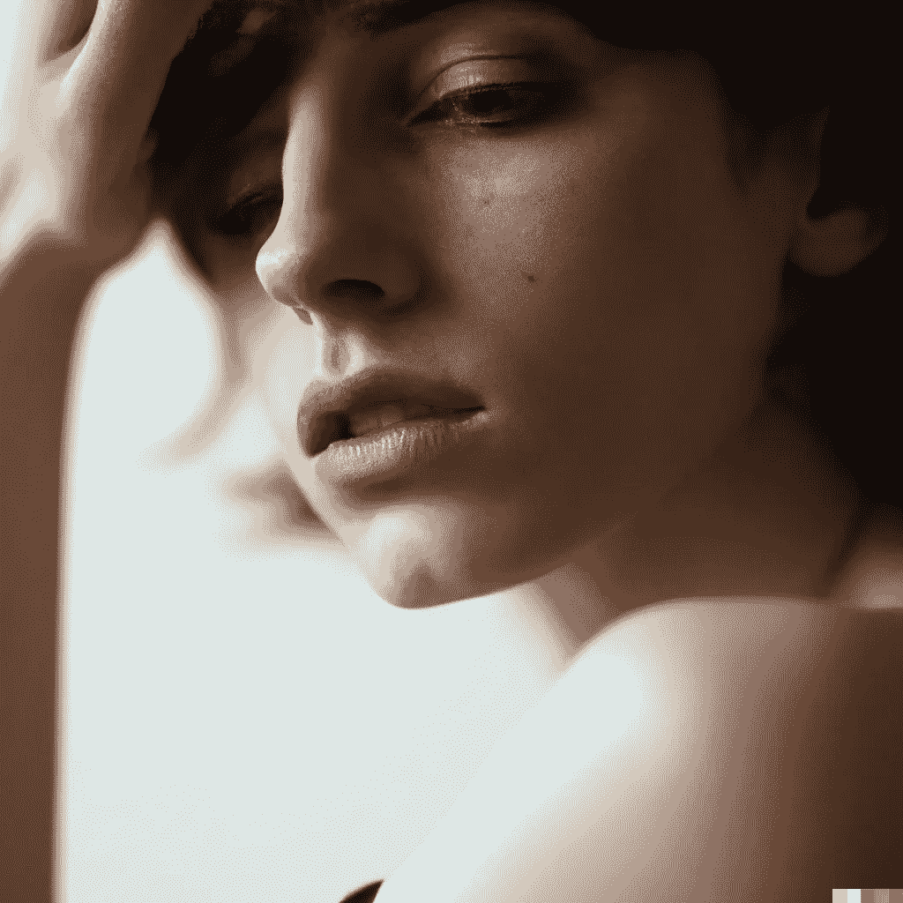

# 一种新的人像风格化人工智能方法

> 原文：<https://medium.com/mlearning-ai/new-ai-method-for-portrait-stylization-28d75b965c6c?source=collection_archive---------4----------------------->

## [机器学习艺术](https://mlearning.substack.com/p/top-features-of-dalle-3?r=z7zu8&s=w&utm_campaign=post&utm_medium=web)

## 摄影质量的照明调节

img [by AI system](https://evartology.substack.com/p/all-of-the-greatest-ai-powered-art?r=9hp4d&s=w&utm_campaign=post&utm_medium=web)

## 什么是 AI 风格化人像？

“风格化的肖像”是什么意思？风格化的肖像是那些不以现实的方式展示真实世界的肖像。换句话说，他们加入了自己的想法和一点创造力。在…