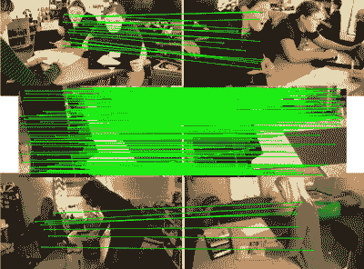

# 将两幅图像转换为三维模型的新方法

> 原文：<https://medium.com/mlearning-ai/new-method-converts-two-images-into-3d-model-37885b4c8648?source=collection_archive---------0----------------------->

## [机器学习艺术](https://mlearning.substack.com)

## **从照片中提取 3D 信息的艺术和科学**

[AI-powered Art tools](https://evartology.substack.com/p/all-of-the-greatest-ai-powered-art?r=9hp4d&s=w&utm_campaign=post&utm_medium=web)

## 什么是摄影测量三维扫描？

> **摄影测量**是一种制作三维模型的方法。这是 3D 扫描的替代方案，可以让你用照片代替…