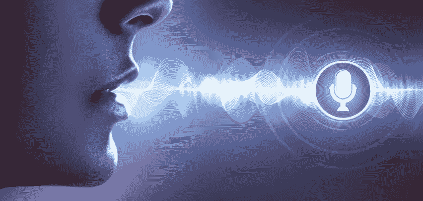

# 新的 OpenAI 技术捕捉并翻译你的声音

> 原文：<https://medium.com/mlearning-ai/new-openai-technology-captures-and-translates-your-voice-b623f1f24a67?source=collection_archive---------1----------------------->

## OpenAI 的 AI 模型可以自动识别语音并翻译成英语

# 什么是 OpenAI？

OpenAI 是一家由埃隆·马斯克(Elon Musk)和萨姆·奥特曼(Sam Altman)在 2015 年组建的研究机构。目标是加速人工智能研究，建立开源人工智能，并与公众分享他们的发现。他们想确保每个人都可以使用人工智能，没有人可以用它来接管世界。由于该研究所致力于让人工智能为每个人所用，他们开发语音到文本翻译的新技术是有意义的。研究人员希望这项技术可以在任何语言中使用。

OpenAI 发布了一个新的开源人工智能模型，名为 [Whisper](https://openai.com/blog/whisper/) ，可以在接近人类语言理解的水平上识别和翻译音频。该模型在 68 万小时的音频数据和从网络上收集的 98 种语言的匹配文字记录上进行训练。这种方法已经“提高了对口音、背景噪音和技术语言的鲁棒性。”它还可以检测口语，并将其翻译成英语。

# 介绍

OpenAI 将 Whisper 描述为一种被称为编码器-解码器转换器的神经网络。这种神经网络可以使用从输入数据中收集的上下文来学习关联，然后可以转换为模型的输出。

> 音频被分成 30 秒的块，转换成 log-Mel 频谱图，然后传递到编码器。解码器被训练来从 log-Mel 频谱图中预测相应的文本字幕，该文本字幕与指示单个模型执行诸如语言识别、短语级时间戳和多语言语音转录之类的任务的特殊标记混合在一起。

OpenAI 希望引入一个新的基础模型，其他人可以在未来的基础上改进语音处理和辅助工具。本组织在这方面有着重要的记录。2021 年 1 月，它发布了 CLIP，这是一个开源的计算机视觉模型，可以说是点燃了最近快速进步的图像合成技术的时代，如 DALL-E 2 和[稳定扩散。](/mlearning-ai/stable-diffusion-beats-dall-e-by-large-margin-7b327abe7064)

# 专业转换

从语音到文本的翻译是实时进行的，结果是准确的。诚然，有许多因素会影响翻译的准确性，但重要的是要注意，无论你的翻译有多准确或不准确，它永远不会改变所说的意思。

将语音转换为文本的过程不会以任何方式改变原始使用的单词。机器翻译和人工翻译的唯一区别是机器翻译比人工翻译更快更准确。

# 最后的想法

神经网络是人工智能的未来，OpenAI 正以其新技术引领潮流。语音到文本翻译背后的技术比我们习惯的要复杂得多，但它可能会对世界产生巨大的影响。这项技术可以打破语言障碍，将人们聚集在一起。神经网络可能是整个地球更美好未来的关键。

 [## Mlearning.ai 提交建议

### 如何成为 Mlearning.ai 上的作家

medium.com](/mlearning-ai/mlearning-ai-submission-suggestions-b51e2b130bfb)