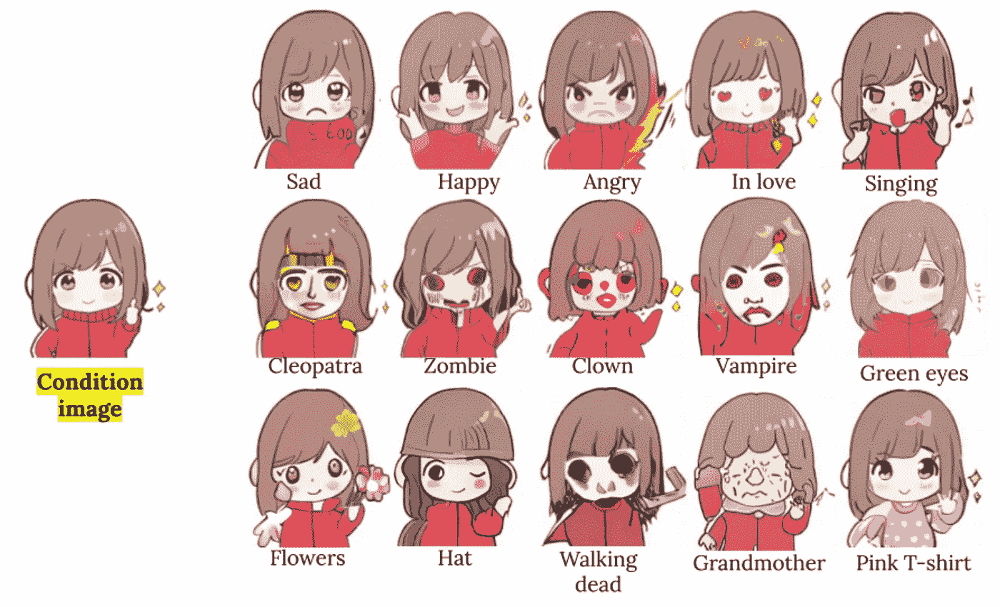

# 一种新的文本图像生成方法

> 原文：<https://medium.com/mlearning-ai/new-text-image-generation-method-6e1a4166b8e6?source=collection_archive---------3----------------------->

## [机器学习艺术](https://mlearning.substack.com)

## KNN 扩散

[https://mlearning.substack.com](https://mlearning.substack.com)

从 20 世纪 50 年代后期开始， [**的艺术家们就开始用电脑制作艺术**](https://mlearning.substack.com) 。计算机视觉和图形的一个基本目标是使个人能够使用计算机创造视觉艺术。生成模型最近显示出允许新艺术种类的前景。它们逐渐增加新的有趣的特征，例如完全…