# 基于 SOTA 模型的新闻文章分类任务及其比较

> 原文：<https://medium.com/mlearning-ai/news-article-classification-task-using-sota-models-and-their-comparison-a0f87abdc0c1?source=collection_archive---------1----------------------->

## 自然语言理解(NLU)和处理(NLP)

## BERT 和 DistilBERT 案例研究

Photo by [Manuel Torres Garcia](https://unsplash.com/@matoga?utm_source=medium&utm_medium=referral) on [Unsplash](https://unsplash.com?utm_source=medium&utm_medium=referral)

# **文本分类**

T ext 分类用于根据内容对自然语言文本进行分类。例如，考虑按主题对新闻文章进行分类，或者根据积极或消极的回应对书评进行分类。文本分类还有助于语言检测、组织客户反馈和欺诈检测。虽然手动完成这个过程非常耗时，但可以通过机器学习模型实现自动化。类别分类，对于新闻来说，是一个多标签的文本分类问题。目标是为一篇新闻文章分配一个或多个类别。

# **NLP 世界及其简史**

**自然语言处理(NLP)** 是计算机程序理解人类口头和书面语言的能力，称为自然语言。互联网上有大量关于 BERT 算法及其应用的文章，理解自然语言处理科学从相当原始的形式到现在的历程可能也很重要。从嵌入技术、改进的语言模型、神经架构等等，在新技术的道路上已经有了相当多的里程碑。

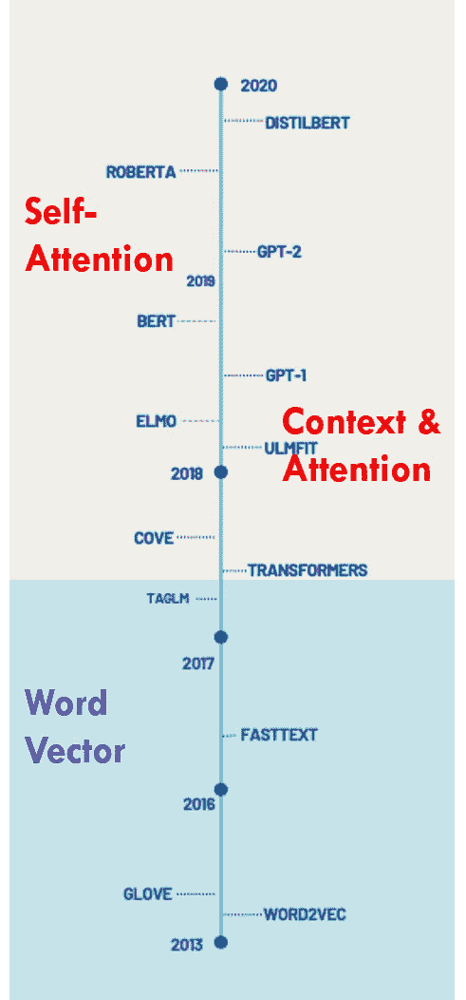

Source: Author

# **伯特及其好处:**

BERT 代表来自变压器的双向编码器表示，建立在自然语言处理和计算机视觉的多种最新技术之上。本质上，BERT 是一种基于深度学习的自然语言表示方法，它将'**迁移学习'**的概念引入到 NLP 中，并可以进行微调，以处理大量下游 NLP 用例，如文本分类、问题回答、文本摘要、语义相似性等。这得益于它是一个双向模型，这意味着它利用了句子的正向序列和反向序列。包含反向序列有助于从上下文和关键字中学习，这些上下文和关键字在自然正向序列处理中还没有被“看到”,并且在构成句子的整体含义中具有潜在的重要性。然而，双向对伯特来说并不新奇，而且已经存在了一段时间。同样,**“注意力”**更像是深度学习中的一个通用概念，在伯特之前就被认为存在了。伯特基于类似的概念使用了'**自我关注'**。

另一个关键要素是**“语境”**，它是基于这样一种想法而构思的，即一个词的意义通常不是字面上的，而是从它被使用的语境中推导出来的。它解决了著名的单词嵌入模型(如 word2vec 和 fastext)的上下文无关性。我将在本文的后面部分对这些想法进行更多的思考。

# **我们为什么需要蒸馏器？**

BERT 模型面临的主要挑战是其庞大的参数数量(1.1 亿个)，因此此类模型主要用于研究工作，从那时起，人们感兴趣的领域之一是“低资源”模型，该模型具有接近最先进的结果，同时更小，运行速度更快，还可进行生产部署。这就是为什么**蒸馏 BERT** ，BERT 的蒸馏版本被**拥抱脸**构思出来:它的参数少了 40%，运行速度快了 60%，同时保留了 BERT 在 **GLUE** 语言理解基准测试中 97%的性能。

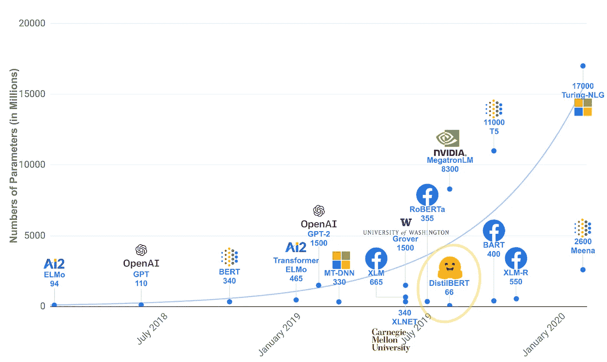

Source: Hugging Face

在 **DistilBERT** 中，它将知识提炼应用于 BERT，这是一种压缩技术，其中一个小模型被训练来重现一个更大模型(或模型集合)的行为，由 [**Hinton 等人**](https://arxiv.org/abs/1503.02531) 演示。

# **案例研究:数据策略**

该数据集包含 2012 年至 2018 年从 [**【赫芬顿邮报**](https://www.huffpost.com/) 获得的约 20 万条新闻标题。但是，由于培训资源的限制，为分析考虑了 40k 行的分层样本。总体策略如下所示，

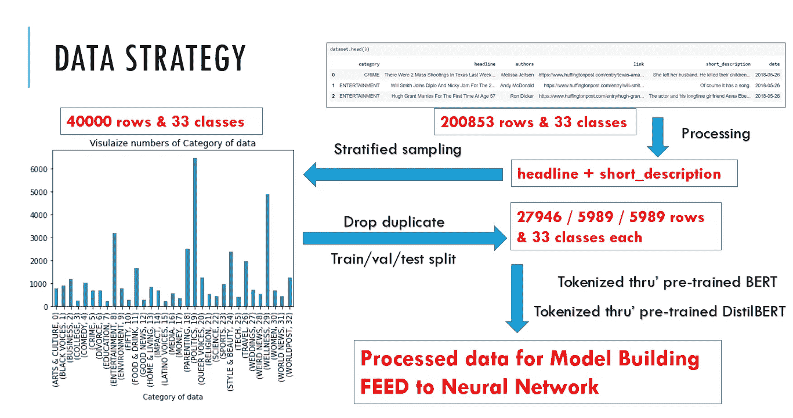

Source : Author

# **案例研究:模型策略**

基于所用模型的不同文献，一些超参数被认为如下:

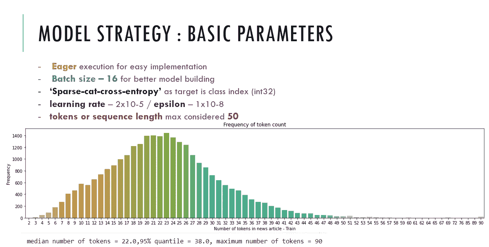

Source : Author

# **案例研究:模型架构**

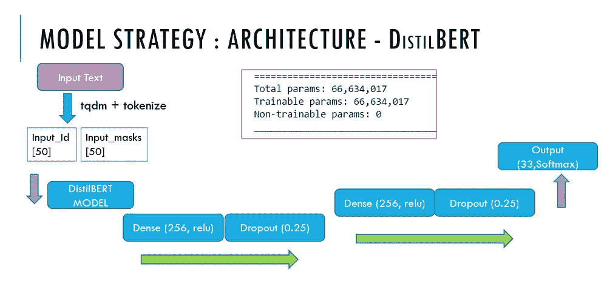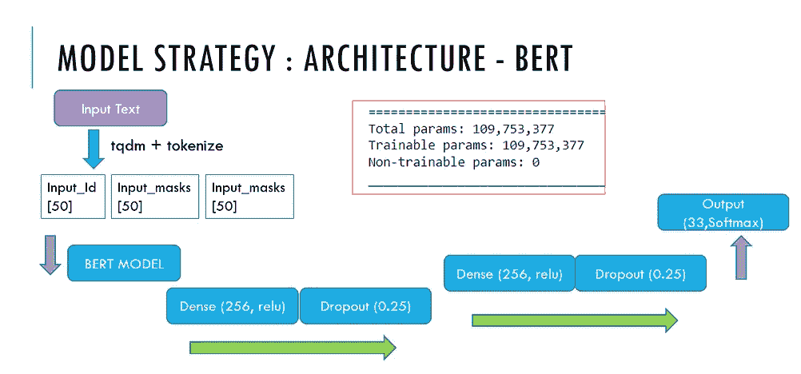

Source : Author

# **案例研究:模型对比**

尝试了不同的 GPU，保持两个模型的超参数相同，比较如下:

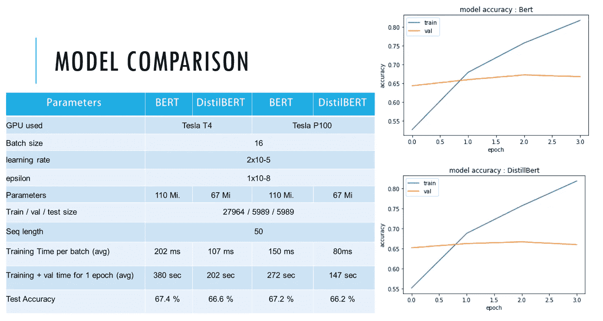

Source : Author

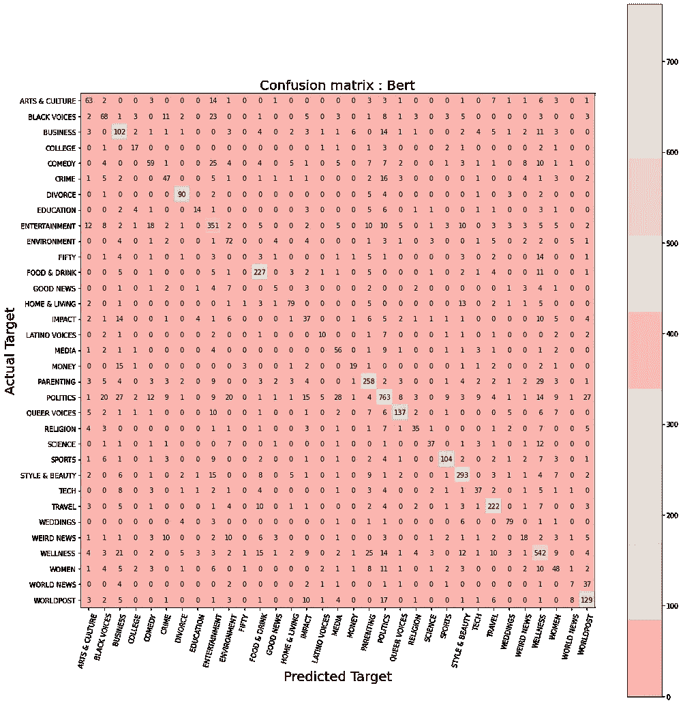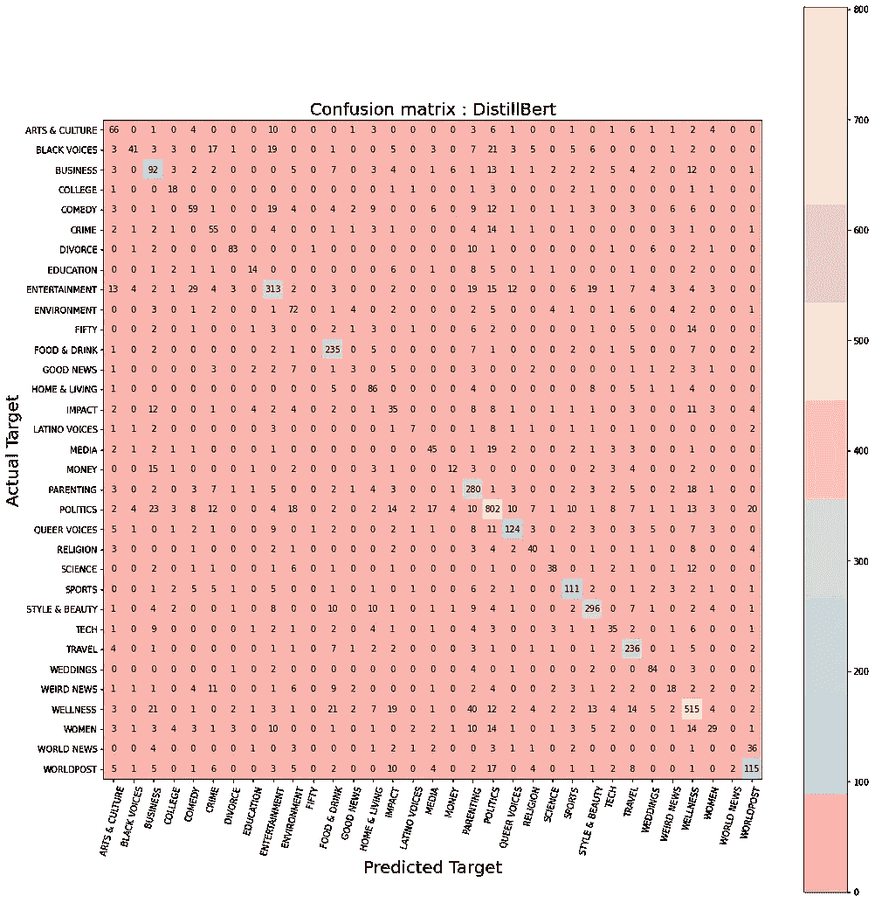

Source : Author

# **伯特土著及其用途**:

谷歌的 BERT 和最近基于 transformer 的方法已经席卷了 NLP 领域，在几个任务上超过了最先进的技术。

[**BERT**](https://arxiv.org/abs/1810.04805) 是一个双向转换器，用于对大量未标记的文本数据进行预训练，以学习一种可用于微调特定机器学习任务的语言表示。

[**XLNet**](https://arxiv.org/abs/1906.08237) 是一个大型双向转换器，它使用改进的训练方法、更大的数据和更强的计算能力，在 20 个语言任务上实现了优于 BERT 的预测指标。

[**RoBERTa**](https://arxiv.org/pdf/1907.11692.pdf) 在脸书推出，RoBERTa 是一种稳健优化的 BERT 方法，是 BERT 的再培训，具有改进的培训方法，1000%以上的数据和计算能力。

[**DistilBERT**](https://arxiv.org/pdf/1910.01108.pdf) 学习一个经过提炼的(近似)版本的 BERT，保留了 97%的性能但只使用了一半数量的参数(paper)。具体来说，它没有令牌类型的嵌入，pooler，并且只保留了 Google 的 BERT 的一半层。DistilBERT 使用一种称为蒸馏的技术，这种技术近似于谷歌的 BERT，即一个较小的神经网络代替一个较大的神经网络。

下表很好地总结了这一点，

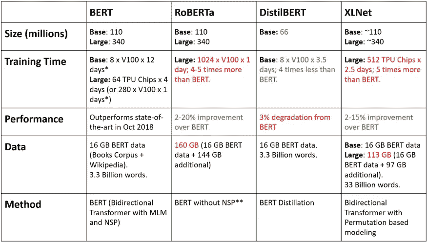

Source : Medium

# **结论和关键措施**:

-如果我们真的需要一个**更快的推理速度**但是**可以在预测指标上妥协**几个百分点的话， **DistilBERT** 是一个合理的选择。

-如果我们在寻找最好的预测指标，我们应该选择脸书的罗伯塔。

-理论上， **XLNet 的**基于排列的训练应该可以很好地处理依赖性，并且在长期运行中可能会更好。

-然而，**谷歌的 BERT** 确实是一个很好的工作基准，如果我们没有上述任何关键需求，我们可以用 **BERT** 保持系统运行。

*   如果完整的数据集将用于**训练**，则**模型可能会进一步改进**。

# 研究的局限性:

*   这项研究已经**在超过 40000 个文本和 33 个 nos 类数据集**和**上进行了，其中一些 SOTA 预训练模型用于 NLP** 作为**的嵌入**。因此，对于**其他可用模型**和**数据集**,**模型性能可能会有所不同**。

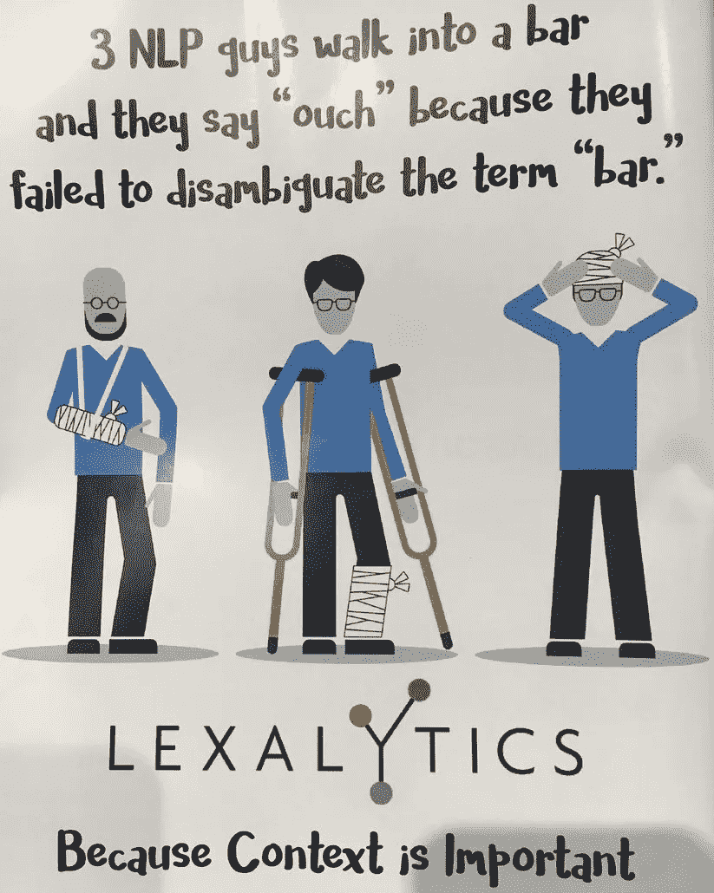

Source : Lexalytics

*如果您认为本文有用，请喜欢并分享，也请随意评论。请随意查看* [***我的 Github 个人资料***](https://github.com/pathakchiranjit) *和* [*回购 f* 或代码](https://github.com/pathakchiranjit/Natural-languge-Processing) *您也可以在*[***LinkedIn***](http://www.linkedin.com/in/pathakchiranjit)*上找到我。有兴趣了解更多工程领域的数据分析、数据科学和机器学习应用？通过访问我的* [***中剖面***](/@pathakc) *来探索我之前的文章。谢谢你的阅读。*

*   *Chiranjit*

 [## Mlearning.ai 提交建议

### 如何成为移动人工智能的作者

medium.com](/mlearning-ai/mlearning-ai-submission-suggestions-b51e2b130bfb)