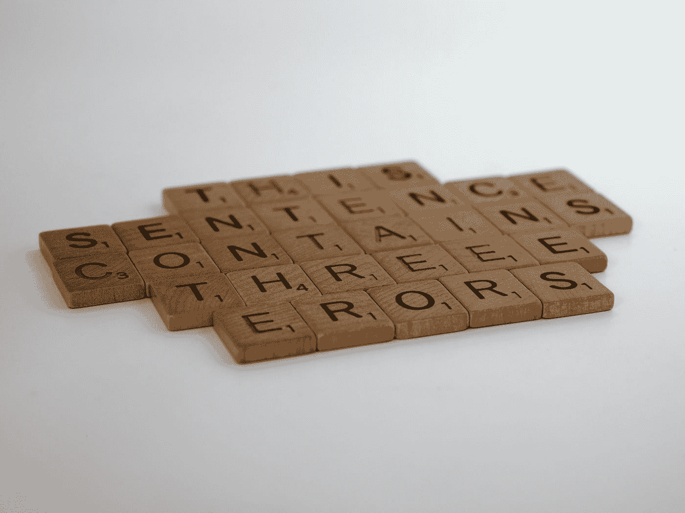
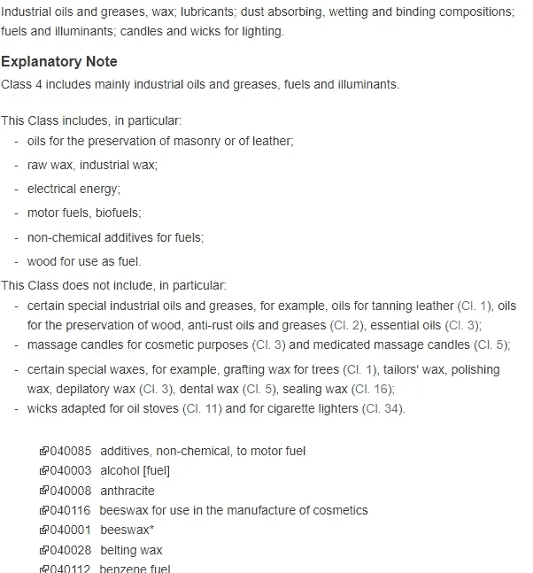
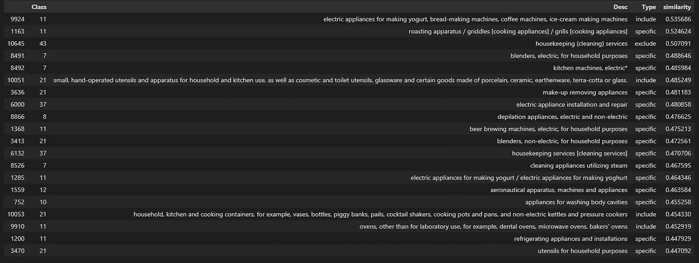
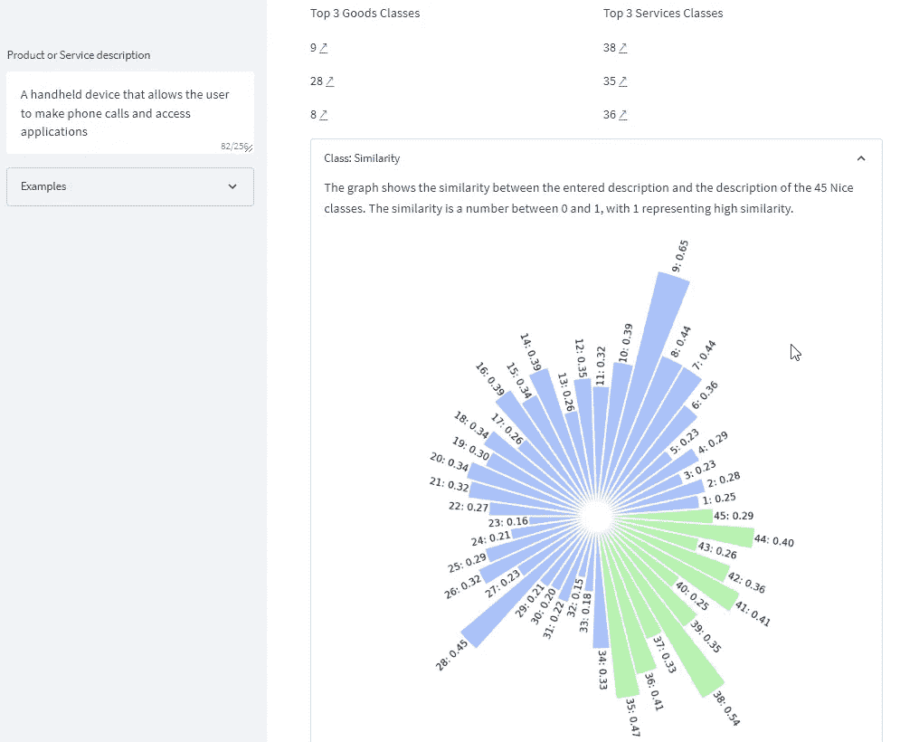

# 使用句子的漂亮分类推荐-BERT

> 原文：<https://medium.com/mlearning-ai/nice-classification-recommendation-using-sentence-bert-b1af32d0131e?source=collection_archive---------6----------------------->



Photo by [Brett Jordan](https://unsplash.com/@brett_jordan?utm_source=medium&utm_medium=referral) on [Unsplash](https://unsplash.com?utm_source=medium&utm_medium=referral)

# 商标保护权衡

要获得一个商标，一个品牌必须是独一无二的，并能将其商品和服务与竞争对手的商品和服务明显区分开来。世界各地的知识产权局使用商标分类系统，将类似的产品或服务分为 45 类。商品属于 1 至 34 类，服务属于 35 至 45 类。每个类别都有一个总标题，它提供了对该类别所包含内容的广泛解释，一个说明性注释，描述了该类别特别包含和不包含的内容，以及一个按字母顺序排列的特定产品或服务列表。



Screenshot of Class 4 from the WIPO IP Portal showing the Class heading, the Explanatory Note, and the start of the (very long) Alphabetical List

正确识别您打算与任何拟议商标相关联的商品和服务至关重要，因为该商标的保护范围仅适用于您在申请中指定并支付费用的特定国际类别，并且不可能在申请提交后添加商品或服务。

由于一个类别中可以包含的商品或服务的数量没有限制，因此选择一个广泛的范围可能很有诱惑力。然而，这增加了商标被他人质疑或因与现有商标过于相似或未被使用而被撤销的可能性。仔细考虑商标申请中包含的商品和服务以避免这些潜在问题是很重要的。

Nice 分类系统目前定义了近 10，000 个选项，这使得选择正确类别和适应症的任务变得更加复杂。

# 句子-伯特来拯救

句子-BERT (SBERT)是一种自然语言处理模型，使用来自变压器的双向编码器表示(BERT)技术进行训练。SBERT 旨在理解和处理句子，以提高自然语言处理任务的性能，如文本分类、情感分析和问题回答。SBERT 使用自我注意机制和变压器的组合来学习句子中单词的上下文表示，这允许它从整体上捕捉句子的意思。

SBERT 将整个句子及其语义信息表示为向量。一个句子的向量可以与另一个句子的向量进行比较，使用余弦相似度这样的度量:值越高，句子就越相似。

# 履行

在我们的用例中，10k 个漂亮的标题、解释性注释和精确分类被矢量化，矩阵中每个向量的余弦相似性和矢量化产品(或服务)描述被计算。具有最高相似性的分类被呈现给用户。

```
#Load the necessary libraries
import pandas as pd
import numpy as np
from sentence_transformers import SentenceTransformer

#Define the Cosine Similarity function
def cosine(u, v):
    return np.dot(u, v) / (np.linalg.norm(u) * np.linalg.norm(v))

#Load the Nice classification data
ncl_all = pd.read_csv('consolidated_nice_classifications.csv', sep=',')

#Load the SBERT model
sbert_model = SentenceTransformer('all-MiniLM-L6-v2')

#Create the sentence embeddings for the Nice classifications
sentence_embeddings = sbert_model.encode(ncl_all['Desc'])

#Create the sentence embeddings for the example product description
#query = "A handbag is a medium-to-large bag typically used by women to hold personal items. It is often fashionably designed. Versions of the term are 'purse', 'pocketbook', 'pouch', or 'clutch', terms which suggest rather smaller versions."
#query = 'A protection, safety, and private security agency. We specialize in the areas of close protection, property and home security and event security.'
query = 'A Home appliance is any consumer-electronic machine use to complete some household task, such as cooking or cleaning. Home appliances can be classified into: Major appliances (or white goods) and Small appliances'
#query = 'ovens for laboratory use'
#query = 'computer game software for use on mobile and cellular telephones'
query_vec = sbert_model.encode([query])[0]

#Calculate the similarity of the product description to the Nice classifications
ncl_sim = []
for ncl in sentence_embeddings:
    ncl_sim.append(cosine(query_vec, ncl))

ncl_all['similarity'] = ncl_sim

#Display the top 20 matches
ncl_all.sort_values(by=['similarity'], ascending=False).head(20).style.set_properties(subset=['Desc'], **{'width-min': '50px'})
```



Top 20 matches

所使用的数据集是从 WIPO 网站上找到的各种文件合并而来的，可以从这里下载:[https://github . com/brice sh/ncl _ recommender/blob/9e 9 B1 b 8 feef 60 ba 71d 84956 a 78 f 152 c 157508 c2b/data/consolidated _ nice _ classifications . CSV](https://github.com/bricesh/ncl_recommender/blob/9e9b1b8feef60ba71d84956a78f152c157508c2b/data/consolidated_nice_classifications.csv)

SBERT 的力量是显而易见的:“*家用电器是用来完成一些家庭任务的任何消费电子机器，如烹饪或清洁……*”与句子密切相关，如“*用于制作酸奶的电器、面包机、咖啡机、冰淇淋机*”或“*在其嵌入空间中利用蒸汽*的清洁电器。

如果你想进一步探索这个想法，我用 Streamlit 写了一个更加用户友好的应用:[https://bricesh-ncl-recommender-app-dyz6y3.streamlit.app/](https://bricesh-ncl-recommender-app-dyz6y3.streamlit.app/)



# 放弃

这项工作是一个未完成的学术练习，不打算通知真正的申请决定。商标注册过程既复杂又耗时。强烈建议寻求合格商标律师的建议，他们将指导申请人完成整个过程，并确保他们的申请正确完成。

# 有用的链接

 [## 余弦相似度-维基百科

### 在数据分析中，余弦相似性是两个数字序列之间相似性的度量。为了定义它…

en.wikipedia.org](https://en.wikipedia.org/wiki/Cosine_similarity)  [## 句子变压器文件-句子-变压器文件

### 可以使用 pip 安装:我们推荐 Python 3.6 或更高版本，至少 PyTorch 1.6.0。请参见安装…

www.sbert.net](https://www.sbert.net/) [](https://www.wipo.int/classifications/nice/en/) [## 分类不错

### 尼斯商标注册用商品和服务国际分类…

www.wipo.int](https://www.wipo.int/classifications/nice/en/) [](/mlearning-ai/mlearning-ai-submission-suggestions-b51e2b130bfb) [## Mlearning.ai 提交建议

### 如何成为 Mlearning.ai 上的作家

medium.com](/mlearning-ai/mlearning-ai-submission-suggestions-b51e2b130bfb)