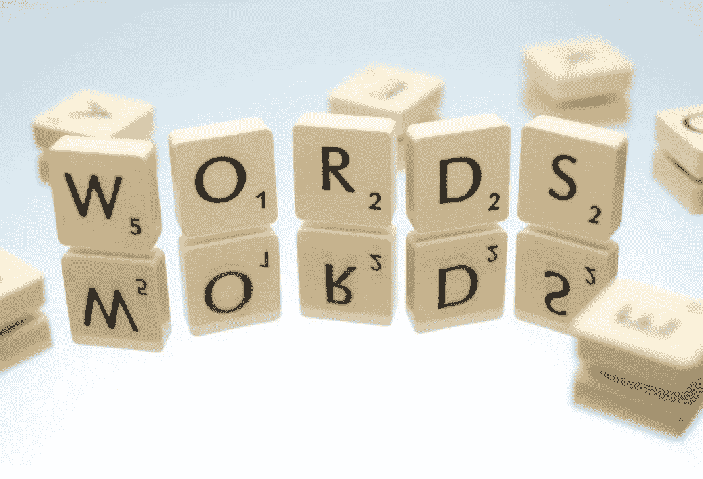

# 使用 spaCy 的 NLP-03 词汇化和词干化

> 原文：<https://medium.com/mlearning-ai/nlp-03-lemmatization-and-stemming-using-spacy-b2829becceca?source=collection_archive---------0----------------------->

[https://www.pexels.com/photo/words-text-scrabble-blocks-695571/](https://www.pexels.com/photo/words-text-scrabble-blocks-695571/)

# 词汇化

引理是记号的基本形式。散步的引理，散步，散步是散步。词汇化是将单词简化为基本形式或词汇的过程。

下面的代码显示了如何将单词简化为它们的词条。