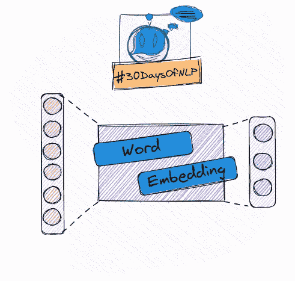

# NLP-第 10 天:为什么要关注单词向量

> 原文：<https://medium.com/mlearning-ai/nlp-day-10-why-you-should-care-about-word-vectors-124bb55621ee?source=collection_archive---------1----------------------->

## #30DaysOfNLP

## 通过揭示单词嵌入引入单词 2Vec

Discovery of word vectors #30DaysOfNLP [Image by Author]

[**昨天**](/mlearning-ai/nlp-day-9-performing-latent-semantic-analysis-with-pca-4d360621e5cd) 我们完成了对潜在语义分析的实际操作。我们创建了主题向量矩阵，甚至试图理解它。