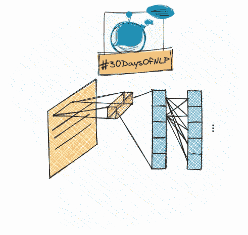

# NLP-第 11 天:使用卷积神经网络理顺你的话语(第 1 部分)

> 原文：<https://medium.com/mlearning-ai/nlp-day-11-get-your-words-in-order-with-convolutional-neural-networks-part-1-fbc82cf3e980?source=collection_archive---------6----------------------->

## #30DaysOfNLP

## 意义、上下文、回旋和词序与回旋神经网络

Word order with convnets #30DaysOfNLP [Image by Author]

[**在上一篇文章**](/mlearning-ai/nlp-day-10-why-you-should-care-about-word-vectors-124bb55621ee) 中，我们了解了单词向量这个令人兴奋的世界。通过这样做，我们也胆怯地透过深深的门窥视……