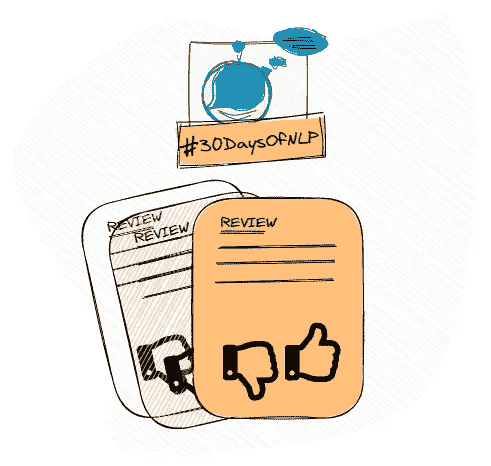

# NLP-第 12 天:用卷积神经网络整理你的单词(第 2 部分)

> 原文：<https://medium.com/mlearning-ai/nlp-day-12-get-your-words-in-order-with-convolutional-neural-networks-part-2-68974b205a6?source=collection_archive---------0----------------------->

## # 30 日

## 基于卷积神经网络的文本分类

Word order with convnets #30DaysOfNLP [Image by Author]

[**昨天**](/mlearning-ai/nlp-day-11-get-your-words-in-order-with-convolutional-neural-networks-part-1-fbc82cf3e980) ，我们进入了深度学习的领域。我们学习了卷积神经网络，基本概念，它们如何工作，以及它们如何能够提取更深层次的含义…