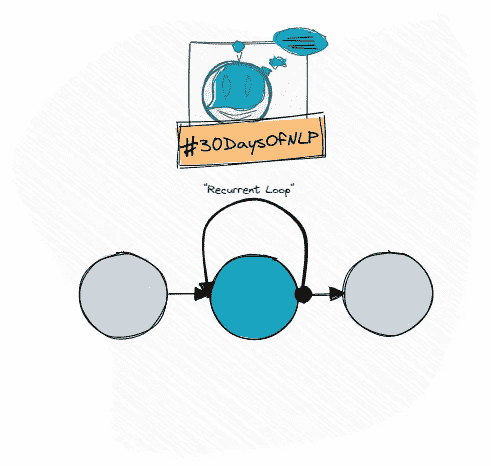

# NLP-第 13 天:使用递归神经网络(第 1 部分)

> 原文：<https://medium.com/mlearning-ai/nlp-day-13-get-loopy-with-recurrent-neural-networks-part-1-28367bddbaf2?source=collection_archive---------3----------------------->

## # 30 日

## 开始用循环神经网络记忆事物

Recurrent Neural Networks #30DaysOfNLP [Image by Author]

[**在最后一集**](/mlearning-ai/nlp-day-12-get-your-words-in-order-with-convolutional-neural-networks-part-2-68974b205a6) 中，我们通过实现我们的第一个卷积神经网络，将电影评论分为正面或负面。我们能够通过解释…来提取有意义的关系