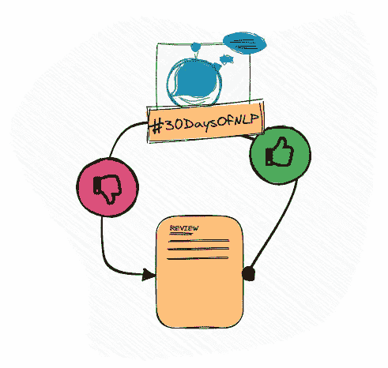

# NLP-第 14 天:使用递归神经网络(第 2 部分)

> 原文：<https://medium.com/mlearning-ai/nlp-day-14-get-loopy-with-recurrent-neural-networks-part-2-37a7b0bed7af?source=collection_archive---------2----------------------->

## # 30 日

## 基于递归神经网络的文本分类

Recurrent Neural Networks #30DaysOfNLP [Image by Author]

[**昨天**](/mlearning-ai/nlp-day-13-get-loopy-with-recurrent-neural-networks-part-1-28367bddbaf2) ，我们讲述了递归神经网络的基本概念和机制。

然而，我们只是在理论上这样做了。