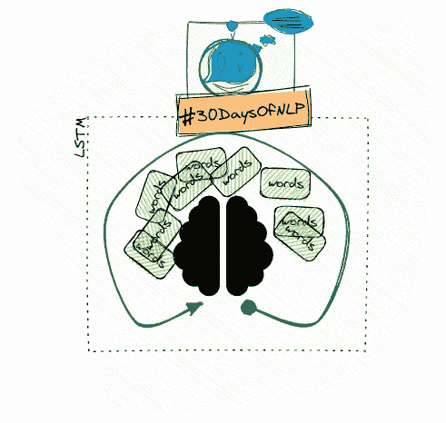

# NLP-第 15 天:如何用长短期记忆来记忆文本(第一部分)

> 原文：<https://medium.com/mlearning-ai/nlp-day-15-how-to-remember-text-with-long-short-term-memory-part-1-4901197c235?source=collection_archive---------0----------------------->

## # 30 日

## 通过应用 LSTM 概念提高保留率

Long-short-term memory #30DaysOfNLP [Image by Author]

[**昨天**](/mlearning-ai/nlp-day-14-get-loopy-with-recurrent-neural-networks-part-2-37a7b0bed7af) ，我们实现了我们的第一个递归神经网络，并利用它将电影评论分为正面或负面。