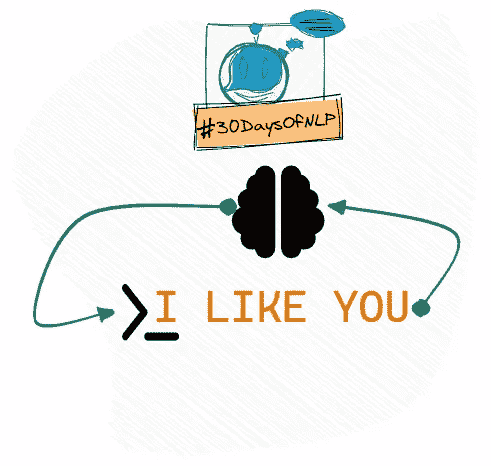

# NLP-第 16 天:如何用长短期记忆记忆文本(第 2 部分)

> 原文：<https://medium.com/mlearning-ai/nlp-day-16-how-to-remember-text-with-long-short-term-memory-part-2-20391f76bb41?source=collection_archive---------1----------------------->

## #30DaysOfNLP

## 产生具有长短期记忆的小说文本

Long-short-term memory #30DaysOfNLP [Image by Author]

[**在前面的文章**](/mlearning-ai/nlp-day-15-how-to-remember-text-with-long-short-term-memory-part-1-4901197c235) 中，我们学习了所有关于长短期记忆的知识。我们涵盖了整体概念以及内部工作原理。我们特别关注记忆状态是如何构成和计算的。