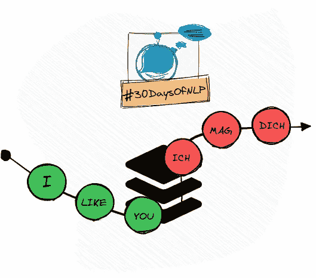

# NLP-第 17 天:序列 2 序列的机器翻译(第 1 部分)

> 原文：<https://medium.com/mlearning-ai/nlp-day-17-machine-translation-with-sequence-2-sequence-part-1-19c30f2b2c27?source=collection_archive---------1----------------------->

## # 30 日

## 介绍 Sequence 2 序列模型和相关任务

Sequence-to-sequence #30DaysOfNLP [Image by Author]

[**昨天**](/mlearning-ai/nlp-day-16-how-to-remember-text-with-long-short-term-memory-part-2-20391f76bb41) ，我们在 Keras API 的帮助下实现了长短期记忆。我们以模型在训练阶段学到的某种风格生成了小说文本。