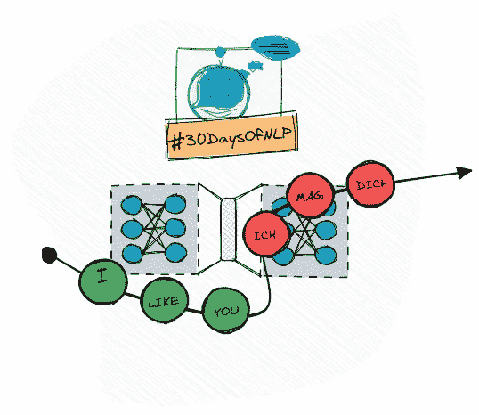

# NLP-第 18 天:序列对序列的机器翻译(第二部分)

> 原文：<https://medium.com/mlearning-ai/nlp-day-18-machine-translation-with-sequence-to-sequence-part-2-dc32dc0e7e1b?source=collection_archive---------6----------------------->

## # 30 日

## 如何使用 seq2seq 模型将英语翻译成德语

Sequence-to-sequence #30DaysOfNLP [Image by Author]

[**在上一集**](/mlearning-ai/nlp-day-17-machine-translation-with-sequence-2-sequence-part-1-19c30f2b2c27) 中，我们学习了所有关于序列到序列，相关问题，以及相关的 seq2seq 模型。我们讨论了基本概念。我们讨论了主要观点。但是我们只在……