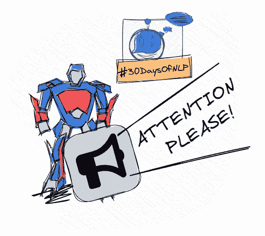

# NLP-第 19 天:你最好关注变形金刚(第 1 部分)

> 原文：<https://medium.com/mlearning-ai/nlp-day-19-you-better-pay-attention-to-transformers-part-1-3b1784b2a7ee?source=collection_archive---------3----------------------->

## # 30 日

## 引入注意力的概念

Transformer-based architectures #30DaysOfNLP [Image by Author]

[**在上一集**](/mlearning-ai/nlp-day-18-machine-translation-with-sequence-to-sequence-part-2-dc32dc0e7e1b) 中，我们实现了一个序列到序列的机器翻译模型。我们通过在编码器-解码器结构中创建一个网络来做到这一点，该网络利用两个 LSTMs，将一个序列映射到另一个序列。