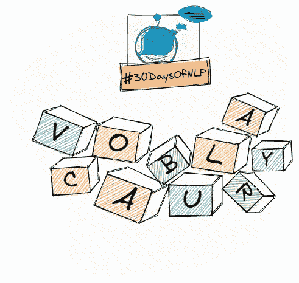

# NLP-第二天:为什么你应该总是学习你的词汇

> 原文：<https://medium.com/mlearning-ai/nlp-day-2-why-you-should-always-learn-your-vocabulary-b9ec7af73ad?source=collection_archive---------3----------------------->

## # 30 日

## 什么是令牌，为什么我需要令牌化器？

Building vocabulary #30DaysOfNLP [Image by Author]

[**昨天**](/@marvinlanhenke/nlp-day-1-the-magical-powers-of-natural-language-processing-56c0208a6b9f) ，我们从鸟瞰的角度介绍了自然语言处理的话题。我们对主题、各种应用程序和总体目标建立了一个总体感觉。