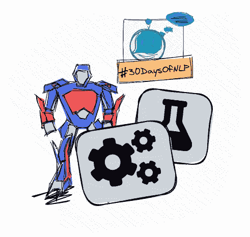

# NLP-第 20 天:你最好关注变形金刚(第 2 部分)

> 原文：<https://medium.com/mlearning-ai/nlp-day-20-you-better-pay-attention-to-transformers-part-2-c6889a0a301b?source=collection_archive---------1----------------------->

## # 30 日

## 了解一般和变压器注意机制

Transformer-based architecture #30DaysOfNLP [Image by Author]

[**在上一集**](/mlearning-ai/nlp-day-19-you-better-pay-attention-to-transformers-part-1-3b1784b2a7ee) 中，我们温和地介绍了一般意义上以及机器学习背景下的注意力概念。然而，我们故意停留在表面，让我们得到一个总的看法。