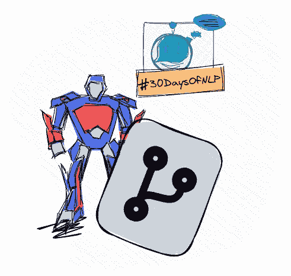

# NLP-第 22 天:如何用变形金刚创建聊天机器人

> 原文：<https://medium.com/mlearning-ai/nlp-day-22-how-to-create-a-chatbot-with-transformers-fbb194608217?source=collection_archive---------1----------------------->

## # 30 日

## 使用基于变压器的神经网络聊天

Transformer-based architecture #30DaysOfNLP [Image by Author]

[**在最后几集**](/mlearning-ai/nlp-day-21-understanding-transformer-models-and-architecture-b185bcfe57eb) 中，我们学习了所有关于注意机制和自我注意的知识。我们还剖析了变压器架构。