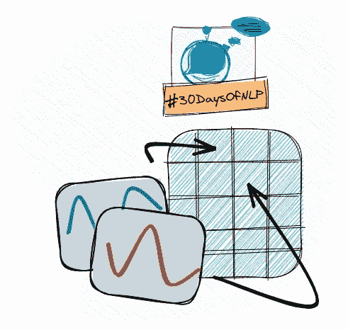

# NLP-第 23 天:了解你的位置。变压器中的位置编码(一)

> 原文：<https://medium.com/mlearning-ai/nlp-day-23-know-your-place-positional-encoding-in-transformers-part-1-75f972ab0342?source=collection_archive---------1----------------------->

## # 30 日

## 在变压器的上下文中引入位置编码的概念

Positional encoding #30DaysOfNLP [Image by Author]

[**昨天**](/mlearning-ai/nlp-day-22-how-to-create-a-chatbot-with-transformers-fbb194608217) ，为了解决一个机器翻译任务，我们创建了一个基于 transformer 的模型。由于变压器模型没有固有的方式来说明…