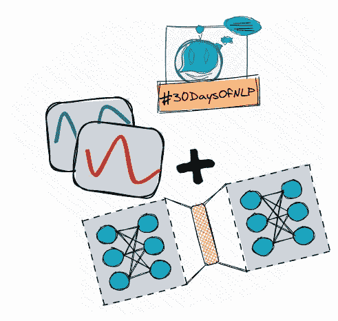

# NLP-第 24 天:了解你的位置。变压器中的位置编码(二)

> 原文：<https://medium.com/mlearning-ai/nlp-day-24-know-your-place-positional-encoding-in-transformers-part-2-c60671711080?source=collection_archive---------3----------------------->

## # 30 日

## 如何在 Keras 中实现位置编码层

Positional encoding #30DaysOfNLP [Image by Author]

[**在上一集**](/mlearning-ai/nlp-day-23-know-your-place-positional-encoding-in-transformers-part-1-75f972ab0342) 中，我们委婉地引入了位置编码的思想。我们揭示了一些潜在的概念，以及必要的计算步骤，以编码在一个…