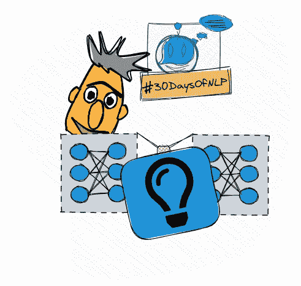

# NLP-第 25 天:NLP 最好的朋友。伯特

> 原文：<https://medium.com/mlearning-ai/nlp-day-25-nlps-best-friend-bert-part-1-7884af01aaa1?source=collection_archive---------2----------------------->

## # 30 日

## 从变压器引入双向编码器表示

NLP’s Best Friend BERT #30DaysOfNLP [Image by Author]

[**在上一集**](/mlearning-ai/nlp-day-24-know-your-place-positional-encoding-in-transformers-part-2-c60671711080) 中，我们通过用 Keras API 实现一个位置嵌入层，结束了对变形金刚主题的深入探究。