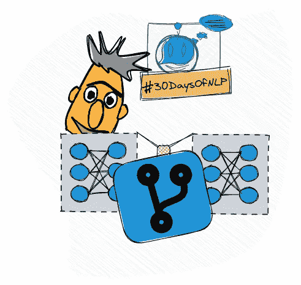

# NLP-第 26 天:与 BERT 和 HuggingFace 变形金刚的语义相似性

> 原文：<https://medium.com/mlearning-ai/nlp-day-26-semantic-similarity-with-bert-and-huggingface-transformers-ce76011d5a51?source=collection_archive---------0----------------------->

## # 30 日

## 或者如何利用 NLP 最好的朋友——BERT

NLP’s Best Friend BERT #30DaysOfNLP [Image by Author]

[**昨天**](/mlearning-ai/nlp-day-25-nlps-best-friend-bert-part-1-7884af01aaa1) ，我们介绍了一位新朋友——伯特。我们了解了预培训的核心理念以及 BERT 的基本框架和构建模块。