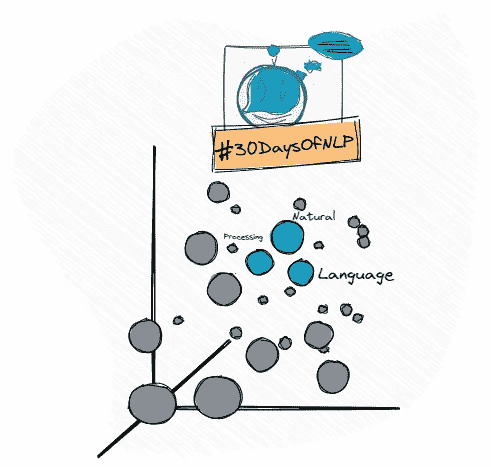

# NLP-第 27 天:如何用 Tensorboard 可视化单词嵌入

> 原文：<https://medium.com/mlearning-ai/nlp-day-27-how-to-visualize-word-embeddings-with-tensorboard-e69f39707d64?source=collection_archive---------1----------------------->

## # 30 日

## 一张图片比 1000 字的嵌入更有价值

Visualizing word embeddings #30DaysOfNLP [Image by Author]

[**昨天**](/mlearning-ai/nlp-day-26-semantic-similarity-with-bert-and-huggingface-transformers-ce76011d5a51) 在之前的日子里，我们实现了几个不同的神经网络。在进入变形金刚的世界之前，我们讨论了卷积网络和递归网络。