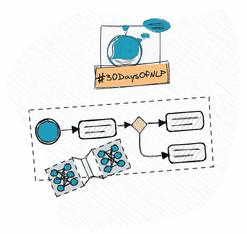

# NLP-第 28 天:如何接近和选择深度学习架构

> 原文：<https://medium.com/mlearning-ai/nlp-day-28-how-to-approach-and-choose-a-deep-learning-architecture-4ef8fff42f45?source=collection_archive---------2----------------------->

## # 30 日

## 一般工作流程和一些关键网络架构

General Workflow & key architectures #30DaysOfNLP [Image by Author]

[**在最后一集**](/mlearning-ai/nlp-day-27-how-to-visualize-word-embeddings-with-tensorboard-e69f39707d64) 中，我们委婉地介绍了 Tensorboard。这是一个工具，它让我们能够深入了解我们实施的各种模型。