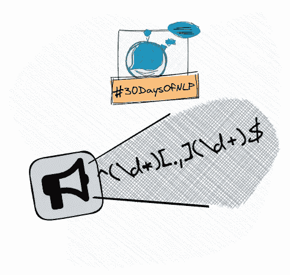

# NLP-Day 29:如何用正则表达式操作和预处理字符串

> 原文：<https://medium.com/mlearning-ai/nlp-day-29-how-to-manipulate-and-preprocess-string-with-regular-expressions-846fd5dac7e2?source=collection_archive---------2----------------------->

## # 30 日

## 用正则表达式表达自己就行了

Express yourself with regular expressions #30DaysOfNLP [Image by Author]

[**在上一集**](/mlearning-ai/nlp-day-28-how-to-approach-and-choose-a-deep-learning-architecture-4ef8fff42f45) 中，我们回顾了深度学习领域的关键架构，并强调了通用工作流的重要性。我们还指出，大多数挑战不在于设计或…