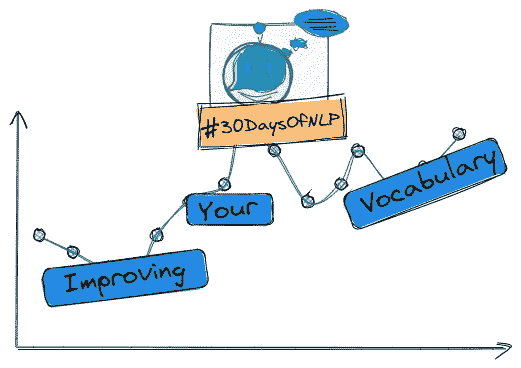

# NLP-第三天:你最好开始提高你的词汇量

> 原文：<https://medium.com/mlearning-ai/nlp-day-3-you-better-start-improving-your-vocabulary-4c06ef626c9f?source=collection_archive---------0----------------------->

## # 30 日

## 标点符号、缩写、停用词和 n-grams

Improving your vocabulary #30DaysOfNLP [Image by Author]

[**在最后一集**](/mlearning-ai/nlp-day-2-why-you-should-always-learn-your-vocabulary-b9ec7af73ad) 中，我们创建了我们的第一个分词器。

然而，实现是非常基础的，远非完美。渴望创造一个更好的，更有意义的给定文本的表示，我们需要…