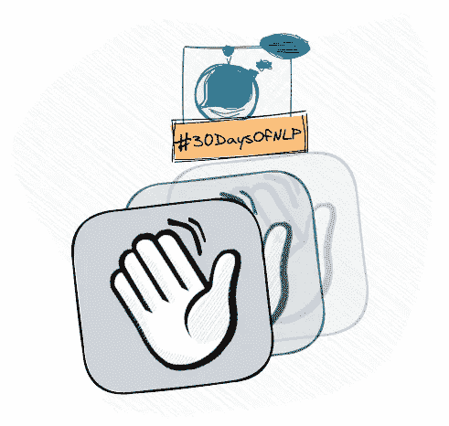

# NLP-第 30 天:NLP 学习冒险的资源包

> 原文：<https://medium.com/mlearning-ai/nlp-day-30-a-bag-of-resources-for-your-nlp-learning-adventure-ebd38f5cb01a?source=collection_archive---------3----------------------->

## # 30 日

## 收集资源以继续学习和提高

Wrapping up the series #30DaysOfNLP [Image by Author]

[**在最后一集**](/mlearning-ai/nlp-day-29-how-to-manipulate-and-preprocess-string-with-regular-expressions-846fd5dac7e2) 中，我们走了一个小弯路，学习了正则表达式的基础知识，让我们能够以适合我们自然语言处理需求的方式来匹配和修改字符串。