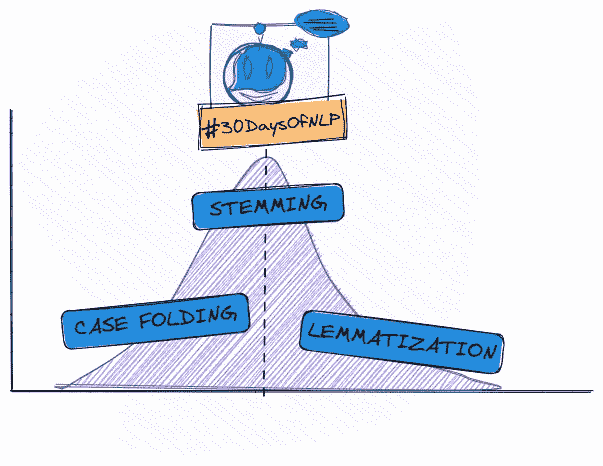

# NLP-第 4 天:规范你的词汇可能是个坏主意

> 原文：<https://medium.com/mlearning-ai/nlp-day-4-normalizing-your-vocabulary-might-be-a-bad-idea-ffdf8aaecc72?source=collection_archive---------2----------------------->

## # 30 日

## 究竟什么是格折叠、词干化和词汇化？

Normalizing your vocabulary #30DaysOfNLP [Image by Author]

[**昨天**](/mlearning-ai/nlp-day-3-you-better-start-improving-your-vocabulary-4c06ef626c9f) ，我们通过精炼分词器来提高词汇量。

我们通过考虑标点符号、缩写、甚至随意的语言来提取更有意义的符号。